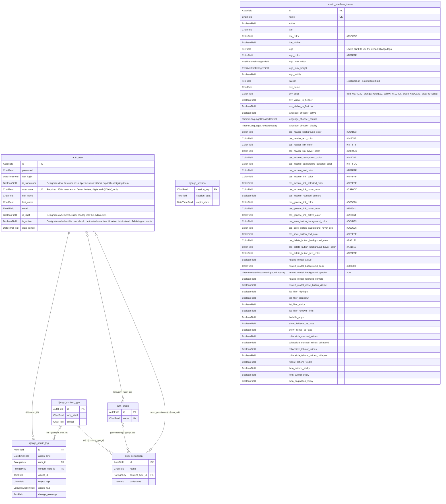

```mermaid
erDiagram
    auth_user ||--o{ django_admin_log : "(id) - (user_id)"
    django_content_type |o--o{ django_admin_log : "(id) - (content_type_id)"
    django_content_type ||--o{ auth_permission : "(id) - (content_type_id)"
    auth_group }o--o{ auth_permission : "(permissions) - (group_set)"
    auth_user }o--o{ auth_group : "(groups) - (user_set)"
    auth_user }o--o{ auth_permission : "(user_permissions) - (user_set)"
    django_admin_log {
        AutoField id PK
        DateTimeField action_time
        ForeignKey user_id FK
        ForeignKey content_type_id FK
        TextField object_id
        CharField object_repr
        LogEntryActionFlag action_flag
        TextField change_message
    }
    auth_permission {
        AutoField id PK
        CharField name
        ForeignKey content_type_id FK
        CharField codename
    }
    auth_group {
        AutoField id PK
        CharField name UK
    }
    auth_user {
        AutoField id PK
        CharField password
        DateTimeField last_login
        BooleanField is_superuser "Designates that this user has all permissions without explicitly assigning them."
        CharField username UK "Required. 150 characters or fewer. Letters, digits and @/./+/-/_ only."
        CharField first_name
        CharField last_name
        EmailField email
        BooleanField is_staff "Designates whether the user can log into this admin site."
        BooleanField is_active "Designates whether this user should be treated as active. Unselect this instead of deleting accounts."
        DateTimeField date_joined
    }
    django_content_type {
        AutoField id PK
        CharField app_label
        CharField model
    }
    django_session {
        CharField session_key PK
        TextField session_data
        DateTimeField expire_date
    }
    admin_interface_theme {
        AutoField id PK
        CharField name UK
        BooleanField active
        CharField title
        ColorField title_color "#F5DD5D"
        BooleanField title_visible
        FileField logo "Leave blank to use the default Django logo"
        ColorField logo_color "#FFFFFF"
        PositiveSmallIntegerField logo_max_width
        PositiveSmallIntegerField logo_max_height
        BooleanField logo_visible
        FileField favicon "(.ico|.png|.gif - 16x16|32x32 px)"
        CharField env_name
        ColorField env_color "(red: #E74C3C, orange: #E67E22, yellow: #F1C40F, green: #2ECC71, blue: #3498DB)"
        BooleanField env_visible_in_header
        BooleanField env_visible_in_favicon
        BooleanField language_chooser_active
        ThemeLanguageChooserControl language_chooser_control
        ThemeLanguageChooserDisplay language_chooser_display
        ColorField css_header_background_color "#0C4B33"
        ColorField css_header_text_color "#44B78B"
        ColorField css_header_link_color "#FFFFFF"
        ColorField css_header_link_hover_color "#C9F0DD"
        ColorField css_module_background_color "#44B78B"
        ColorField css_module_background_selected_color "#FFFFCC"
        ColorField css_module_text_color "#FFFFFF"
        ColorField css_module_link_color "#FFFFFF"
        ColorField css_module_link_selected_color "#FFFFFF"
        ColorField css_module_link_hover_color "#C9F0DD"
        BooleanField css_module_rounded_corners
        ColorField css_generic_link_color "#0C3C26"
        ColorField css_generic_link_hover_color "#156641"
        ColorField css_generic_link_active_color "#29B864"
        ColorField css_save_button_background_color "#0C4B33"
        ColorField css_save_button_background_hover_color "#0C3C26"
        ColorField css_save_button_text_color "#FFFFFF"
        ColorField css_delete_button_background_color "#BA2121"
        ColorField css_delete_button_background_hover_color "#A41515"
        ColorField css_delete_button_text_color "#FFFFFF"
        BooleanField related_modal_active
        ColorField related_modal_background_color "#000000"
        ThemeRelatedModalBackgroundOpacity related_modal_background_opacity "20%"
        BooleanField related_modal_rounded_corners
        BooleanField related_modal_close_button_visible
        BooleanField list_filter_highlight
        BooleanField list_filter_dropdown
        BooleanField list_filter_sticky
        BooleanField list_filter_removal_links
        BooleanField foldable_apps
        BooleanField show_fieldsets_as_tabs
        BooleanField show_inlines_as_tabs
        BooleanField collapsible_stacked_inlines
        BooleanField collapsible_stacked_inlines_collapsed
        BooleanField collapsible_tabular_inlines
        BooleanField collapsible_tabular_inlines_collapsed
        BooleanField recent_actions_visible
        BooleanField form_actions_sticky
        BooleanField form_submit_sticky
        BooleanField form_pagination_sticky
    }
```
