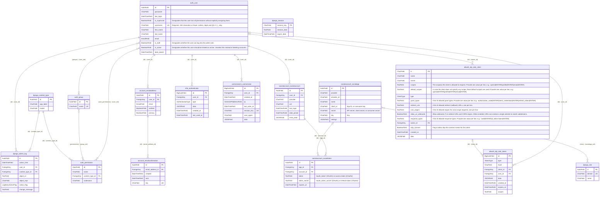

```mermaid
erDiagram
    auth_user ||--o{ django_admin_log : "(id) - (user_id)"
    django_content_type |o--o{ django_admin_log : "(id) - (content_type_id)"
    django_content_type ||--o{ auth_permission : "(id) - (content_type_id)"
    auth_group }o--o{ auth_permission : "(permissions) - (group_set)"
    auth_user }o--o{ auth_group : "(groups) - (user_set)"
    auth_user }o--o{ auth_permission : "(user_permissions) - (user_set)"
    auth_user ||--o{ account_emailaddress : "(id) - (user_id)"
    account_emailaddress ||--o{ account_emailconfirmation : "(id) - (email_address_id)"
    socialaccount_socialapp }o--o{ django_site : "(sites) - (socialapp_set)"
    auth_user ||--o{ socialaccount_socialaccount : "(id) - (user_id)"
    socialaccount_socialapp |o--o{ socialaccount_socialtoken : "(id) - (app_id)"
    socialaccount_socialaccount ||--o{ socialaccount_socialtoken : "(id) - (account_id)"
    auth_user ||--o{ mfa_authenticator : "(id) - (user_id)"
    auth_user ||--o{ usersessions_usersession : "(id) - (user_id)"
    auth_user |o--o{ allauth_idp_oidc_client : "(id) - (owner_id)"
    allauth_idp_oidc_client |o--o{ allauth_idp_oidc_token : "(id) - (client_id)"
    auth_user |o--o{ allauth_idp_oidc_token : "(id) - (user_id)"
    django_admin_log {
        AutoField id PK
        DateTimeField action_time
        ForeignKey user_id FK
        ForeignKey content_type_id FK
        TextField object_id
        CharField object_repr
        LogEntryActionFlag action_flag
        TextField change_message
    }
    auth_permission {
        AutoField id PK
        CharField name
        ForeignKey content_type_id FK
        CharField codename
    }
    auth_group {
        AutoField id PK
        CharField name UK
    }
    auth_user {
        AutoField id PK
        CharField password
        DateTimeField last_login
        BooleanField is_superuser "Designates that this user has all permissions without explicitly assigning them."
        CharField username UK "Required. 150 characters or fewer. Letters, digits and @/./+/-/_ only."
        CharField first_name
        CharField last_name
        EmailField email
        BooleanField is_staff "Designates whether the user can log into this admin site."
        BooleanField is_active "Designates whether this user should be treated as active. Unselect this instead of deleting accounts."
        DateTimeField date_joined
    }
    django_content_type {
        AutoField id PK
        CharField app_label
        CharField model
    }
    django_session {
        CharField session_key PK
        TextField session_data
        DateTimeField expire_date
    }
    django_site {
        AutoField id PK
        CharField domain UK
        CharField name
    }
    account_emailaddress {
        AutoField id PK
        ForeignKey user_id FK
        EmailField email
        BooleanField verified
        BooleanField primary
    }
    account_emailconfirmation {
        AutoField id PK
        ForeignKey email_address_id FK
        DateTimeField created
        DateTimeField sent
        CharField key UK
    }
    socialaccount_socialapp {
        AutoField id PK
        CharField provider
        CharField provider_id
        CharField name
        CharField client_id "App ID, or consumer key"
        CharField secret "API secret, client secret, or consumer secret"
        CharField key "Key"
        JSONField settings
    }
    socialaccount_socialaccount {
        AutoField id PK
        ForeignKey user_id FK
        CharField provider
        CharField uid
        DateTimeField last_login
        DateTimeField date_joined
        JSONField extra_data
    }
    socialaccount_socialtoken {
        AutoField id PK
        ForeignKey app_id FK
        ForeignKey account_id FK
        TextField token "'oauth_token' (OAuth1) or access token (OAuth2)"
        TextField token_secret "'oauth_token_secret' (OAuth1) or refresh token (OAuth2)"
        DateTimeField expires_at
    }
    mfa_authenticator {
        BigAutoField id PK
        ForeignKey user_id FK
        AuthenticatorType type
        JSONField data
        DateTimeField created_at
        DateTimeField last_used_at
    }
    usersessions_usersession {
        BigAutoField id PK
        ForeignKey user_id FK
        DateTimeField created_at
        GenericIPAddressField ip
        DateTimeField last_seen_at
        CharField session_key UK
        CharField user_agent
        JSONField data
    }
    allauth_idp_oidc_client {
        CharField id PK
        CharField name
        CharField secret
        TextField scopes "The scope(s) the client is allowed to request. Provide one value per line, e.g.: openid(ENTER)profile(ENTER)email(ENTER)"
        TextField default_scopes "In case the client does not specify any scope, these default scopes are used. Provide one value per line, e.g.: openid(ENTER)profile(ENTER)email(ENTER)"
        ClientType type
        TextField grant_types "A list of allowed grant types. Provide one value per line, e.g.: authorization_code(ENTER)client_credentials(ENTER)refresh_token(ENTER)"
        TextField redirect_uris "A list of allowed redirect (callback) URLs, one per line."
        TextField cors_origins "A list of allowed origins for cross-origin requests, one per line."
        BooleanField allow_uri_wildcards "Allow wildcards (*) in redirect URIs and CORS origins. When enabled, URIs can contain a single asterisk to match subdomains."
        TextField response_types "A list of allowed response types. Provide one value per line, e.g.: code(ENTER)id_token token(ENTER)"
        ForeignKey owner_id FK
        BooleanField skip_consent "Flag to allow skip the consent screen for this client"
        DateTimeField created_at
        JSONField data
    }
    allauth_idp_oidc_token {
        BigAutoField id PK
        TokenType type
        CharField hash
        ForeignKey client_id FK
        ForeignKey user_id FK
        JSONField data
        DateTimeField created_at
        DateTimeField expires_at
        TextField scopes
    }
```
