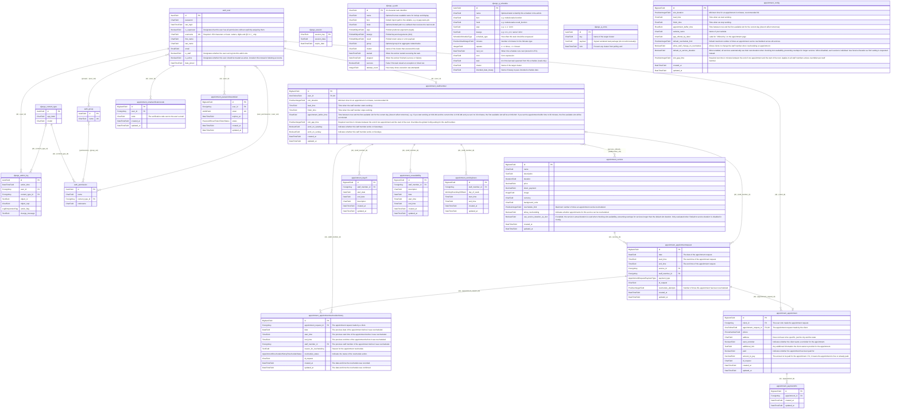

```mermaid
erDiagram
    auth_user ||--o{ django_admin_log : "(id) - (user_id)"
    django_content_type |o--o{ django_admin_log : "(id) - (content_type_id)"
    django_content_type ||--o{ auth_permission : "(id) - (content_type_id)"
    auth_group }o--o{ auth_permission : "(permissions) - (group_set)"
    auth_user }o--o{ auth_group : "(groups) - (user_set)"
    auth_user }o--o{ auth_permission : "(user_permissions) - (user_set)"
    auth_user ||--o| appointment_staffmember : "(id) - (user_id)"
    appointment_staffmember }o--o{ appointment_service : "(services_offered) - (staffmember_set)"
    appointment_service ||--o{ appointment_appointmentrequest : "(id) - (service_id)"
    appointment_staffmember |o--o{ appointment_appointmentrequest : "(id) - (staff_member_id)"
    appointment_appointmentrequest ||--o{ appointment_appointmentreschedulehistory : "(id) - (appointment_request_id)"
    appointment_staffmember |o--o{ appointment_appointmentreschedulehistory : "(id) - (staff_member_id)"
    auth_user |o--o{ appointment_appointment : "(id) - (client_id)"
    appointment_appointmentrequest ||--o| appointment_appointment : "(id) - (appointment_request_id)"
    appointment_appointment ||--o{ appointment_paymentinfo : "(id) - (appointment_id)"
    auth_user ||--o{ appointment_emailverificationcode : "(id) - (user_id)"
    auth_user ||--o{ appointment_passwordresettoken : "(id) - (user_id)"
    appointment_staffmember ||--o{ appointment_dayoff : "(id) - (staff_member_id)"
    appointment_staffmember ||--o{ appointment_unavailability : "(id) - (staff_member_id)"
    appointment_staffmember ||--o{ appointment_workinghours : "(id) - (staff_member_id)"
    django_admin_log {
        AutoField id PK
        DateTimeField action_time
        ForeignKey user_id FK
        ForeignKey content_type_id FK
        TextField object_id
        CharField object_repr
        LogEntryActionFlag action_flag
        TextField change_message
    }
    auth_permission {
        AutoField id PK
        CharField name
        ForeignKey content_type_id FK
        CharField codename
    }
    auth_group {
        AutoField id PK
        CharField name UK
    }
    auth_user {
        AutoField id PK
        CharField password
        DateTimeField last_login
        BooleanField is_superuser "Designates that this user has all permissions without explicitly assigning them."
        CharField username UK "Required. 150 characters or fewer. Letters, digits and @/./+/-/_ only."
        CharField first_name
        CharField last_name
        EmailField email
        BooleanField is_staff "Designates whether the user can log into this admin site."
        BooleanField is_active "Designates whether this user should be treated as active. Unselect this instead of deleting accounts."
        DateTimeField date_joined
    }
    django_content_type {
        AutoField id PK
        CharField app_label
        CharField model
    }
    django_session {
        CharField session_key PK
        TextField session_data
        DateTimeField expire_date
    }
    django_q_task {
        CharField id PK "32-character task identifier."
        CharField name "Optional human-readable name for lookup and display."
        CharField func "Dotted import path to the callable, e.g. myapp.tasks.job."
        CharField hook "Optional dotted path to a callback that receives the task result."
        PickledObjectField args "Pickled positional arguments (tuple)."
        PickledObjectField kwargs "Pickled keyword arguments (dict)."
        PickledObjectField result "Pickled return value or error payload."
        CharField group "Optional group id to aggregate related tasks."
        CharField cluster "Name of the cluster that executed this task."
        DateTimeField started "When the worker started executing the task."
        DateTimeField stopped "When the worker finished (success or failure)."
        BooleanField success "False if the task raised an exception or timed out."
        IntegerField attempt_count "How many times execution was attempted."
    }
    django_q_schedule {
        AutoField id PK
        CharField name "Optional label to identify this schedule in the admin."
        CharField func "e.g. module.tasks.function"
        CharField hook "e.g. module.tasks.result_function"
        TextField args "e.g. 1, 2, 'John'"
        TextField kwargs "e.g. x=1, y=2, name='John'"
        ScheduleScheduleType schedule_type "How often this task should be enqueued."
        PositiveSmallIntegerField minutes "Number of minutes for the Minutes type"
        IntegerField repeats "n = n times, -1 = forever"
        DateTimeField next_run "When this schedule runs next (stored in UTC)."
        CharField cron "Cron expression"
        CharField task "Id of the last task spawned from this schedule (read-only)."
        CharField cluster "Name of the target cluster"
        CharField intended_date_kwarg "Name of kwarg to pass intended schedule date"
    }
    django_q_ormq {
        AutoField id PK
        CharField key "Name of the target cluster"
        TextField payload "Signed serialized task package (do not edit manually)."
        DateTimeField lock "Prevent any cluster from pulling until"
    }
    appointment_service {
        BigAutoField id PK
        CharField name
        TextField description
        DurationField duration
        DecimalField price
        DecimalField down_payment
        ImageField image
        CharField currency
        CharField background_color
        PositiveIntegerField reschedule_limit "Maximum number of times an appointment can be rescheduled."
        BooleanField allow_rescheduling "Indicates whether appointments for this service can be rescheduled."
        BooleanField use_service_duration_as_slot "If enabled, the service's actual duration is used when checking slot availability, preventing overlaps for services longer than the default slot duration. Only evaluated when 'Default to service duration' is disabled in Config."
        DateTimeField created_at
        DateTimeField updated_at
    }
    appointment_staffmember {
        BigAutoField id PK
        OneToOneField user_id FK, UK
        PositiveIntegerField slot_duration "Minimum time for an appointment in minutes, recommended 30."
        TimeField lead_time "Time when the staff member starts working."
        TimeField finish_time "Time when the staff member stops working."
        FloatField appointment_buffer_time "Time between now and the first available slot for the current day (doesn't affect tomorrow). e.g: If you start working at 9:00 AM and the current time is 8:30 AM and you set it to 30 minutes, the first available slot will be at 9:00 AM. If you set the appointment buffer time to 60 minutes, the first available slot will be at 9:30 AM."
        PositiveIntegerField slot_gap_time "Required rest time in minutes between the end of one appointment and the start of the next. Overrides the global Config setting for this staff member."
        BooleanField work_on_saturday "Indicates whether this staff member works on Saturdays."
        BooleanField work_on_sunday "Indicates whether this staff member works on Sundays."
        DateTimeField created_at
        DateTimeField updated_at
    }
    appointment_appointmentrequest {
        BigAutoField id PK
        DateField date "The date of the appointment request."
        TimeField start_time "The start time of the appointment request."
        TimeField end_time "The end time of the appointment request."
        ForeignKey service_id FK
        ForeignKey staff_member_id FK
        AppointmentRequestPaymentType payment_type
        CharField id_request
        PositiveIntegerField reschedule_attempts "Number of times this appointment has been rescheduled."
        DateTimeField created_at
        DateTimeField updated_at
    }
    appointment_appointmentreschedulehistory {
        BigAutoField id PK
        ForeignKey appointment_request_id FK "The appointment request made by a client."
        DateField date "The previous date of the appointment before it was rescheduled."
        TimeField start_time "The previous start time of the appointment before it was rescheduled."
        TimeField end_time "The previous end time of the appointment before it was rescheduled."
        ForeignKey staff_member_id FK "The previous staff member of the appointment before it was rescheduled."
        TextField reason_for_rescheduling "Reason for the appointment reschedule."
        AppointmentRescheduleHistoryRescheduleStatus reschedule_status "Indicates the status of the reschedule action."
        CharField id_request
        DateTimeField created_at "The date and time the reschedule was recorded."
        DateTimeField updated_at "The date and time the reschedule was confirmed."
    }
    appointment_appointment {
        BigAutoField id PK
        ForeignKey client_id FK "The user who made the appointment request."
        OneToOneField appointment_request_id FK, UK "The appointment request made by the client."
        PhoneNumberField phone
        CharField address "Does not have to be specific, just the city and the state"
        BooleanField want_reminder "Indicates whether the client wants a reminder for the appointment."
        TextField additional_info "Any additional information the client wants to provide for the appointment."
        BooleanField paid "Indicates whether the appointment has been paid for."
        DecimalField amount_to_pay "The amount to be paid for the appointment. If 0, it means the appointment is free or already paid."
        CharField id_request
        DateTimeField created_at
        DateTimeField updated_at
    }
    appointment_config {
        BigAutoField id PK
        PositiveIntegerField slot_duration "Minimum time for an appointment in minutes, recommended 30."
        TimeField lead_time "Time when we start working."
        TimeField finish_time "Time when we stop working."
        FloatField appointment_buffer_time "Time between now and the first available slot for the current day (doesn't affect tomorrow)."
        CharField website_name "Name of your website."
        CharField app_offered_by_label "Label for `Offered by` on the appointment page"
        PositiveIntegerField default_reschedule_limit "Default maximum number of times an appointment can be rescheduled across all services."
        BooleanField allow_staff_change_on_reschedule "Allows clients to change the staff member when rescheduling an appointment."
        BooleanField default_to_service_duration "When enabled, all services automatically use their own duration when checking slot availability, preventing overlaps for longer services. When disabled, each service's individual 'Use Service Duration as Slot' setting is respected instead."
        PositiveIntegerField slot_gap_time "Required rest time in minutes between the end of one appointment and the start of the next. Applies to all staff members unless overridden per staff member."
        DateTimeField created_at
        DateTimeField updated_at
    }
    appointment_paymentinfo {
        BigAutoField id PK
        ForeignKey appointment_id FK
        DateTimeField created_at
        DateTimeField updated_at
    }
    appointment_emailverificationcode {
        BigAutoField id PK
        ForeignKey user_id FK
        CharField code "The verification code sent to the user's email."
        DateTimeField created_at
        DateTimeField updated_at
    }
    appointment_passwordresettoken {
        BigAutoField id PK
        ForeignKey user_id FK
        UUIDField token UK
        DateTimeField expires_at
        PasswordResetTokenTokenStatus status
        DateTimeField created_at
        DateTimeField updated_at
    }
    appointment_dayoff {
        BigAutoField id PK
        ForeignKey staff_member_id FK
        DateField start_date
        DateField end_date
        CharField description
        DateTimeField created_at
        DateTimeField updated_at
    }
    appointment_unavailability {
        BigAutoField id PK
        ForeignKey staff_member_id FK
        CharField description
        DateField date
        TimeField start_time
        TimeField end_time
        DateTimeField created_at
        DateTimeField updated_at
    }
    appointment_workinghours {
        BigAutoField id PK
        ForeignKey staff_member_id FK
        WorkingHoursDayOfWeek day_of_week
        TimeField start_time
        TimeField end_time
        DateTimeField created_at
        DateTimeField updated_at
    }
```
