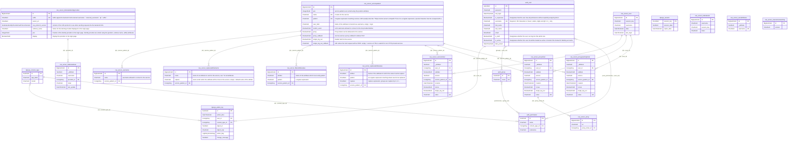

```mermaid
erDiagram
    auth_user ||--o{ django_admin_log : "(id) - (user_id)"
    django_content_type |o--o{ django_admin_log : "(id) - (content_type_id)"
    django_content_type ||--o{ auth_permission : "(id) - (content_type_id)"
    auth_group }o--o{ auth_permission : "(permissions) - (group_set)"
    auth_user }o--o{ auth_group : "(groups) - (user_set)"
    auth_user }o--o{ auth_permission : "(user_permissions) - (user_set)"
    cas_server_federatediendityprovider ||--o{ cas_server_federateduser : "(id) - (provider_id)"
    cas_server_servicepattern ||--o{ cas_server_username : "(id) - (service_pattern_id)"
    cas_server_servicepattern ||--o{ cas_server_replaceattributname : "(id) - (service_pattern_id)"
    cas_server_servicepattern ||--o{ cas_server_filterattributvalue : "(id) - (service_pattern_id)"
    cas_server_servicepattern ||--o{ cas_server_replaceattributvalue : "(id) - (service_pattern_id)"
    cas_server_user ||--o{ cas_server_serviceticket : "(id) - (user_id)"
    cas_server_servicepattern ||--o{ cas_server_serviceticket : "(id) - (service_pattern_id)"
    cas_server_user ||--o{ cas_server_proxyticket : "(id) - (user_id)"
    cas_server_servicepattern ||--o{ cas_server_proxyticket : "(id) - (service_pattern_id)"
    cas_server_user ||--o{ cas_server_proxygrantingticket : "(id) - (user_id)"
    cas_server_servicepattern ||--o{ cas_server_proxygrantingticket : "(id) - (service_pattern_id)"
    cas_server_proxyticket ||--o{ cas_server_proxy : "(id) - (proxy_ticket_id)"
    django_admin_log {
        AutoField id PK
        DateTimeField action_time
        ForeignKey user_id FK
        ForeignKey content_type_id FK
        TextField object_id
        CharField object_repr
        LogEntryActionFlag action_flag
        TextField change_message
    }
    auth_permission {
        AutoField id PK
        CharField name
        ForeignKey content_type_id FK
        CharField codename
    }
    auth_group {
        AutoField id PK
        CharField name UK
    }
    auth_user {
        AutoField id PK
        CharField password
        DateTimeField last_login
        BooleanField is_superuser "Designates that this user has all permissions without explicitly assigning them."
        CharField username UK "Required. 150 characters or fewer. Letters, digits and @/./+/-/_ only."
        CharField first_name
        CharField last_name
        EmailField email
        BooleanField is_staff "Designates whether the user can log into this admin site."
        BooleanField is_active "Designates whether this user should be treated as active. Unselect this instead of deleting accounts."
        DateTimeField date_joined
    }
    django_content_type {
        AutoField id PK
        CharField app_label
        CharField model
    }
    django_session {
        CharField session_key PK
        TextField session_data
        DateTimeField expire_date
    }
    cas_server_federatediendityprovider {
        BigAutoField id PK
        CharField suffix UK "Suffix append to backend CAS returned username: ``returned_username`` @ ``suffix``."
        CharField server_url
        FederatedIendityProviderCasProtocolVersion cas_protocol_version "Version of the CAS protocol to use when sending requests the the backend CAS."
        CharField verbose_name "Name for this identity provider displayed on the login page."
        IntegerField pos "Position of the identity provider on the login page. Identity provider are sorted using the (position, verbose name, suffix) attributes."
        BooleanField display "Display the provider on the login page."
    }
    cas_server_federateduser {
        BigAutoField id PK
        TextField _attributs
        CharField username
        ForeignKey provider_id FK
        CharField ticket
        DateTimeField last_update
    }
    cas_server_federateslo {
        BigAutoField id PK
        CharField username
        CharField session_key
        CharField ticket
    }
    cas_server_userattributes {
        BigAutoField id PK
        TextField _attributs
        CharField username UK
    }
    cas_server_user {
        BigAutoField id PK
        CharField session_key
        CharField username
        DateTimeField date
        DateTimeField last_login
    }
    cas_server_servicepattern {
        BigAutoField id PK
        IntegerField pos "service patterns are sorted using the position attribute"
        CharField name UK "A name for the service"
        CharField pattern UK "A regular expression matching services. Will usually looks like '^https://some\.server\.com/path/.*$'.As it is a regular expression, special character must be escaped with a '\'."
        CharField user_field "Name of the attribute to transmit as username, empty = login"
        BooleanField restrict_users "Limit username allowed to connect to the list provided bellow"
        BooleanField proxy "Proxy tickets can be delivered to the service"
        BooleanField proxy_callback "can be used as a proxy callback to deliver PGT"
        BooleanField single_log_out "Enable SLO for the service"
        CharField single_log_out_callback "URL where the SLO request will be POST. empty = service url This is usefull for non HTTP proxied services."
    }
    cas_server_username {
        BigAutoField id PK
        CharField value "username allowed to connect to the service"
        ForeignKey service_pattern_id FK
    }
    cas_server_replaceattributname {
        BigAutoField id PK
        CharField name "name of an attribute to send to the service, use * for all attributes"
        CharField replace "name under which the attribute will be show to the service. empty = default name of the attribut"
        ForeignKey service_pattern_id FK
    }
    cas_server_filterattributvalue {
        BigAutoField id PK
        CharField attribut "Name of the attribute which must verify pattern"
        CharField pattern "a regular expression"
        ForeignKey service_pattern_id FK
    }
    cas_server_replaceattributvalue {
        BigAutoField id PK
        CharField attribut "Name of the attribute for which the value must be replace"
        CharField pattern "An regular expression maching whats need to be replaced"
        CharField replace "replace expression, groups are capture by \1, \2 …"
        ForeignKey service_pattern_id FK
    }
    cas_server_serviceticket {
        BigAutoField id PK
        TextField _attributs
        ForeignKey user_id FK
        BooleanField validate
        TextField service
        ForeignKey service_pattern_id FK
        DateTimeField creation
        BooleanField renew
        BooleanField single_log_out
        CharField value UK
    }
    cas_server_proxyticket {
        BigAutoField id PK
        TextField _attributs
        ForeignKey user_id FK
        BooleanField validate
        TextField service
        ForeignKey service_pattern_id FK
        DateTimeField creation
        BooleanField renew
        BooleanField single_log_out
        CharField value UK
    }
    cas_server_proxygrantingticket {
        BigAutoField id PK
        TextField _attributs
        ForeignKey user_id FK
        BooleanField validate
        TextField service
        ForeignKey service_pattern_id FK
        DateTimeField creation
        BooleanField renew
        BooleanField single_log_out
        CharField value UK
    }
    cas_server_proxy {
        BigAutoField id PK
        CharField url
        ForeignKey proxy_ticket_id FK
    }
    cas_server_newversionwarning {
        BigAutoField id PK
        CharField version
    }
```
