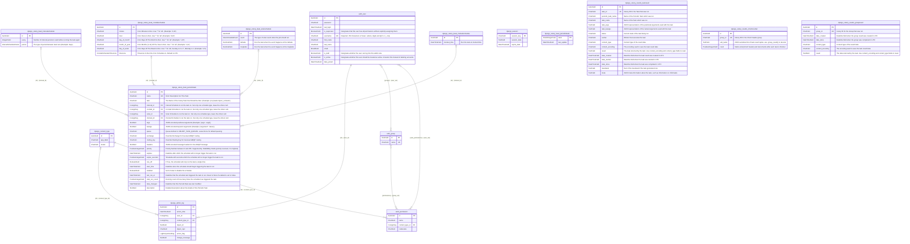

```mermaid
erDiagram
    auth_user ||--o{ django_admin_log : "(id) - (user_id)"
    django_content_type |o--o{ django_admin_log : "(id) - (content_type_id)"
    django_content_type ||--o{ auth_permission : "(id) - (content_type_id)"
    auth_group }o--o{ auth_permission : "(permissions) - (group_set)"
    auth_user }o--o{ auth_group : "(groups) - (user_set)"
    auth_user }o--o{ auth_permission : "(user_permissions) - (user_set)"
    django_celery_beat_intervalschedule |o--o{ django_celery_beat_periodictask : "(id) - (interval_id)"
    django_celery_beat_crontabschedule |o--o{ django_celery_beat_periodictask : "(id) - (crontab_id)"
    django_celery_beat_solarschedule |o--o{ django_celery_beat_periodictask : "(id) - (solar_id)"
    django_celery_beat_clockedschedule |o--o{ django_celery_beat_periodictask : "(id) - (clocked_id)"
    django_admin_log {
        AutoField id PK
        DateTimeField action_time
        ForeignKey user_id FK
        ForeignKey content_type_id FK
        TextField object_id
        CharField object_repr
        LogEntryActionFlag action_flag
        TextField change_message
    }
    auth_permission {
        AutoField id PK
        CharField name
        ForeignKey content_type_id FK
        CharField codename
    }
    auth_group {
        AutoField id PK
        CharField name UK
    }
    auth_user {
        AutoField id PK
        CharField password
        DateTimeField last_login
        BooleanField is_superuser "Designates that this user has all permissions without explicitly assigning them."
        CharField username UK "Required. 150 characters or fewer. Letters, digits and @/./+/-/_ only."
        CharField first_name
        CharField last_name
        EmailField email
        BooleanField is_staff "Designates whether the user can log into this admin site."
        BooleanField is_active "Designates whether this user should be treated as active. Unselect this instead of deleting accounts."
        DateTimeField date_joined
    }
    django_content_type {
        AutoField id PK
        CharField app_label
        CharField model
    }
    django_session {
        CharField session_key PK
        TextField session_data
        DateTimeField expire_date
    }
    django_celery_beat_solarschedule {
        AutoField id PK
        SolarScheduleEvent event "The type of solar event when the job should run"
        DecimalField latitude "Run the task when the event happens at this latitude"
        DecimalField longitude "Run the task when the event happens at this longitude"
    }
    django_celery_beat_intervalschedule {
        AutoField id PK
        IntegerField every "Number of interval periods to wait before running the task again"
        IntervalSchedulePeriod period "The type of period between task runs (Example: days)"
    }
    django_celery_beat_clockedschedule {
        AutoField id PK
        DateTimeField clocked_time "Run the task at clocked time"
    }
    django_celery_beat_crontabschedule {
        AutoField id PK
        CharField minute "Cron Minutes to Run. Use '*' for 'all'. (Example: '0,30')"
        CharField hour "Cron Hours to Run. Use '*' for 'all'. (Example: '8,20')"
        CharField day_of_month "Cron Days Of The Month to Run. Use '*' for 'all'. (Example: '1,15')"
        CharField month_of_year "Cron Months (1-12) Of The Year to Run. Use '*' for 'all'. (Example: '1,12')"
        CharField day_of_week "Cron Days Of The Week to Run. Use '*' for 'all', Sunday is 0 or 7, Monday is 1. (Example: '0,5')"
        CrontabScheduleTimezone timezone "Timezone to Run the Cron Schedule on. Default is UTC."
    }
    django_celery_beat_periodictasks {
        SmallIntegerField ident PK
        DateTimeField last_update
    }
    django_celery_beat_periodictask {
        AutoField id PK
        CharField name UK "Short Description For This Task"
        CharField task "The Name of the Celery Task that Should be Run.  (Example: 'proj.tasks.import_contacts')"
        ForeignKey interval_id FK "Interval Schedule to run the task on.  Set only one schedule type, leave the others null."
        ForeignKey crontab_id FK "Crontab Schedule to run the task on.  Set only one schedule type, leave the others null."
        ForeignKey solar_id FK "Solar Schedule to run the task on.  Set only one schedule type, leave the others null."
        ForeignKey clocked_id FK "Clocked Schedule to run the task on.  Set only one schedule type, leave the others null."
        TextField args "JSON encoded positional arguments (Example: ['arg1', 'arg2'])"
        TextField kwargs "JSON encoded keyword arguments (Example: {'argument': 'value'})"
        CharField queue "Queue defined in CELERY_TASK_QUEUES. Leave None for default queuing."
        CharField exchange "Override Exchange for low-level AMQP routing"
        CharField routing_key "Override Routing Key for low-level AMQP routing"
        TextField headers "JSON encoded message headers for the AMQP message."
        PositiveIntegerField priority "Priority Number between 0 and 255. Supported by: RabbitMQ, Redis (priority reversed, 0 is highest)."
        DateTimeField expires "Datetime after which the schedule will no longer trigger the task to run"
        PositiveIntegerField expire_seconds "Timedelta with seconds which the schedule will no longer trigger the task to run"
        BooleanField one_off "If True, the schedule will only run the task a single time"
        DateTimeField start_time "Datetime when the schedule should begin triggering the task to run"
        BooleanField enabled "Set to False to disable the schedule"
        DateTimeField last_run_at "Datetime that the schedule last triggered the task to run. Reset to None if enabled is set to False."
        PositiveIntegerField total_run_count "Running count of how many times the schedule has triggered the task"
        DateTimeField date_changed "Datetime that this PeriodicTask was last modified"
        TextField description "Detailed description about the details of this Periodic Task"
    }
    django_celery_results_taskresult {
        AutoField id PK
        CharField task_id UK "Celery ID for the Task that was run"
        CharField periodic_task_name "Name of the Periodic Task which was run"
        CharField task_name "Name of the Task which was run"
        TextField task_args "JSON representation of the positional arguments used with the task"
        TextField task_kwargs "JSON representation of the named arguments used with the task"
        CharField status "Current state of the task being run"
        CharField worker "Worker that executes the task"
        CharField content_type "Content type of the result data"
        CharField content_encoding "The encoding used to save the task result data"
        TextField result "The data returned by the task.  Use content_encoding and content_type fields to read."
        DateTimeField date_created "Datetime field when the task result was created in UTC"
        DateTimeField date_started "Datetime field when the task was started in UTC"
        DateTimeField date_done "Datetime field when the task was completed in UTC"
        TextField traceback "Text of the traceback if the task generated one"
        TextField meta "JSON meta information about the task, such as information on child tasks"
    }
    django_celery_results_chordcounter {
        AutoField id PK
        CharField group_id UK "Celery ID for the Chord header group"
        TextField sub_tasks "JSON serialized list of task result tuples. use .group_result() to decode"
        PositiveIntegerField count "Starts at len(chord header) and decrements after each task is finished"
    }
    django_celery_results_groupresult {
        AutoField id PK
        CharField group_id UK "Celery ID for the Group that was run"
        DateTimeField date_created "Datetime field when the group result was created in UTC"
        DateTimeField date_done "Datetime field when the group was completed in UTC"
        CharField content_type "Content type of the result data"
        CharField content_encoding "The encoding used to save the task result data"
        TextField result "The data returned by the task.  Use content_encoding and content_type fields to read."
    }
```
