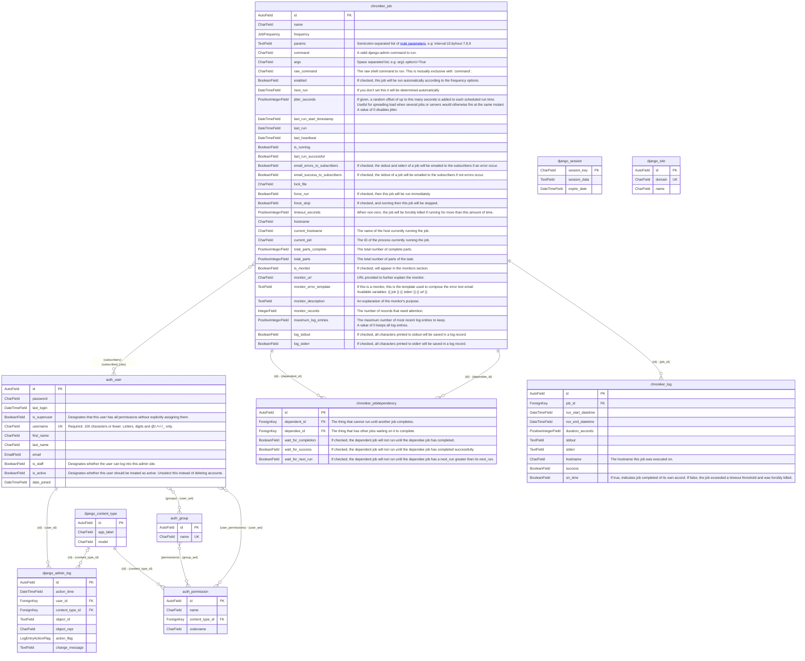

```mermaid
erDiagram
    auth_user ||--o{ django_admin_log : "(id) - (user_id)"
    django_content_type |o--o{ django_admin_log : "(id) - (content_type_id)"
    django_content_type ||--o{ auth_permission : "(id) - (content_type_id)"
    auth_group }o--o{ auth_permission : "(permissions) - (group_set)"
    auth_user }o--o{ auth_group : "(groups) - (user_set)"
    auth_user }o--o{ auth_permission : "(user_permissions) - (user_set)"
    chroniker_job ||--o{ chroniker_jobdependency : "(id) - (dependent_id)"
    chroniker_job ||--o{ chroniker_jobdependency : "(id) - (dependee_id)"
    chroniker_job }o--o{ auth_user : "(subscribers) - (subscribed_jobs)"
    chroniker_job ||--o{ chroniker_log : "(id) - (job_id)"
    django_admin_log {
        AutoField id PK
        DateTimeField action_time
        ForeignKey user_id FK
        ForeignKey content_type_id FK
        TextField object_id
        CharField object_repr
        LogEntryActionFlag action_flag
        TextField change_message
    }
    auth_permission {
        AutoField id PK
        CharField name
        ForeignKey content_type_id FK
        CharField codename
    }
    auth_group {
        AutoField id PK
        CharField name UK
    }
    auth_user {
        AutoField id PK
        CharField password
        DateTimeField last_login
        BooleanField is_superuser "Designates that this user has all permissions without explicitly assigning them."
        CharField username UK "Required. 150 characters or fewer. Letters, digits and @/./+/-/_ only."
        CharField first_name
        CharField last_name
        EmailField email
        BooleanField is_staff "Designates whether the user can log into this admin site."
        BooleanField is_active "Designates whether this user should be treated as active. Unselect this instead of deleting accounts."
        DateTimeField date_joined
    }
    django_content_type {
        AutoField id PK
        CharField app_label
        CharField model
    }
    django_session {
        CharField session_key PK
        TextField session_data
        DateTimeField expire_date
    }
    django_site {
        AutoField id PK
        CharField domain UK
        CharField name
    }
    chroniker_jobdependency {
        AutoField id PK
        ForeignKey dependent_id FK "The thing that cannot run until another job completes."
        ForeignKey dependee_id FK "The thing that has other jobs waiting on it to complete."
        BooleanField wait_for_completion "If checked, the dependent job will not run until the dependee job has completed."
        BooleanField wait_for_success "If checked, the dependent job will not run until the dependee job has completed successfully."
        BooleanField wait_for_next_run "If checked, the dependent job will not run until the dependee job has a next_run greater than its next_run."
    }
    chroniker_job {
        AutoField id PK
        CharField name
        JobFrequency frequency
        TextField params "Semicolon-separated list of <a href='http://labix.org/python-dateutil' target='_blank'>rrule parameters</a>. e.g: interval:15;byhour:7,8,9"
        CharField command "A valid django-admin command to run."
        CharField args "Space separated list; e.g: arg1 option1=True"
        CharField raw_command "The raw shell command to run.             This is mutually exclusive with `command`."
        BooleanField enabled "If checked, this job will be run automatically according             to the frequency options."
        DateTimeField next_run "If you don't set this it will be determined automatically"
        PositiveIntegerField jitter_seconds "If given, a random offset of up to this many seconds is added to each scheduled run time.<br/>Useful for spreading load when several jobs or servers would otherwise fire at the same instant.<br/>A value of 0 disables jitter."
        DateTimeField last_run_start_timestamp
        DateTimeField last_run
        DateTimeField last_heartbeat
        BooleanField is_running
        BooleanField last_run_successful
        BooleanField email_errors_to_subscribers "If checked, the stdout and stderr of a job will be emailed to the subscribers if an error occur."
        BooleanField email_success_to_subscribers "If checked, the stdout of a job will be emailed to the subscribers if not errors occur."
        CharField lock_file
        BooleanField force_run "If checked, then this job will be run immediately."
        BooleanField force_stop "If checked, and running then this job will be stopped."
        PositiveIntegerField timeout_seconds "When non-zero, the job will be forcibly killed if             running for more than this amount of time."
        CharField hostname "<function hostname_help_text_setter at 0xffffa5dba980>"
        CharField current_hostname "The name of the host currently running the job."
        CharField current_pid "The ID of the process currently running the job."
        PositiveIntegerField total_parts_complete "The total number of complete parts."
        PositiveIntegerField total_parts "The total number of parts of the task."
        BooleanField is_monitor "If checked, will appear in the monitors section."
        CharField monitor_url "URL provided to further explain the monitor."
        TextField monitor_error_template "If this is a monitor, this is the template used to compose the error text email.<br/>Available variables: {{ job }} {{ stderr }} {{ url }}"
        TextField monitor_description "An explanation of the monitor's purpose."
        IntegerField monitor_records "The number of records that need attention."
        PositiveIntegerField maximum_log_entries "The maximum number of most recent log entries to keep.<br/>A value of 0 keeps all log entries."
        BooleanField log_stdout "If checked, all characters printed to stdout will be             saved in a log record."
        BooleanField log_stderr "If checked, all characters printed to stderr will be             saved in a log record."
    }
    chroniker_log {
        AutoField id PK
        ForeignKey job_id FK
        DateTimeField run_start_datetime
        DateTimeField run_end_datetime
        PositiveIntegerField duration_seconds
        TextField stdout
        TextField stderr
        CharField hostname "The hostname this job was executed on."
        BooleanField success
        BooleanField on_time "If true, indicates job completed of its own accord.             If false, the job exceeded a timeout threshold and was forcibly             killed."
    }
```
