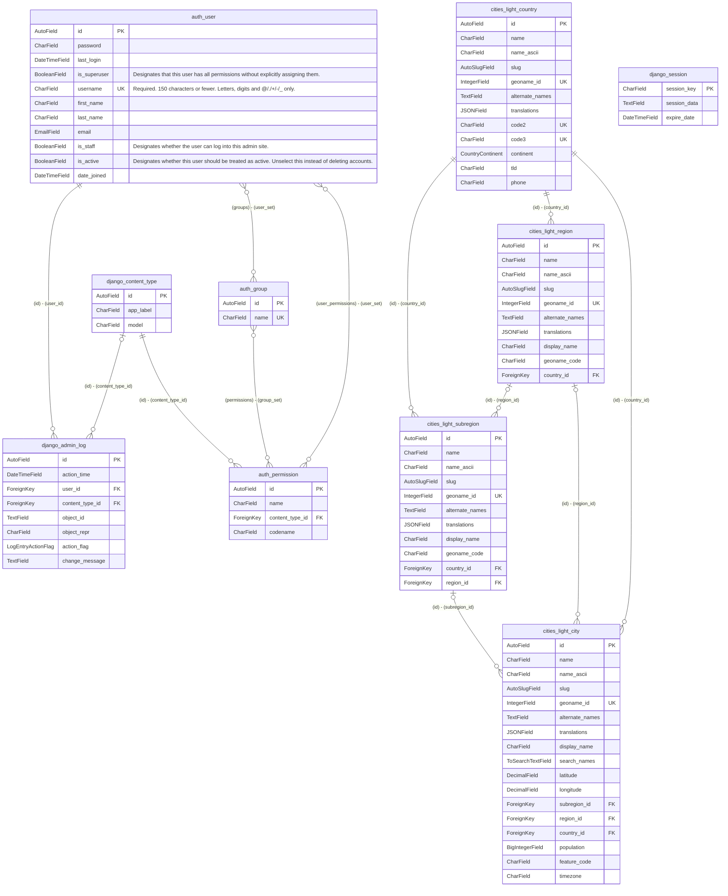

```mermaid
erDiagram
    auth_user ||--o{ django_admin_log : "(id) - (user_id)"
    django_content_type |o--o{ django_admin_log : "(id) - (content_type_id)"
    django_content_type ||--o{ auth_permission : "(id) - (content_type_id)"
    auth_group }o--o{ auth_permission : "(permissions) - (group_set)"
    auth_user }o--o{ auth_group : "(groups) - (user_set)"
    auth_user }o--o{ auth_permission : "(user_permissions) - (user_set)"
    cities_light_country ||--o{ cities_light_region : "(id) - (country_id)"
    cities_light_country ||--o{ cities_light_subregion : "(id) - (country_id)"
    cities_light_region |o--o{ cities_light_subregion : "(id) - (region_id)"
    cities_light_subregion |o--o{ cities_light_city : "(id) - (subregion_id)"
    cities_light_region |o--o{ cities_light_city : "(id) - (region_id)"
    cities_light_country ||--o{ cities_light_city : "(id) - (country_id)"
    django_admin_log {
        AutoField id PK
        DateTimeField action_time
        ForeignKey user_id FK
        ForeignKey content_type_id FK
        TextField object_id
        CharField object_repr
        LogEntryActionFlag action_flag
        TextField change_message
    }
    auth_permission {
        AutoField id PK
        CharField name
        ForeignKey content_type_id FK
        CharField codename
    }
    auth_group {
        AutoField id PK
        CharField name UK
    }
    auth_user {
        AutoField id PK
        CharField password
        DateTimeField last_login
        BooleanField is_superuser "Designates that this user has all permissions without explicitly assigning them."
        CharField username UK "Required. 150 characters or fewer. Letters, digits and @/./+/-/_ only."
        CharField first_name
        CharField last_name
        EmailField email
        BooleanField is_staff "Designates whether the user can log into this admin site."
        BooleanField is_active "Designates whether this user should be treated as active. Unselect this instead of deleting accounts."
        DateTimeField date_joined
    }
    django_content_type {
        AutoField id PK
        CharField app_label
        CharField model
    }
    django_session {
        CharField session_key PK
        TextField session_data
        DateTimeField expire_date
    }
    cities_light_country {
        AutoField id PK
        CharField name
        CharField name_ascii
        AutoSlugField slug
        IntegerField geoname_id UK
        TextField alternate_names
        JSONField translations
        CharField code2 UK
        CharField code3 UK
        CountryContinent continent
        CharField tld
        CharField phone
    }
    cities_light_region {
        AutoField id PK
        CharField name
        CharField name_ascii
        AutoSlugField slug
        IntegerField geoname_id UK
        TextField alternate_names
        JSONField translations
        CharField display_name
        CharField geoname_code
        ForeignKey country_id FK
    }
    cities_light_subregion {
        AutoField id PK
        CharField name
        CharField name_ascii
        AutoSlugField slug
        IntegerField geoname_id UK
        TextField alternate_names
        JSONField translations
        CharField display_name
        CharField geoname_code
        ForeignKey country_id FK
        ForeignKey region_id FK
    }
    cities_light_city {
        AutoField id PK
        CharField name
        CharField name_ascii
        AutoSlugField slug
        IntegerField geoname_id UK
        TextField alternate_names
        JSONField translations
        CharField display_name
        ToSearchTextField search_names
        DecimalField latitude
        DecimalField longitude
        ForeignKey subregion_id FK
        ForeignKey region_id FK
        ForeignKey country_id FK
        BigIntegerField population
        CharField feature_code
        CharField timezone
    }
```
