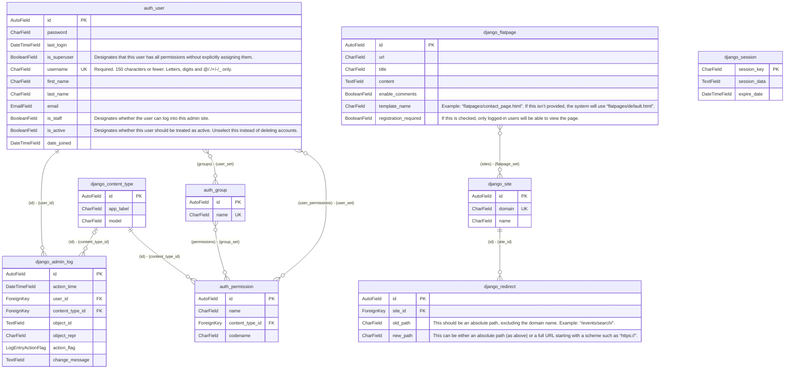

```mermaid
erDiagram
    auth_user ||--o{ django_admin_log : "(id) - (user_id)"
    django_content_type |o--o{ django_admin_log : "(id) - (content_type_id)"
    django_content_type ||--o{ auth_permission : "(id) - (content_type_id)"
    auth_group }o--o{ auth_permission : "(permissions) - (group_set)"
    auth_user }o--o{ auth_group : "(groups) - (user_set)"
    auth_user }o--o{ auth_permission : "(user_permissions) - (user_set)"
    django_flatpage }o--o{ django_site : "(sites) - (flatpage_set)"
    django_site ||--o{ django_redirect : "(id) - (site_id)"
    django_admin_log {
        AutoField id PK
        DateTimeField action_time
        ForeignKey user_id FK
        ForeignKey content_type_id FK
        TextField object_id
        CharField object_repr
        LogEntryActionFlag action_flag
        TextField change_message
    }
    auth_permission {
        AutoField id PK
        CharField name
        ForeignKey content_type_id FK
        CharField codename
    }
    auth_group {
        AutoField id PK
        CharField name UK
    }
    auth_user {
        AutoField id PK
        CharField password
        DateTimeField last_login
        BooleanField is_superuser "Designates that this user has all permissions without explicitly assigning them."
        CharField username UK "Required. 150 characters or fewer. Letters, digits and @/./+/-/_ only."
        CharField first_name
        CharField last_name
        EmailField email
        BooleanField is_staff "Designates whether the user can log into this admin site."
        BooleanField is_active "Designates whether this user should be treated as active. Unselect this instead of deleting accounts."
        DateTimeField date_joined
    }
    django_content_type {
        AutoField id PK
        CharField app_label
        CharField model
    }
    django_session {
        CharField session_key PK
        TextField session_data
        DateTimeField expire_date
    }
    django_site {
        AutoField id PK
        CharField domain UK
        CharField name
    }
    django_flatpage {
        AutoField id PK
        CharField url
        CharField title
        TextField content
        BooleanField enable_comments
        CharField template_name "Example: “flatpages/contact_page.html”. If this isn’t provided, the system will use “flatpages/default.html”."
        BooleanField registration_required "If this is checked, only logged-in users will be able to view the page."
    }
    django_redirect {
        AutoField id PK
        ForeignKey site_id FK
        CharField old_path "This should be an absolute path, excluding the domain name. Example: “/events/search/”."
        CharField new_path "This can be either an absolute path (as above) or a full URL starting with a scheme such as “https://”."
    }
```
