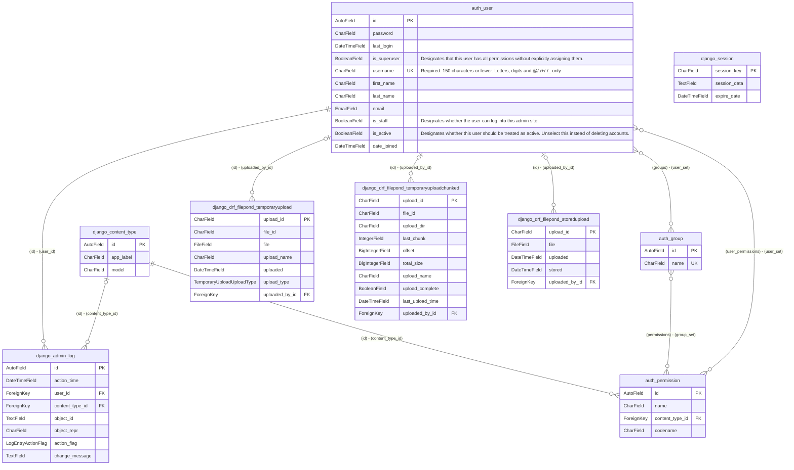

```mermaid
erDiagram
    auth_user ||--o{ django_admin_log : "(id) - (user_id)"
    django_content_type |o--o{ django_admin_log : "(id) - (content_type_id)"
    django_content_type ||--o{ auth_permission : "(id) - (content_type_id)"
    auth_group }o--o{ auth_permission : "(permissions) - (group_set)"
    auth_user }o--o{ auth_group : "(groups) - (user_set)"
    auth_user }o--o{ auth_permission : "(user_permissions) - (user_set)"
    auth_user |o--o{ django_drf_filepond_temporaryupload : "(id) - (uploaded_by_id)"
    auth_user |o--o{ django_drf_filepond_temporaryuploadchunked : "(id) - (uploaded_by_id)"
    auth_user |o--o{ django_drf_filepond_storedupload : "(id) - (uploaded_by_id)"
    django_admin_log {
        AutoField id PK
        DateTimeField action_time
        ForeignKey user_id FK
        ForeignKey content_type_id FK
        TextField object_id
        CharField object_repr
        LogEntryActionFlag action_flag
        TextField change_message
    }
    auth_permission {
        AutoField id PK
        CharField name
        ForeignKey content_type_id FK
        CharField codename
    }
    auth_group {
        AutoField id PK
        CharField name UK
    }
    auth_user {
        AutoField id PK
        CharField password
        DateTimeField last_login
        BooleanField is_superuser "Designates that this user has all permissions without explicitly assigning them."
        CharField username UK "Required. 150 characters or fewer. Letters, digits and @/./+/-/_ only."
        CharField first_name
        CharField last_name
        EmailField email
        BooleanField is_staff "Designates whether the user can log into this admin site."
        BooleanField is_active "Designates whether this user should be treated as active. Unselect this instead of deleting accounts."
        DateTimeField date_joined
    }
    django_content_type {
        AutoField id PK
        CharField app_label
        CharField model
    }
    django_session {
        CharField session_key PK
        TextField session_data
        DateTimeField expire_date
    }
    django_drf_filepond_temporaryupload {
        CharField upload_id PK
        CharField file_id
        FileField file
        CharField upload_name
        DateTimeField uploaded
        TemporaryUploadUploadType upload_type
        ForeignKey uploaded_by_id FK
    }
    django_drf_filepond_temporaryuploadchunked {
        CharField upload_id PK
        CharField file_id
        CharField upload_dir
        IntegerField last_chunk
        BigIntegerField offset
        BigIntegerField total_size
        CharField upload_name
        BooleanField upload_complete
        DateTimeField last_upload_time
        ForeignKey uploaded_by_id FK
    }
    django_drf_filepond_storedupload {
        CharField upload_id PK
        FileField file
        DateTimeField uploaded
        DateTimeField stored
        ForeignKey uploaded_by_id FK
    }
```
