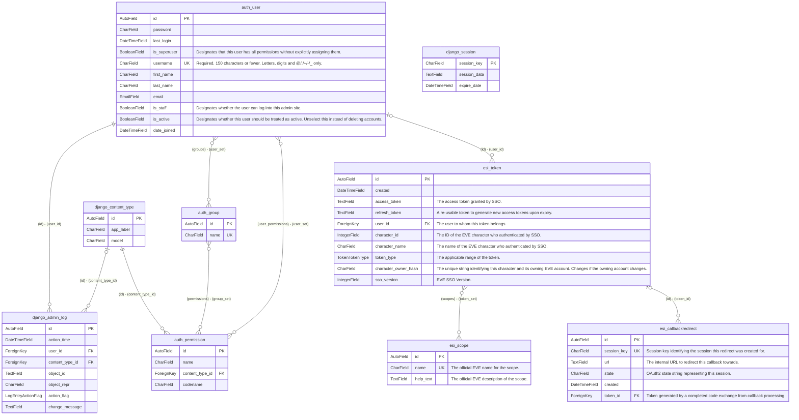

```mermaid
erDiagram
    auth_user ||--o{ django_admin_log : "(id) - (user_id)"
    django_content_type |o--o{ django_admin_log : "(id) - (content_type_id)"
    django_content_type ||--o{ auth_permission : "(id) - (content_type_id)"
    auth_group }o--o{ auth_permission : "(permissions) - (group_set)"
    auth_user }o--o{ auth_group : "(groups) - (user_set)"
    auth_user }o--o{ auth_permission : "(user_permissions) - (user_set)"
    auth_user |o--o{ esi_token : "(id) - (user_id)"
    esi_token }o--o{ esi_scope : "(scopes) - (token_set)"
    esi_token |o--o{ esi_callbackredirect : "(id) - (token_id)"
    django_admin_log {
        AutoField id PK
        DateTimeField action_time
        ForeignKey user_id FK
        ForeignKey content_type_id FK
        TextField object_id
        CharField object_repr
        LogEntryActionFlag action_flag
        TextField change_message
    }
    auth_permission {
        AutoField id PK
        CharField name
        ForeignKey content_type_id FK
        CharField codename
    }
    auth_group {
        AutoField id PK
        CharField name UK
    }
    auth_user {
        AutoField id PK
        CharField password
        DateTimeField last_login
        BooleanField is_superuser "Designates that this user has all permissions without explicitly assigning them."
        CharField username UK "Required. 150 characters or fewer. Letters, digits and @/./+/-/_ only."
        CharField first_name
        CharField last_name
        EmailField email
        BooleanField is_staff "Designates whether the user can log into this admin site."
        BooleanField is_active "Designates whether this user should be treated as active. Unselect this instead of deleting accounts."
        DateTimeField date_joined
    }
    django_content_type {
        AutoField id PK
        CharField app_label
        CharField model
    }
    django_session {
        CharField session_key PK
        TextField session_data
        DateTimeField expire_date
    }
    esi_scope {
        AutoField id PK
        CharField name UK "The official EVE name for the scope."
        TextField help_text "The official EVE description of the scope."
    }
    esi_token {
        AutoField id PK
        DateTimeField created
        TextField access_token "The access token granted by SSO."
        TextField refresh_token "A re-usable token to generate new access tokens upon expiry."
        ForeignKey user_id FK "The user to whom this token belongs."
        IntegerField character_id "The ID of the EVE character who authenticated by SSO."
        CharField character_name "The name of the EVE character who authenticated by SSO."
        TokenTokenType token_type "The applicable range of the token."
        CharField character_owner_hash "The unique string identifying this character and its owning EVE account. Changes if the owning account changes."
        IntegerField sso_version "EVE SSO Version."
    }
    esi_callbackredirect {
        AutoField id PK
        CharField session_key UK "Session key identifying the session this redirect was created for."
        TextField url "The internal URL to redirect this callback towards."
        CharField state "OAuth2 state string representing this session."
        DateTimeField created
        ForeignKey token_id FK "Token generated by a completed code exchange from callback processing."
    }
```
