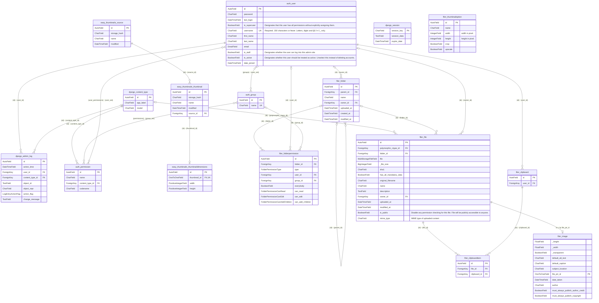

```mermaid
erDiagram
    auth_user ||--o{ django_admin_log : "(id) - (user_id)"
    django_content_type |o--o{ django_admin_log : "(id) - (content_type_id)"
    django_content_type ||--o{ auth_permission : "(id) - (content_type_id)"
    auth_group }o--o{ auth_permission : "(permissions) - (group_set)"
    auth_user }o--o{ auth_group : "(groups) - (user_set)"
    auth_user }o--o{ auth_permission : "(user_permissions) - (user_set)"
    easy_thumbnails_source ||--o{ easy_thumbnails_thumbnail : "(id) - (source_id)"
    easy_thumbnails_thumbnail ||--o| easy_thumbnails_thumbnaildimensions : "(id) - (thumbnail_id)"
    filer_folder |o--o{ filer_folder : "(id) - (parent_id)"
    auth_user |o--o{ filer_folder : "(id) - (owner_id)"
    filer_folder |o--o{ filer_folderpermission : "(id) - (folder_id)"
    auth_user |o--o{ filer_folderpermission : "(id) - (user_id)"
    auth_group |o--o{ filer_folderpermission : "(id) - (group_id)"
    django_content_type |o--o{ filer_file : "(id) - (polymorphic_ctype_id)"
    filer_folder |o--o{ filer_file : "(id) - (folder_id)"
    auth_user |o--o{ filer_file : "(id) - (owner_id)"
    auth_user ||--o{ filer_clipboard : "(id) - (user_id)"
    filer_file ||--o{ filer_clipboarditem : "(id) - (file_id)"
    filer_clipboard ||--o{ filer_clipboarditem : "(id) - (clipboard_id)"
    filer_file ||--o| filer_image : "is a, by file_ptr_id"
    django_admin_log {
        AutoField id PK
        DateTimeField action_time
        ForeignKey user_id FK
        ForeignKey content_type_id FK
        TextField object_id
        CharField object_repr
        LogEntryActionFlag action_flag
        TextField change_message
    }
    auth_permission {
        AutoField id PK
        CharField name
        ForeignKey content_type_id FK
        CharField codename
    }
    auth_group {
        AutoField id PK
        CharField name UK
    }
    auth_user {
        AutoField id PK
        CharField password
        DateTimeField last_login
        BooleanField is_superuser "Designates that this user has all permissions without explicitly assigning them."
        CharField username UK "Required. 150 characters or fewer. Letters, digits and @/./+/-/_ only."
        CharField first_name
        CharField last_name
        EmailField email
        BooleanField is_staff "Designates whether the user can log into this admin site."
        BooleanField is_active "Designates whether this user should be treated as active. Unselect this instead of deleting accounts."
        DateTimeField date_joined
    }
    django_content_type {
        AutoField id PK
        CharField app_label
        CharField model
    }
    django_session {
        CharField session_key PK
        TextField session_data
        DateTimeField expire_date
    }
    easy_thumbnails_source {
        AutoField id PK
        CharField storage_hash
        CharField name
        DateTimeField modified
    }
    easy_thumbnails_thumbnail {
        AutoField id PK
        CharField storage_hash
        CharField name
        DateTimeField modified
        ForeignKey source_id FK
    }
    easy_thumbnails_thumbnaildimensions {
        AutoField id PK
        OneToOneField thumbnail_id FK, UK
        PositiveIntegerField width
        PositiveIntegerField height
    }
    filer_folder {
        AutoField id PK
        ForeignKey parent_id FK
        CharField name
        ForeignKey owner_id FK
        DateTimeField uploaded_at
        DateTimeField created_at
        DateTimeField modified_at
    }
    filer_folderpermission {
        AutoField id PK
        ForeignKey folder_id FK
        FolderPermissionType type
        ForeignKey user_id FK
        ForeignKey group_id FK
        BooleanField everybody
        FolderPermissionCanRead can_read
        FolderPermissionCanEdit can_edit
        FolderPermissionCanAddChildren can_add_children
    }
    filer_file {
        AutoField id PK
        ForeignKey polymorphic_ctype_id FK
        ForeignKey folder_id FK
        MultiStorageFileField file
        BigIntegerField _file_size
        CharField sha1
        BooleanField has_all_mandatory_data
        CharField original_filename
        CharField name
        TextField description
        ForeignKey owner_id FK
        DateTimeField uploaded_at
        DateTimeField modified_at
        BooleanField is_public "Disable any permission checking for this file. File will be publicly accessible to anyone."
        CharField mime_type "MIME type of uploaded content"
    }
    filer_clipboard {
        AutoField id PK
        ForeignKey user_id FK
    }
    filer_clipboarditem {
        AutoField id PK
        ForeignKey file_id FK
        ForeignKey clipboard_id FK
    }
    filer_image {
        FloatField _height
        FloatField _width
        BooleanField _transparent
        CharField default_alt_text
        CharField default_caption
        CharField subject_location
        OneToOneField file_ptr_id PK
        DateTimeField date_taken
        CharField author
        BooleanField must_always_publish_author_credit
        BooleanField must_always_publish_copyright
    }
    filer_thumbnailoption {
        AutoField id PK
        CharField name
        IntegerField width "width in pixel."
        IntegerField height "height in pixel."
        BooleanField crop
        BooleanField upscale
    }
```
