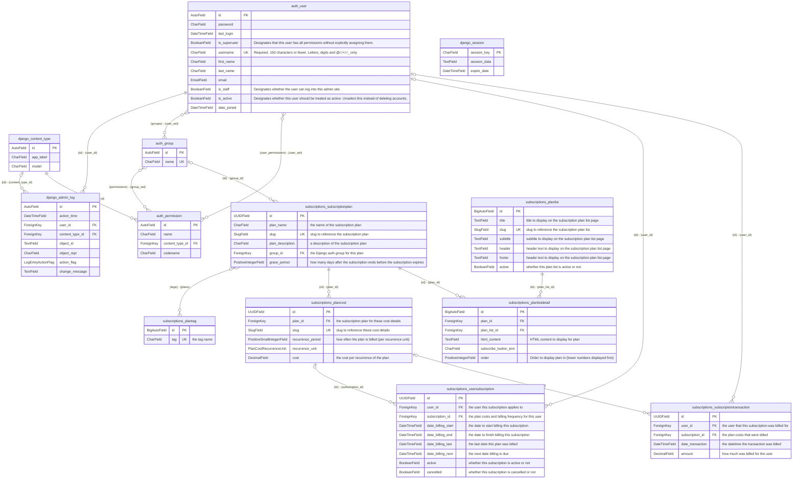

```mermaid
erDiagram
    auth_user ||--o{ django_admin_log : "(id) - (user_id)"
    django_content_type |o--o{ django_admin_log : "(id) - (content_type_id)"
    django_content_type ||--o{ auth_permission : "(id) - (content_type_id)"
    auth_group }o--o{ auth_permission : "(permissions) - (group_set)"
    auth_user }o--o{ auth_group : "(groups) - (user_set)"
    auth_user }o--o{ auth_permission : "(user_permissions) - (user_set)"
    auth_group |o--o{ subscriptions_subscriptionplan : "(id) - (group_id)"
    subscriptions_subscriptionplan }o--o{ subscriptions_plantag : "(tags) - (plans)"
    subscriptions_subscriptionplan ||--o{ subscriptions_plancost : "(id) - (plan_id)"
    auth_user |o--o{ subscriptions_usersubscription : "(id) - (user_id)"
    subscriptions_plancost |o--o{ subscriptions_usersubscription : "(id) - (subscription_id)"
    auth_user |o--o{ subscriptions_subscriptiontransaction : "(id) - (user_id)"
    subscriptions_plancost |o--o{ subscriptions_subscriptiontransaction : "(id) - (subscription_id)"
    subscriptions_subscriptionplan ||--o{ subscriptions_planlistdetail : "(id) - (plan_id)"
    subscriptions_planlist ||--o{ subscriptions_planlistdetail : "(id) - (plan_list_id)"
    django_admin_log {
        AutoField id PK
        DateTimeField action_time
        ForeignKey user_id FK
        ForeignKey content_type_id FK
        TextField object_id
        CharField object_repr
        LogEntryActionFlag action_flag
        TextField change_message
    }
    auth_permission {
        AutoField id PK
        CharField name
        ForeignKey content_type_id FK
        CharField codename
    }
    auth_group {
        AutoField id PK
        CharField name UK
    }
    auth_user {
        AutoField id PK
        CharField password
        DateTimeField last_login
        BooleanField is_superuser "Designates that this user has all permissions without explicitly assigning them."
        CharField username UK "Required. 150 characters or fewer. Letters, digits and @/./+/-/_ only."
        CharField first_name
        CharField last_name
        EmailField email
        BooleanField is_staff "Designates whether the user can log into this admin site."
        BooleanField is_active "Designates whether this user should be treated as active. Unselect this instead of deleting accounts."
        DateTimeField date_joined
    }
    django_content_type {
        AutoField id PK
        CharField app_label
        CharField model
    }
    django_session {
        CharField session_key PK
        TextField session_data
        DateTimeField expire_date
    }
    subscriptions_plantag {
        BigAutoField id PK
        CharField tag UK "the tag name"
    }
    subscriptions_subscriptionplan {
        UUIDField id PK
        CharField plan_name "the name of the subscription plan"
        SlugField slug UK "slug to reference the subscription plan"
        CharField plan_description "a description of the subscription plan"
        ForeignKey group_id FK "the Django auth group for this plan"
        PositiveIntegerField grace_period "how many days after the subscription ends before the subscription expires"
    }
    subscriptions_plancost {
        UUIDField id PK
        ForeignKey plan_id FK "the subscription plan for these cost details"
        SlugField slug UK "slug to reference these cost details"
        PositiveSmallIntegerField recurrence_period "how often the plan is billed (per recurrence unit)"
        PlanCostRecurrenceUnit recurrence_unit
        DecimalField cost "the cost per recurrence of the plan"
    }
    subscriptions_usersubscription {
        UUIDField id PK
        ForeignKey user_id FK "the user this subscription applies to"
        ForeignKey subscription_id FK "the plan costs and billing frequency for this user"
        DateTimeField date_billing_start "the date to start billing this subscription"
        DateTimeField date_billing_end "the date to finish billing this subscription"
        DateTimeField date_billing_last "the last date this plan was billed"
        DateTimeField date_billing_next "the next date billing is due"
        BooleanField active "whether this subscription is active or not"
        BooleanField cancelled "whether this subscription is cancelled or not"
    }
    subscriptions_subscriptiontransaction {
        UUIDField id PK
        ForeignKey user_id FK "the user that this subscription was billed for"
        ForeignKey subscription_id FK "the plan costs that were billed"
        DateTimeField date_transaction "the datetime the transaction was billed"
        DecimalField amount "how much was billed for the user"
    }
    subscriptions_planlist {
        BigAutoField id PK
        TextField title "title to display on the subscription plan list page"
        SlugField slug UK "slug to reference the subscription plan list"
        TextField subtitle "subtitle to display on the subscription plan list page"
        TextField header "header text to display on the subscription plan list page"
        TextField footer "header text to display on the subscription plan list page"
        BooleanField active "whether this plan list is active or not."
    }
    subscriptions_planlistdetail {
        BigAutoField id PK
        ForeignKey plan_id FK
        ForeignKey plan_list_id FK
        TextField html_content "HTML content to display for plan"
        CharField subscribe_button_text
        PositiveIntegerField order "Order to display plan in (lower numbers displayed first)"
    }
```
