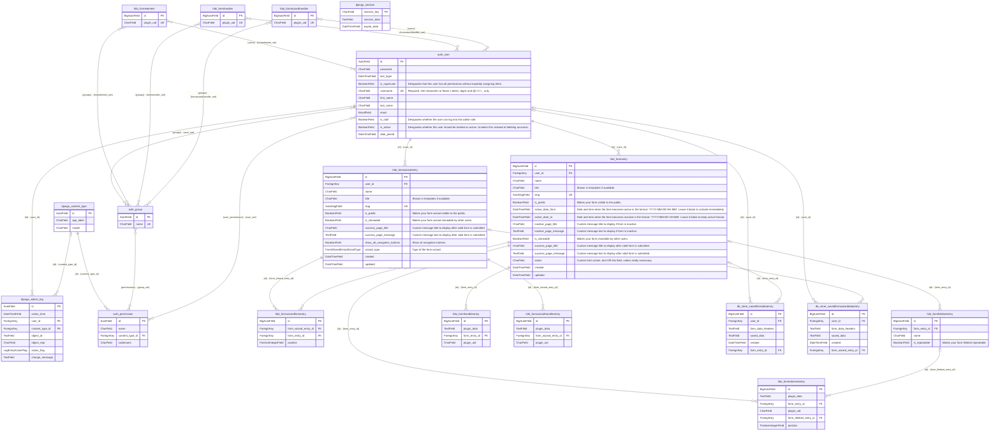

```mermaid
erDiagram
    auth_user ||--o{ django_admin_log : "(id) - (user_id)"
    django_content_type |o--o{ django_admin_log : "(id) - (content_type_id)"
    django_content_type ||--o{ auth_permission : "(id) - (content_type_id)"
    auth_group }o--o{ auth_permission : "(permissions) - (group_set)"
    auth_user }o--o{ auth_group : "(groups) - (user_set)"
    auth_user }o--o{ auth_permission : "(user_permissions) - (user_set)"
    fobi_formelement }o--o{ auth_user : "(users) - (formelement_set)"
    fobi_formelement }o--o{ auth_group : "(groups) - (formelement_set)"
    fobi_formhandler }o--o{ auth_user : "(users) - (formhandler_set)"
    fobi_formhandler }o--o{ auth_group : "(groups) - (formhandler_set)"
    fobi_formwizardhandler }o--o{ auth_user : "(users) - (formwizardhandler_set)"
    fobi_formwizardhandler }o--o{ auth_group : "(groups) - (formwizardhandler_set)"
    auth_user ||--o{ fobi_formwizardentry : "(id) - (user_id)"
    auth_user ||--o{ fobi_formentry : "(id) - (user_id)"
    fobi_formwizardentry ||--o{ fobi_formwizardformentry : "(id) - (form_wizard_entry_id)"
    fobi_formentry ||--o{ fobi_formwizardformentry : "(id) - (form_entry_id)"
    fobi_formentry |o--o{ fobi_formfieldsetentry : "(id) - (form_entry_id)"
    fobi_formentry ||--o{ fobi_formelemententry : "(id) - (form_entry_id)"
    fobi_formfieldsetentry |o--o{ fobi_formelemententry : "(id) - (form_fieldset_entry_id)"
    fobi_formentry ||--o{ fobi_formhandlerentry : "(id) - (form_entry_id)"
    fobi_formwizardentry ||--o{ fobi_formwizardhandlerentry : "(id) - (form_wizard_entry_id)"
    auth_user |o--o{ db_store_savedformdataentry : "(id) - (user_id)"
    fobi_formentry |o--o{ db_store_savedformdataentry : "(id) - (form_entry_id)"
    auth_user |o--o{ db_store_savedformwizarddataentry : "(id) - (user_id)"
    fobi_formwizardentry |o--o{ db_store_savedformwizarddataentry : "(id) - (form_wizard_entry_id)"
    django_admin_log {
        AutoField id PK
        DateTimeField action_time
        ForeignKey user_id FK
        ForeignKey content_type_id FK
        TextField object_id
        CharField object_repr
        LogEntryActionFlag action_flag
        TextField change_message
    }
    auth_permission {
        AutoField id PK
        CharField name
        ForeignKey content_type_id FK
        CharField codename
    }
    auth_group {
        AutoField id PK
        CharField name UK
    }
    auth_user {
        AutoField id PK
        CharField password
        DateTimeField last_login
        BooleanField is_superuser "Designates that this user has all permissions without explicitly assigning them."
        CharField username UK "Required. 150 characters or fewer. Letters, digits and @/./+/-/_ only."
        CharField first_name
        CharField last_name
        EmailField email
        BooleanField is_staff "Designates whether the user can log into this admin site."
        BooleanField is_active "Designates whether this user should be treated as active. Unselect this instead of deleting accounts."
        DateTimeField date_joined
    }
    django_content_type {
        AutoField id PK
        CharField app_label
        CharField model
    }
    django_session {
        CharField session_key PK
        TextField session_data
        DateTimeField expire_date
    }
    fobi_formelement {
        BigAutoField id PK
        CharField plugin_uid UK
    }
    fobi_formhandler {
        BigAutoField id PK
        CharField plugin_uid UK
    }
    fobi_formwizardhandler {
        BigAutoField id PK
        CharField plugin_uid UK
    }
    fobi_formwizardentry {
        BigAutoField id PK
        ForeignKey user_id FK
        CharField name
        CharField title "Shown in templates if available."
        AutoSlugField slug UK
        BooleanField is_public "Makes your form wizard visible to the public."
        BooleanField is_cloneable "Makes your form wizard cloneable by other users."
        CharField success_page_title "Custom message title to display after valid form is submitted"
        TextField success_page_message "Custom message text to display after valid form is submitted"
        BooleanField show_all_navigation_buttons "Show all navigation buttons."
        FormWizardEntryWizardType wizard_type "Type of the form wizard."
        DateTimeField created
        DateTimeField updated
    }
    fobi_formentry {
        BigAutoField id PK
        ForeignKey user_id FK
        CharField name
        CharField title "Shown in templates if available."
        AutoSlugField slug UK
        BooleanField is_public "Makes your form visible to the public."
        DateTimeField active_date_from "Date and time when the form becomes active in the format: 'YYYY-MM-DD HH:MM'. Leave it blank to activate immediately."
        DateTimeField active_date_to "Date and time when the form becomes inactive in the format: 'YYYY-MM-DD HH:MM'. Leave it blank to keep active forever."
        CharField inactive_page_title "Custom message title to display if form is inactive."
        TextField inactive_page_message "Custom message text to display if form is inactive."
        BooleanField is_cloneable "Makes your form cloneable by other users."
        CharField success_page_title "Custom message title to display after valid form is submitted"
        TextField success_page_message "Custom message text to display after valid form is submitted"
        CharField action "Custom form action; don't fill this field, unless really necessary."
        DateTimeField created
        DateTimeField updated
    }
    fobi_formwizardformentry {
        BigAutoField id PK
        ForeignKey form_wizard_entry_id FK
        ForeignKey form_entry_id FK
        PositiveIntegerField position
    }
    fobi_formfieldsetentry {
        BigAutoField id PK
        ForeignKey form_entry_id FK
        CharField name
        BooleanField is_repeatable "Makes your form fieldset repeatable."
    }
    fobi_formelemententry {
        BigAutoField id PK
        TextField plugin_data
        ForeignKey form_entry_id FK
        CharField plugin_uid
        ForeignKey form_fieldset_entry_id FK
        PositiveIntegerField position
    }
    fobi_formhandlerentry {
        BigAutoField id PK
        TextField plugin_data
        ForeignKey form_entry_id FK
        CharField plugin_uid
    }
    fobi_formwizardhandlerentry {
        BigAutoField id PK
        TextField plugin_data
        ForeignKey form_wizard_entry_id FK
        CharField plugin_uid
    }
    db_store_savedformdataentry {
        BigAutoField id PK
        ForeignKey user_id FK
        TextField form_data_headers
        TextField saved_data
        DateTimeField created
        ForeignKey form_entry_id FK
    }
    db_store_savedformwizarddataentry {
        BigAutoField id PK
        ForeignKey user_id FK
        TextField form_data_headers
        TextField saved_data
        DateTimeField created
        ForeignKey form_wizard_entry_id FK
    }
```
