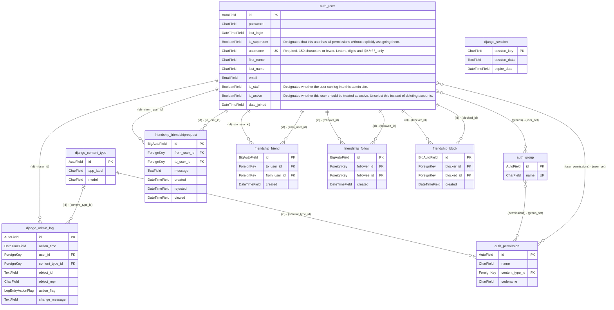

```mermaid
erDiagram
    auth_user ||--o{ django_admin_log : "(id) - (user_id)"
    django_content_type |o--o{ django_admin_log : "(id) - (content_type_id)"
    django_content_type ||--o{ auth_permission : "(id) - (content_type_id)"
    auth_group }o--o{ auth_permission : "(permissions) - (group_set)"
    auth_user }o--o{ auth_group : "(groups) - (user_set)"
    auth_user }o--o{ auth_permission : "(user_permissions) - (user_set)"
    auth_user ||--o{ friendship_friendshiprequest : "(id) - (from_user_id)"
    auth_user ||--o{ friendship_friendshiprequest : "(id) - (to_user_id)"
    auth_user ||--o{ friendship_friend : "(id) - (to_user_id)"
    auth_user ||--o{ friendship_friend : "(id) - (from_user_id)"
    auth_user ||--o{ friendship_follow : "(id) - (follower_id)"
    auth_user ||--o{ friendship_follow : "(id) - (followee_id)"
    auth_user ||--o{ friendship_block : "(id) - (blocker_id)"
    auth_user ||--o{ friendship_block : "(id) - (blocked_id)"
    django_admin_log {
        AutoField id PK
        DateTimeField action_time
        ForeignKey user_id FK
        ForeignKey content_type_id FK
        TextField object_id
        CharField object_repr
        LogEntryActionFlag action_flag
        TextField change_message
    }
    auth_permission {
        AutoField id PK
        CharField name
        ForeignKey content_type_id FK
        CharField codename
    }
    auth_group {
        AutoField id PK
        CharField name UK
    }
    auth_user {
        AutoField id PK
        CharField password
        DateTimeField last_login
        BooleanField is_superuser "Designates that this user has all permissions without explicitly assigning them."
        CharField username UK "Required. 150 characters or fewer. Letters, digits and @/./+/-/_ only."
        CharField first_name
        CharField last_name
        EmailField email
        BooleanField is_staff "Designates whether the user can log into this admin site."
        BooleanField is_active "Designates whether this user should be treated as active. Unselect this instead of deleting accounts."
        DateTimeField date_joined
    }
    django_content_type {
        AutoField id PK
        CharField app_label
        CharField model
    }
    django_session {
        CharField session_key PK
        TextField session_data
        DateTimeField expire_date
    }
    friendship_friendshiprequest {
        BigAutoField id PK
        ForeignKey from_user_id FK
        ForeignKey to_user_id FK
        TextField message
        DateTimeField created
        DateTimeField rejected
        DateTimeField viewed
    }
    friendship_friend {
        BigAutoField id PK
        ForeignKey to_user_id FK
        ForeignKey from_user_id FK
        DateTimeField created
    }
    friendship_follow {
        BigAutoField id PK
        ForeignKey follower_id FK
        ForeignKey followee_id FK
        DateTimeField created
    }
    friendship_block {
        BigAutoField id PK
        ForeignKey blocker_id FK
        ForeignKey blocked_id FK
        DateTimeField created
    }
```
