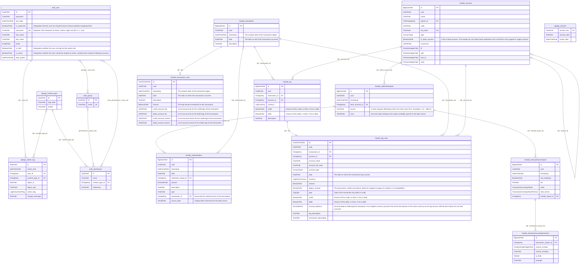

```mermaid
erDiagram
    auth_user ||--o{ django_admin_log : "(id) - (user_id)"
    django_content_type |o--o{ django_admin_log : "(id) - (content_type_id)"
    django_content_type ||--o{ auth_permission : "(id) - (content_type_id)"
    auth_group }o--o{ auth_permission : "(permissions) - (group_set)"
    auth_user }o--o{ auth_group : "(groups) - (user_set)"
    auth_user }o--o{ auth_permission : "(user_permissions) - (user_set)"
    hordak_account |o--o{ hordak_account : "(id) - (parent_id)"
    hordak_transaction ||--o{ hordak_leg : "(id) - (transaction_id)"
    hordak_account ||--o{ hordak_leg : "(id) - (account_id)"
    hordak_account ||--o{ hordak_statementimport : "(id) - (bank_account_id)"
    hordak_statementimport ||--o{ hordak_statementline : "(id) - (statement_import_id)"
    hordak_transaction |o--o{ hordak_statementline : "(id) - (transaction_id)"
    hordak_leg ||--o| hordak_leg_view : "(id) - (id)"
    hordak_transaction ||--o{ hordak_leg_view : "(id) - (transaction_id)"
    hordak_account ||--o{ hordak_leg_view : "(id) - (account_id)"
    hordak_transaction ||--o| hordak_transaction_view : "(id) - (id)"
    hordak_statementimport ||--o{ hordak_transactioncsvimport : "(id) - (hordak_import_id)"
    hordak_transactioncsvimport ||--o{ hordak_transactioncsvimportcolumn : "(id) - (transaction_import_id)"
    django_admin_log {
        AutoField id PK
        DateTimeField action_time
        ForeignKey user_id FK
        ForeignKey content_type_id FK
        TextField object_id
        CharField object_repr
        LogEntryActionFlag action_flag
        TextField change_message
    }
    auth_permission {
        AutoField id PK
        CharField name
        ForeignKey content_type_id FK
        CharField codename
    }
    auth_group {
        AutoField id PK
        CharField name UK
    }
    auth_user {
        AutoField id PK
        CharField password
        DateTimeField last_login
        BooleanField is_superuser "Designates that this user has all permissions without explicitly assigning them."
        CharField username UK "Required. 150 characters or fewer. Letters, digits and @/./+/-/_ only."
        CharField first_name
        CharField last_name
        EmailField email
        BooleanField is_staff "Designates whether the user can log into this admin site."
        BooleanField is_active "Designates whether this user should be treated as active. Unselect this instead of deleting accounts."
        DateTimeField date_joined
    }
    django_content_type {
        AutoField id PK
        CharField app_label
        CharField model
    }
    django_session {
        CharField session_key PK
        TextField session_data
        DateTimeField expire_date
    }
    hordak_account {
        BigAutoField id PK
        UUIDField uuid
        CharField name
        TreeForeignKey parent_id FK
        CharField code
        CharField full_code UK
        AccountType type
        BooleanField is_bank_account "Is this a bank account. This implies we can import bank statements into it and that it only supports a single currency"
        JSONField currencies
        PositiveIntegerField lft
        PositiveIntegerField rght
        PositiveIntegerField tree_id
        PositiveIntegerField level
    }
    hordak_transaction {
        BigAutoField id PK
        UUIDField uuid
        DateTimeField timestamp "The creation date of this transaction object"
        DateField date "The date on which this transaction occurred"
        TextField description
    }
    hordak_leg {
        BigAutoField id PK
        UUIDField uuid
        ForeignKey transaction_id FK
        ForeignKey account_id FK
        LegCurrency currency
        MoneyField credit "Amount of this credit, or NULL if not a credit"
        MoneyField debit "Amount of this debit, or NULL if not a debit"
        TextField description
    }
    hordak_statementimport {
        BigAutoField id PK
        UUIDField uuid
        DateTimeField timestamp
        ForeignKey bank_account_id FK
        CharField source "A value uniquely identifying where this data came from. Examples: 'csv', 'teller.io'."
        JSONField extra "Any extra data relating to the import, probably specific to the data source."
    }
    hordak_statementline {
        BigAutoField id PK
        UUIDField uuid
        DateTimeField timestamp
        DateField date
        ForeignKey statement_import_id FK
        DecimalField amount
        TextField description
        CharField type
        ForeignKey transaction_id FK "Reconcile this statement line to this transaction"
        JSONField source_data "Original data received from the data source."
    }
    hordak_leg_view {
        OneToOneField id PK
        UUIDField uuid
        ForeignKey transaction_id FK
        ForeignKey account_id FK
        CharField account_name
        CharField account_full_code
        AccountType account_type
        DateField date "The date on which this transaction leg occurred"
        LegViewCurrency currency
        MoneyField amount
        MoneyField legacy_amount "The leg amount, credits are positive, debit are negative (Legacy for Hordak 1.0 compatability)"
        LegType type "Type of this transaction leg: debit or credit"
        MoneyField credit "Amount of this credit, or NULL if not a credit"
        MoneyField debit "Amount of this debit, or NULL if not a debit"
        DecimalField account_balance "Account balance following this transaction. For multiple-currency accounts this will be the balance of the same currency as the leg amount. Will be NULL/None for non-leaf accounts."
        TextField leg_description
        TextField transaction_description
    }
    hordak_transaction_view {
        OneToOneField id PK
        UUIDField uuid
        DateTimeField timestamp "The creation date of this transaction object"
        DateField date "The date on which this transaction occurred"
        TextField description
        BalanceField amount "The total amount transferred in this transaction"
        JSONField credit_account_ids "List of account ids for the credit legs of this transaction"
        JSONField debit_account_ids "List of account ids for the debit legs of this transaction"
        JSONField credit_account_names "List of account names for the credit legs of this transaction"
        JSONField debit_account_names "List of account names for the debit legs of this transaction"
    }
    hordak_transactioncsvimport {
        BigAutoField id PK
        UUIDField uuid
        DateTimeField timestamp
        BooleanField has_headings
        FileField file
        TransactionCsvImportState state
        TransactionCsvImportDateFormat date_format
        ForeignKey hordak_import_id FK
    }
    hordak_transactioncsvimportcolumn {
        BigAutoField id PK
        ForeignKey transaction_import_id FK
        PositiveSmallIntegerField column_number
        CharField column_heading
        ToField to_field
        CharField example
    }
```
