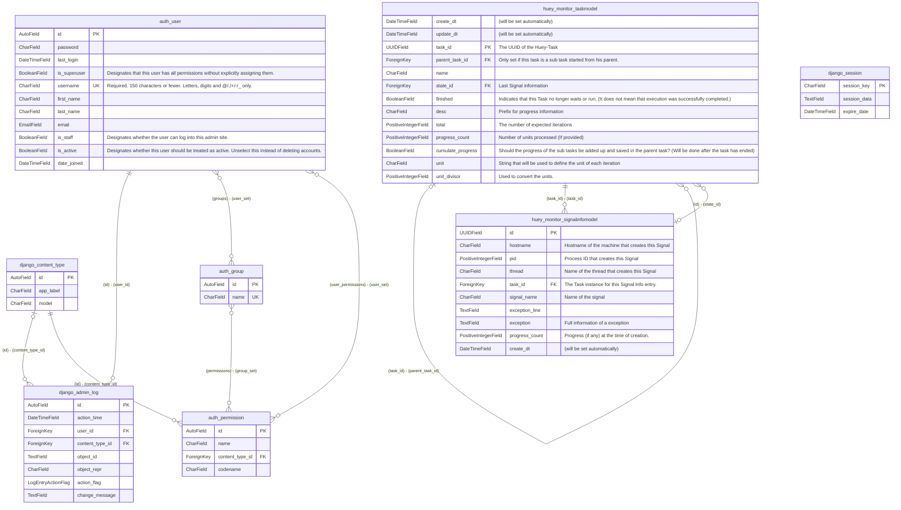

```mermaid
erDiagram
    auth_user ||--o{ django_admin_log : "(id) - (user_id)"
    django_content_type |o--o{ django_admin_log : "(id) - (content_type_id)"
    django_content_type ||--o{ auth_permission : "(id) - (content_type_id)"
    auth_group }o--o{ auth_permission : "(permissions) - (group_set)"
    auth_user }o--o{ auth_group : "(groups) - (user_set)"
    auth_user }o--o{ auth_permission : "(user_permissions) - (user_set)"
    huey_monitor_taskmodel |o--o{ huey_monitor_taskmodel : "(task_id) - (parent_task_id)"
    huey_monitor_signalinfomodel |o--o{ huey_monitor_taskmodel : "(id) - (state_id)"
    huey_monitor_taskmodel ||--o{ huey_monitor_signalinfomodel : "(task_id) - (task_id)"
    django_admin_log {
        AutoField id PK
        DateTimeField action_time
        ForeignKey user_id FK
        ForeignKey content_type_id FK
        TextField object_id
        CharField object_repr
        LogEntryActionFlag action_flag
        TextField change_message
    }
    auth_permission {
        AutoField id PK
        CharField name
        ForeignKey content_type_id FK
        CharField codename
    }
    auth_group {
        AutoField id PK
        CharField name UK
    }
    auth_user {
        AutoField id PK
        CharField password
        DateTimeField last_login
        BooleanField is_superuser "Designates that this user has all permissions without explicitly assigning them."
        CharField username UK "Required. 150 characters or fewer. Letters, digits and @/./+/-/_ only."
        CharField first_name
        CharField last_name
        EmailField email
        BooleanField is_staff "Designates whether the user can log into this admin site."
        BooleanField is_active "Designates whether this user should be treated as active. Unselect this instead of deleting accounts."
        DateTimeField date_joined
    }
    django_content_type {
        AutoField id PK
        CharField app_label
        CharField model
    }
    django_session {
        CharField session_key PK
        TextField session_data
        DateTimeField expire_date
    }
    huey_monitor_taskmodel {
        DateTimeField create_dt "(will be set automatically)"
        DateTimeField update_dt "(will be set automatically)"
        UUIDField task_id PK "The UUID of the Huey-Task"
        ForeignKey parent_task_id FK "Only set if this task is a sub task started from his parent."
        CharField name
        ForeignKey state_id FK "Last Signal information"
        BooleanField finished "Indicates that this Task no longer waits or run. (It does not mean that execution was successfully completed.)"
        CharField desc "Prefix for progress information"
        PositiveIntegerField total "The number of expected iterations"
        PositiveIntegerField progress_count "Number of units processed (If provided)"
        BooleanField cumulate_progress "Should the progress of the sub tasks be added up and saved in the parent task? (Will be done after the task has ended)"
        CharField unit "String that will be used to define the unit of each iteration"
        PositiveIntegerField unit_divisor "Used to convert the units."
    }
    huey_monitor_signalinfomodel {
        UUIDField id PK
        CharField hostname "Hostname of the machine that creates this Signal"
        PositiveIntegerField pid "Process ID that creates this Signal"
        CharField thread "Name of the thread that creates this Signal"
        ForeignKey task_id FK "The Task instance for this Signal Info entry."
        CharField signal_name "Name of the signal"
        TextField exception_line
        TextField exception "Full information of a exception"
        PositiveIntegerField progress_count "Progress (if any) at the time of creation."
        DateTimeField create_dt "(will be set automatically)"
    }
```
