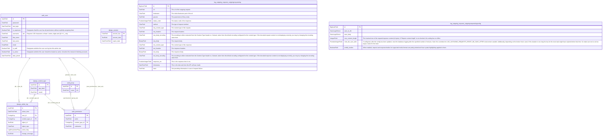

```mermaid
erDiagram
    auth_user ||--o{ django_admin_log : "(id) - (user_id)"
    django_content_type |o--o{ django_admin_log : "(id) - (content_type_id)"
    django_content_type ||--o{ auth_permission : "(id) - (content_type_id)"
    auth_group }o--o{ auth_permission : "(permissions) - (group_set)"
    auth_user }o--o{ auth_group : "(groups) - (user_set)"
    auth_user }o--o{ auth_permission : "(user_permissions) - (user_set)"
    django_admin_log {
        AutoField id PK
        DateTimeField action_time
        ForeignKey user_id FK
        ForeignKey content_type_id FK
        TextField object_id
        CharField object_repr
        LogEntryActionFlag action_flag
        TextField change_message
    }
    auth_permission {
        AutoField id PK
        CharField name
        ForeignKey content_type_id FK
        CharField codename
    }
    auth_group {
        AutoField id PK
        CharField name UK
    }
    auth_user {
        AutoField id PK
        CharField password
        DateTimeField last_login
        BooleanField is_superuser "Designates that this user has all permissions without explicitly assigning them."
        CharField username UK "Required. 150 characters or fewer. Letters, digits and @/./+/-/_ only."
        CharField first_name
        CharField last_name
        EmailField email
        BooleanField is_staff "Designates whether the user can log into this admin site."
        BooleanField is_active "Designates whether this user should be treated as active. Unselect this instead of deleting accounts."
        DateTimeField date_joined
    }
    django_content_type {
        AutoField id PK
        CharField app_label
        CharField model
    }
    django_session {
        CharField session_key PK
        TextField session_data
        DateTimeField expire_date
    }
    log_outgoing_requests_outgoingrequestslog {
        BigAutoField id PK
        TextField url "The url of the outgoing request."
        CharField hostname "The netloc/hostname part of the url."
        TextField params "The parameters (if they exist)."
        PositiveIntegerField status_code "The status code of the response."
        CharField method "The type of request method."
        CharField req_content_type "The content type of the request."
        TextField req_headers "The request headers."
        CharField req_body_encoding "The encoding is either extracted from the Content-Type header or, if absent, taken from the default encoding configured for the content type. If the decoded request content is not displaying correctly, you may try changing the encoding value here."
        BinaryField req_body "The request body."
        CharField res_content_type "The content type of the response."
        TextField res_headers "The response headers."
        BinaryField res_body "The response body."
        CharField res_body_encoding "The encoding is either extracted from the Content-Type header or, if absent, taken from the default encoding configured for the content type. If the decoded response content is not displaying correctly, you may try changing the encoding value here."
        PositiveIntegerField response_ms "This is the response time in ms."
        DateTimeField timestamp "This is the date and time the API call was made."
        TextField trace "Text providing information in case of request failure."
    }
    log_outgoing_requests_outgoingrequestslogconfig {
        BigAutoField id PK
        SaveLogsChoice save_to_db
        SaveLogsChoice save_body
        IntegerField max_content_length "The maximal size of the request/response content (in bytes). If 'Require content length' is not checked, this setting has no effect."
        PositiveIntegerField reset_db_save_after "If configured, after the config has been updated, reset the database logging after the specified number of minutes. Note: this overrides the LOG_OUTGOING_REQUESTS_RESET_DB_SAVE_AFTER environment variable. Additionally, depending on the broker that is used, if this duration is too long the key for the reset task might have expired before that time. So make sure not to set too large a value for the reset."
        BooleanField prettify_bodies "When enabled, request and response bodies for supported media formats are pretty printed and have syntax highlighting applied to them."
    }
```
