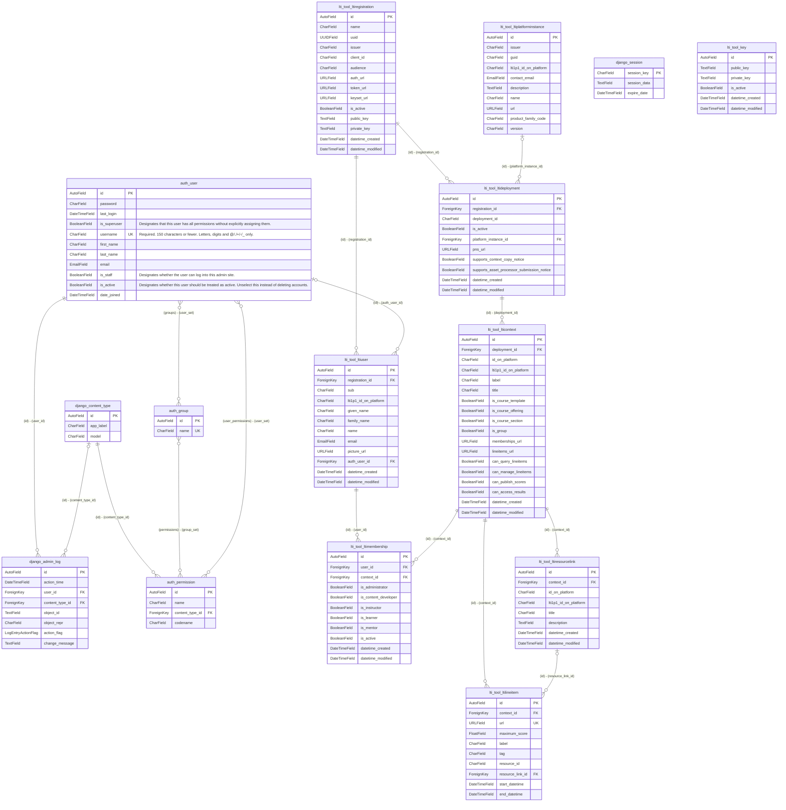

```mermaid
erDiagram
    auth_user ||--o{ django_admin_log : "(id) - (user_id)"
    django_content_type |o--o{ django_admin_log : "(id) - (content_type_id)"
    django_content_type ||--o{ auth_permission : "(id) - (content_type_id)"
    auth_group }o--o{ auth_permission : "(permissions) - (group_set)"
    auth_user }o--o{ auth_group : "(groups) - (user_set)"
    auth_user }o--o{ auth_permission : "(user_permissions) - (user_set)"
    lti_tool_ltiregistration ||--o{ lti_tool_ltideployment : "(id) - (registration_id)"
    lti_tool_ltiplatforminstance |o--o{ lti_tool_ltideployment : "(id) - (platform_instance_id)"
    lti_tool_ltiregistration ||--o{ lti_tool_ltiuser : "(id) - (registration_id)"
    auth_user |o--o{ lti_tool_ltiuser : "(id) - (auth_user_id)"
    lti_tool_ltideployment ||--o{ lti_tool_lticontext : "(id) - (deployment_id)"
    lti_tool_ltiuser ||--o{ lti_tool_ltimembership : "(id) - (user_id)"
    lti_tool_lticontext ||--o{ lti_tool_ltimembership : "(id) - (context_id)"
    lti_tool_lticontext ||--o{ lti_tool_ltiresourcelink : "(id) - (context_id)"
    lti_tool_lticontext ||--o{ lti_tool_ltilineitem : "(id) - (context_id)"
    lti_tool_ltiresourcelink |o--o{ lti_tool_ltilineitem : "(id) - (resource_link_id)"
    django_admin_log {
        AutoField id PK
        DateTimeField action_time
        ForeignKey user_id FK
        ForeignKey content_type_id FK
        TextField object_id
        CharField object_repr
        LogEntryActionFlag action_flag
        TextField change_message
    }
    auth_permission {
        AutoField id PK
        CharField name
        ForeignKey content_type_id FK
        CharField codename
    }
    auth_group {
        AutoField id PK
        CharField name UK
    }
    auth_user {
        AutoField id PK
        CharField password
        DateTimeField last_login
        BooleanField is_superuser "Designates that this user has all permissions without explicitly assigning them."
        CharField username UK "Required. 150 characters or fewer. Letters, digits and @/./+/-/_ only."
        CharField first_name
        CharField last_name
        EmailField email
        BooleanField is_staff "Designates whether the user can log into this admin site."
        BooleanField is_active "Designates whether this user should be treated as active. Unselect this instead of deleting accounts."
        DateTimeField date_joined
    }
    django_content_type {
        AutoField id PK
        CharField app_label
        CharField model
    }
    django_session {
        CharField session_key PK
        TextField session_data
        DateTimeField expire_date
    }
    lti_tool_key {
        AutoField id PK
        TextField public_key
        TextField private_key
        BooleanField is_active
        DateTimeField datetime_created
        DateTimeField datetime_modified
    }
    lti_tool_ltiregistration {
        AutoField id PK
        CharField name
        UUIDField uuid
        CharField issuer
        CharField client_id
        CharField audience
        URLField auth_url
        URLField token_url
        URLField keyset_url
        BooleanField is_active
        TextField public_key
        TextField private_key
        DateTimeField datetime_created
        DateTimeField datetime_modified
    }
    lti_tool_ltiplatforminstance {
        AutoField id PK
        CharField issuer
        CharField guid
        CharField lti1p1_id_on_platform
        EmailField contact_email
        TextField description
        CharField name
        URLField url
        CharField product_family_code
        CharField version
    }
    lti_tool_ltideployment {
        AutoField id PK
        ForeignKey registration_id FK
        CharField deployment_id
        BooleanField is_active
        ForeignKey platform_instance_id FK
        URLField pns_url
        BooleanField supports_context_copy_notice
        BooleanField supports_asset_processor_submission_notice
        DateTimeField datetime_created
        DateTimeField datetime_modified
    }
    lti_tool_ltiuser {
        AutoField id PK
        ForeignKey registration_id FK
        CharField sub
        CharField lti1p1_id_on_platform
        CharField given_name
        CharField family_name
        CharField name
        EmailField email
        URLField picture_url
        ForeignKey auth_user_id FK
        DateTimeField datetime_created
        DateTimeField datetime_modified
    }
    lti_tool_lticontext {
        AutoField id PK
        ForeignKey deployment_id FK
        CharField id_on_platform
        CharField lti1p1_id_on_platform
        CharField label
        CharField title
        BooleanField is_course_template
        BooleanField is_course_offering
        BooleanField is_course_section
        BooleanField is_group
        URLField memberships_url
        URLField lineitems_url
        BooleanField can_query_lineitems
        BooleanField can_manage_lineitems
        BooleanField can_publish_scores
        BooleanField can_access_results
        DateTimeField datetime_created
        DateTimeField datetime_modified
    }
    lti_tool_ltimembership {
        AutoField id PK
        ForeignKey user_id FK
        ForeignKey context_id FK
        BooleanField is_administrator
        BooleanField is_content_developer
        BooleanField is_instructor
        BooleanField is_learner
        BooleanField is_mentor
        BooleanField is_active
        DateTimeField datetime_created
        DateTimeField datetime_modified
    }
    lti_tool_ltiresourcelink {
        AutoField id PK
        ForeignKey context_id FK
        CharField id_on_platform
        CharField lti1p1_id_on_platform
        CharField title
        TextField description
        DateTimeField datetime_created
        DateTimeField datetime_modified
    }
    lti_tool_ltilineitem {
        AutoField id PK
        ForeignKey context_id FK
        URLField url UK
        FloatField maximum_score
        CharField label
        CharField tag
        CharField resource_id
        ForeignKey resource_link_id FK
        DateTimeField start_datetime
        DateTimeField end_datetime
    }
```
