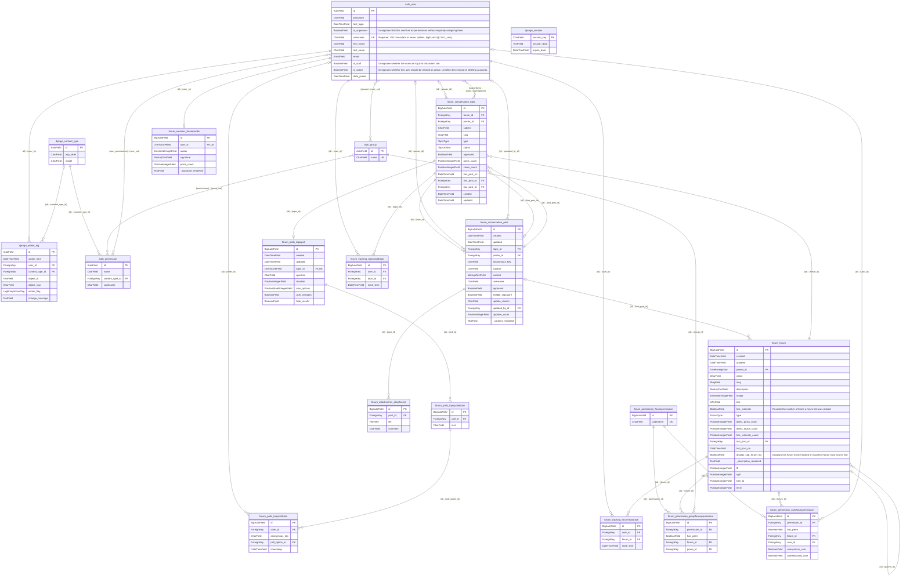

```mermaid
erDiagram
    auth_user ||--o{ django_admin_log : "(id) - (user_id)"
    django_content_type |o--o{ django_admin_log : "(id) - (content_type_id)"
    django_content_type ||--o{ auth_permission : "(id) - (content_type_id)"
    auth_group }o--o{ auth_permission : "(permissions) - (group_set)"
    auth_user }o--o{ auth_group : "(groups) - (user_set)"
    auth_user }o--o{ auth_permission : "(user_permissions) - (user_set)"
    forum_forum |o--o{ forum_forum : "(id) - (parent_id)"
    forum_conversation_post |o--o{ forum_forum : "(id) - (last_post_id)"
    forum_forum ||--o{ forum_conversation_topic : "(id) - (forum_id)"
    auth_user |o--o{ forum_conversation_topic : "(id) - (poster_id)"
    forum_conversation_post |o--o{ forum_conversation_topic : "(id) - (first_post_id)"
    forum_conversation_post |o--o{ forum_conversation_topic : "(id) - (last_post_id)"
    forum_conversation_topic }o--o{ auth_user : "(subscribers) - (topic_subscriptions)"
    forum_conversation_topic ||--o{ forum_conversation_post : "(id) - (topic_id)"
    auth_user |o--o{ forum_conversation_post : "(id) - (poster_id)"
    auth_user |o--o{ forum_conversation_post : "(id) - (updated_by_id)"
    forum_conversation_post ||--o{ forum_attachments_attachment : "(id) - (post_id)"
    forum_conversation_topic ||--o| forum_polls_topicpoll : "(id) - (topic_id)"
    forum_polls_topicpoll ||--o{ forum_polls_topicpolloption : "(id) - (poll_id)"
    auth_user |o--o{ forum_polls_topicpollvote : "(id) - (voter_id)"
    forum_polls_topicpolloption ||--o{ forum_polls_topicpollvote : "(id) - (poll_option_id)"
    auth_user ||--o{ forum_tracking_forumreadtrack : "(id) - (user_id)"
    forum_forum ||--o{ forum_tracking_forumreadtrack : "(id) - (forum_id)"
    auth_user ||--o{ forum_tracking_topicreadtrack : "(id) - (user_id)"
    forum_conversation_topic ||--o{ forum_tracking_topicreadtrack : "(id) - (topic_id)"
    auth_user ||--o| forum_member_forumprofile : "(id) - (user_id)"
    forum_permission_forumpermission ||--o{ forum_permission_groupforumpermission : "(id) - (permission_id)"
    forum_forum |o--o{ forum_permission_groupforumpermission : "(id) - (forum_id)"
    auth_group ||--o{ forum_permission_groupforumpermission : "(id) - (group_id)"
    forum_permission_forumpermission ||--o{ forum_permission_userforumpermission : "(id) - (permission_id)"
    forum_forum |o--o{ forum_permission_userforumpermission : "(id) - (forum_id)"
    auth_user |o--o{ forum_permission_userforumpermission : "(id) - (user_id)"
    django_admin_log {
        AutoField id PK
        DateTimeField action_time
        ForeignKey user_id FK
        ForeignKey content_type_id FK
        TextField object_id
        CharField object_repr
        LogEntryActionFlag action_flag
        TextField change_message
    }
    auth_permission {
        AutoField id PK
        CharField name
        ForeignKey content_type_id FK
        CharField codename
    }
    auth_group {
        AutoField id PK
        CharField name UK
    }
    auth_user {
        AutoField id PK
        CharField password
        DateTimeField last_login
        BooleanField is_superuser "Designates that this user has all permissions without explicitly assigning them."
        CharField username UK "Required. 150 characters or fewer. Letters, digits and @/./+/-/_ only."
        CharField first_name
        CharField last_name
        EmailField email
        BooleanField is_staff "Designates whether the user can log into this admin site."
        BooleanField is_active "Designates whether this user should be treated as active. Unselect this instead of deleting accounts."
        DateTimeField date_joined
    }
    django_content_type {
        AutoField id PK
        CharField app_label
        CharField model
    }
    django_session {
        CharField session_key PK
        TextField session_data
        DateTimeField expire_date
    }
    forum_forum {
        BigAutoField id PK
        DateTimeField created
        DateTimeField updated
        TreeForeignKey parent_id FK
        CharField name
        SlugField slug
        MarkupTextField description
        ExtendedImageField image
        URLField link
        BooleanField link_redirects "Records the number of times a forum link was clicked"
        ForumType type
        PositiveIntegerField direct_posts_count
        PositiveIntegerField direct_topics_count
        PositiveIntegerField link_redirects_count
        ForeignKey last_post_id FK
        DateTimeField last_post_on
        BooleanField display_sub_forum_list "Displays this forum on the legend of its parent-forum (sub forums list)"
        TextField _description_rendered
        PositiveIntegerField lft
        PositiveIntegerField rght
        PositiveIntegerField tree_id
        PositiveIntegerField level
    }
    forum_conversation_topic {
        BigAutoField id PK
        ForeignKey forum_id FK
        ForeignKey poster_id FK
        CharField subject
        SlugField slug
        TopicType type
        TopicStatus status
        BooleanField approved
        PositiveIntegerField posts_count
        PositiveIntegerField views_count
        DateTimeField last_post_on
        ForeignKey first_post_id FK
        ForeignKey last_post_id FK
        DateTimeField created
        DateTimeField updated
    }
    forum_conversation_post {
        BigAutoField id PK
        DateTimeField created
        DateTimeField updated
        ForeignKey topic_id FK
        ForeignKey poster_id FK
        CharField anonymous_key
        CharField subject
        MarkupTextField content
        CharField username
        BooleanField approved
        BooleanField enable_signature
        CharField update_reason
        ForeignKey updated_by_id FK
        PositiveIntegerField updates_count
        TextField _content_rendered
    }
    forum_attachments_attachment {
        BigAutoField id PK
        ForeignKey post_id FK
        FileField file
        CharField comment
    }
    forum_polls_topicpoll {
        BigAutoField id PK
        DateTimeField created
        DateTimeField updated
        OneToOneField topic_id FK, UK
        CharField question
        PositiveIntegerField duration
        PositiveSmallIntegerField max_options
        BooleanField user_changes
        BooleanField hide_results
    }
    forum_polls_topicpolloption {
        BigAutoField id PK
        ForeignKey poll_id FK
        CharField text
    }
    forum_polls_topicpollvote {
        BigAutoField id PK
        ForeignKey voter_id FK
        CharField anonymous_key
        ForeignKey poll_option_id FK
        DateTimeField timestamp
    }
    forum_tracking_forumreadtrack {
        BigAutoField id PK
        ForeignKey user_id FK
        ForeignKey forum_id FK
        DateTimeField mark_time
    }
    forum_tracking_topicreadtrack {
        BigAutoField id PK
        ForeignKey user_id FK
        ForeignKey topic_id FK
        DateTimeField mark_time
    }
    forum_member_forumprofile {
        BigAutoField id PK
        OneToOneField user_id FK, UK
        ExtendedImageField avatar
        MarkupTextField signature
        PositiveIntegerField posts_count
        TextField _signature_rendered
    }
    forum_permission_forumpermission {
        BigAutoField id PK
        CharField codename UK
    }
    forum_permission_groupforumpermission {
        BigAutoField id PK
        ForeignKey permission_id FK
        BooleanField has_perm
        ForeignKey forum_id FK
        ForeignKey group_id FK
    }
    forum_permission_userforumpermission {
        BigAutoField id PK
        ForeignKey permission_id FK
        BooleanField has_perm
        ForeignKey forum_id FK
        ForeignKey user_id FK
        BooleanField anonymous_user
        BooleanField authenticated_user
    }
```
