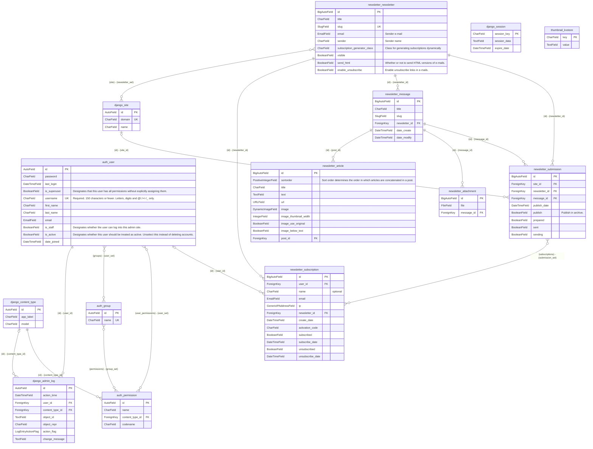

```mermaid
erDiagram
    auth_user ||--o{ django_admin_log : "(id) - (user_id)"
    django_content_type |o--o{ django_admin_log : "(id) - (content_type_id)"
    django_content_type ||--o{ auth_permission : "(id) - (content_type_id)"
    auth_group }o--o{ auth_permission : "(permissions) - (group_set)"
    auth_user }o--o{ auth_group : "(groups) - (user_set)"
    auth_user }o--o{ auth_permission : "(user_permissions) - (user_set)"
    newsletter_newsletter }o--o{ django_site : "(site) - (newsletter_set)"
    auth_user |o--o{ newsletter_subscription : "(id) - (user_id)"
    newsletter_newsletter ||--o{ newsletter_subscription : "(id) - (newsletter_id)"
    newsletter_message ||--o{ newsletter_article : "(id) - (post_id)"
    newsletter_message ||--o{ newsletter_attachment : "(id) - (message_id)"
    newsletter_newsletter ||--o{ newsletter_message : "(id) - (newsletter_id)"
    django_site |o--o{ newsletter_submission : "(id) - (site_id)"
    newsletter_newsletter ||--o{ newsletter_submission : "(id) - (newsletter_id)"
    newsletter_message ||--o{ newsletter_submission : "(id) - (message_id)"
    newsletter_submission }o--o{ newsletter_subscription : "(subscriptions) - (submission_set)"
    django_admin_log {
        AutoField id PK
        DateTimeField action_time
        ForeignKey user_id FK
        ForeignKey content_type_id FK
        TextField object_id
        CharField object_repr
        LogEntryActionFlag action_flag
        TextField change_message
    }
    auth_permission {
        AutoField id PK
        CharField name
        ForeignKey content_type_id FK
        CharField codename
    }
    auth_group {
        AutoField id PK
        CharField name UK
    }
    auth_user {
        AutoField id PK
        CharField password
        DateTimeField last_login
        BooleanField is_superuser "Designates that this user has all permissions without explicitly assigning them."
        CharField username UK "Required. 150 characters or fewer. Letters, digits and @/./+/-/_ only."
        CharField first_name
        CharField last_name
        EmailField email
        BooleanField is_staff "Designates whether the user can log into this admin site."
        BooleanField is_active "Designates whether this user should be treated as active. Unselect this instead of deleting accounts."
        DateTimeField date_joined
    }
    django_content_type {
        AutoField id PK
        CharField app_label
        CharField model
    }
    django_session {
        CharField session_key PK
        TextField session_data
        DateTimeField expire_date
    }
    django_site {
        AutoField id PK
        CharField domain UK
        CharField name
    }
    thumbnail_kvstore {
        CharField key PK
        TextField value
    }
    newsletter_newsletter {
        BigAutoField id PK
        CharField title
        SlugField slug UK
        EmailField email "Sender e-mail"
        CharField sender "Sender name"
        CharField subscription_generator_class "Class for generating subscriptions dynamically"
        BooleanField visible
        BooleanField send_html "Whether or not to send HTML versions of e-mails."
        BooleanField enable_unsubscribe "Enable unsubscribe links in e-mails."
    }
    newsletter_subscription {
        BigAutoField id PK
        ForeignKey user_id FK
        CharField name "optional"
        EmailField email
        GenericIPAddressField ip
        ForeignKey newsletter_id FK
        DateTimeField create_date
        CharField activation_code
        BooleanField subscribed
        DateTimeField subscribe_date
        BooleanField unsubscribed
        DateTimeField unsubscribe_date
    }
    newsletter_article {
        BigAutoField id PK
        PositiveIntegerField sortorder "Sort order determines the order in which articles are concatenated in a post."
        CharField title
        TextField text
        URLField url
        DynamicImageField image
        IntegerField image_thumbnail_width
        BooleanField image_use_original
        BooleanField image_below_text
        ForeignKey post_id FK
    }
    newsletter_attachment {
        BigAutoField id PK
        FileField file
        ForeignKey message_id FK
    }
    newsletter_message {
        BigAutoField id PK
        CharField title
        SlugField slug
        ForeignKey newsletter_id FK
        DateTimeField date_create
        DateTimeField date_modify
    }
    newsletter_submission {
        BigAutoField id PK
        ForeignKey site_id FK
        ForeignKey newsletter_id FK
        ForeignKey message_id FK
        DateTimeField publish_date
        BooleanField publish "Publish in archive."
        BooleanField prepared
        BooleanField sent
        BooleanField sending
    }
```
