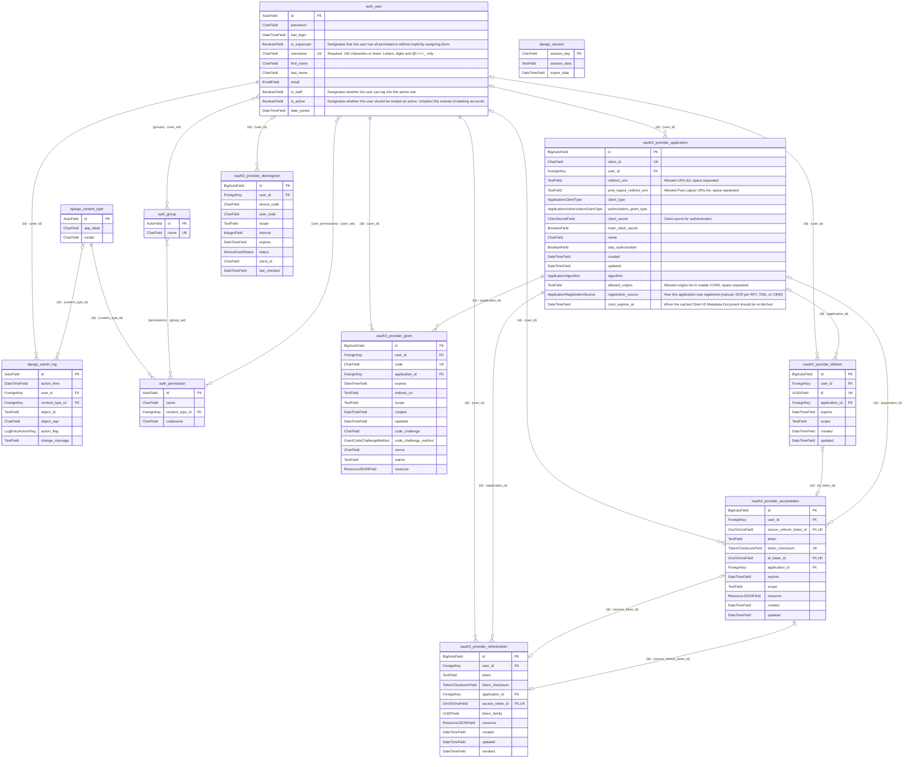

```mermaid
erDiagram
    auth_user ||--o{ django_admin_log : "(id) - (user_id)"
    django_content_type |o--o{ django_admin_log : "(id) - (content_type_id)"
    django_content_type ||--o{ auth_permission : "(id) - (content_type_id)"
    auth_group }o--o{ auth_permission : "(permissions) - (group_set)"
    auth_user }o--o{ auth_group : "(groups) - (user_set)"
    auth_user }o--o{ auth_permission : "(user_permissions) - (user_set)"
    auth_user |o--o{ oauth2_provider_application : "(id) - (user_id)"
    auth_user ||--o{ oauth2_provider_grant : "(id) - (user_id)"
    oauth2_provider_application ||--o{ oauth2_provider_grant : "(id) - (application_id)"
    auth_user |o--o{ oauth2_provider_accesstoken : "(id) - (user_id)"
    oauth2_provider_refreshtoken |o--o| oauth2_provider_accesstoken : "(id) - (source_refresh_token_id)"
    oauth2_provider_idtoken |o--o| oauth2_provider_accesstoken : "(id) - (id_token_id)"
    oauth2_provider_application |o--o{ oauth2_provider_accesstoken : "(id) - (application_id)"
    auth_user ||--o{ oauth2_provider_refreshtoken : "(id) - (user_id)"
    oauth2_provider_application ||--o{ oauth2_provider_refreshtoken : "(id) - (application_id)"
    oauth2_provider_accesstoken |o--o| oauth2_provider_refreshtoken : "(id) - (access_token_id)"
    auth_user |o--o{ oauth2_provider_idtoken : "(id) - (user_id)"
    oauth2_provider_application |o--o{ oauth2_provider_idtoken : "(id) - (application_id)"
    auth_user |o--o{ oauth2_provider_devicegrant : "(id) - (user_id)"
    django_admin_log {
        AutoField id PK
        DateTimeField action_time
        ForeignKey user_id FK
        ForeignKey content_type_id FK
        TextField object_id
        CharField object_repr
        LogEntryActionFlag action_flag
        TextField change_message
    }
    auth_permission {
        AutoField id PK
        CharField name
        ForeignKey content_type_id FK
        CharField codename
    }
    auth_group {
        AutoField id PK
        CharField name UK
    }
    auth_user {
        AutoField id PK
        CharField password
        DateTimeField last_login
        BooleanField is_superuser "Designates that this user has all permissions without explicitly assigning them."
        CharField username UK "Required. 150 characters or fewer. Letters, digits and @/./+/-/_ only."
        CharField first_name
        CharField last_name
        EmailField email
        BooleanField is_staff "Designates whether the user can log into this admin site."
        BooleanField is_active "Designates whether this user should be treated as active. Unselect this instead of deleting accounts."
        DateTimeField date_joined
    }
    django_content_type {
        AutoField id PK
        CharField app_label
        CharField model
    }
    django_session {
        CharField session_key PK
        TextField session_data
        DateTimeField expire_date
    }
    oauth2_provider_application {
        BigAutoField id PK
        CharField client_id UK
        ForeignKey user_id FK
        TextField redirect_uris "Allowed URIs list, space separated"
        TextField post_logout_redirect_uris "Allowed Post Logout URIs list, space separated"
        ApplicationClientType client_type
        ApplicationAuthorizationGrantType authorization_grant_type
        ClientSecretField client_secret "Client secret for authentication"
        BooleanField hash_client_secret
        CharField name
        BooleanField skip_authorization
        DateTimeField created
        DateTimeField updated
        ApplicationAlgorithm algorithm
        TextField allowed_origins "Allowed origins list to enable CORS, space separated"
        ApplicationRegistrationSource registration_source "How this application was registered (manual, DCR per RFC 7591, or CIMD)"
        DateTimeField cimd_expires_at "When the cached Client ID Metadata Document should be re-fetched"
    }
    oauth2_provider_grant {
        BigAutoField id PK
        ForeignKey user_id FK
        CharField code UK
        ForeignKey application_id FK
        DateTimeField expires
        TextField redirect_uri
        TextField scope
        DateTimeField created
        DateTimeField updated
        CharField code_challenge
        GrantCodeChallengeMethod code_challenge_method
        CharField nonce
        TextField claims
        ResourceJSONField resource
    }
    oauth2_provider_accesstoken {
        BigAutoField id PK
        ForeignKey user_id FK
        OneToOneField source_refresh_token_id FK, UK
        TextField token
        TokenChecksumField token_checksum UK
        OneToOneField id_token_id FK, UK
        ForeignKey application_id FK
        DateTimeField expires
        TextField scope
        ResourceJSONField resource
        DateTimeField created
        DateTimeField updated
    }
    oauth2_provider_refreshtoken {
        BigAutoField id PK
        ForeignKey user_id FK
        TextField token
        TokenChecksumField token_checksum
        ForeignKey application_id FK
        OneToOneField access_token_id FK, UK
        UUIDField token_family
        ResourceJSONField resource
        DateTimeField created
        DateTimeField updated
        DateTimeField revoked
    }
    oauth2_provider_idtoken {
        BigAutoField id PK
        ForeignKey user_id FK
        UUIDField jti UK
        ForeignKey application_id FK
        DateTimeField expires
        TextField scope
        DateTimeField created
        DateTimeField updated
    }
    oauth2_provider_devicegrant {
        BigAutoField id PK
        ForeignKey user_id FK
        CharField device_code
        CharField user_code
        TextField scope
        IntegerField interval
        DateTimeField expires
        DeviceGrantStatus status
        CharField client_id
        DateTimeField last_checked
    }
```
