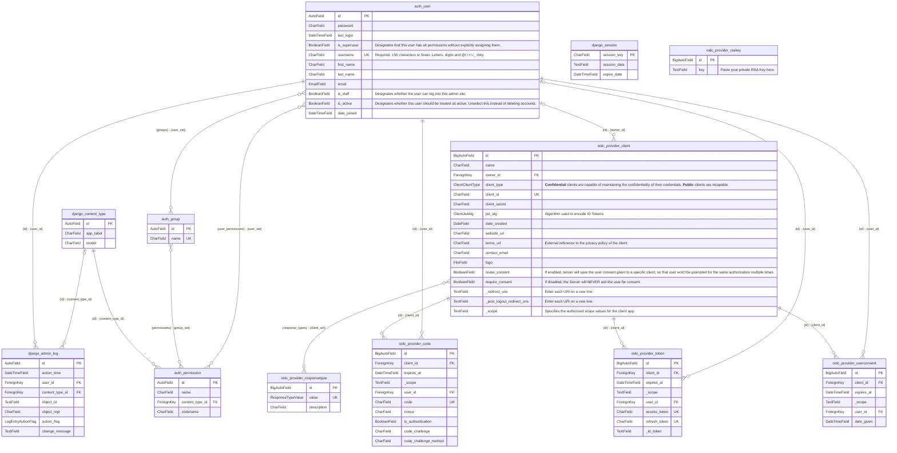

```mermaid
erDiagram
    auth_user ||--o{ django_admin_log : "(id) - (user_id)"
    django_content_type |o--o{ django_admin_log : "(id) - (content_type_id)"
    django_content_type ||--o{ auth_permission : "(id) - (content_type_id)"
    auth_group }o--o{ auth_permission : "(permissions) - (group_set)"
    auth_user }o--o{ auth_group : "(groups) - (user_set)"
    auth_user }o--o{ auth_permission : "(user_permissions) - (user_set)"
    auth_user |o--o{ oidc_provider_client : "(id) - (owner_id)"
    oidc_provider_client }o--o{ oidc_provider_responsetype : "(response_types) - (client_set)"
    oidc_provider_client ||--o{ oidc_provider_code : "(id) - (client_id)"
    auth_user ||--o{ oidc_provider_code : "(id) - (user_id)"
    oidc_provider_client ||--o{ oidc_provider_token : "(id) - (client_id)"
    auth_user |o--o{ oidc_provider_token : "(id) - (user_id)"
    oidc_provider_client ||--o{ oidc_provider_userconsent : "(id) - (client_id)"
    auth_user ||--o{ oidc_provider_userconsent : "(id) - (user_id)"
    django_admin_log {
        AutoField id PK
        DateTimeField action_time
        ForeignKey user_id FK
        ForeignKey content_type_id FK
        TextField object_id
        CharField object_repr
        LogEntryActionFlag action_flag
        TextField change_message
    }
    auth_permission {
        AutoField id PK
        CharField name
        ForeignKey content_type_id FK
        CharField codename
    }
    auth_group {
        AutoField id PK
        CharField name UK
    }
    auth_user {
        AutoField id PK
        CharField password
        DateTimeField last_login
        BooleanField is_superuser "Designates that this user has all permissions without explicitly assigning them."
        CharField username UK "Required. 150 characters or fewer. Letters, digits and @/./+/-/_ only."
        CharField first_name
        CharField last_name
        EmailField email
        BooleanField is_staff "Designates whether the user can log into this admin site."
        BooleanField is_active "Designates whether this user should be treated as active. Unselect this instead of deleting accounts."
        DateTimeField date_joined
    }
    django_content_type {
        AutoField id PK
        CharField app_label
        CharField model
    }
    django_session {
        CharField session_key PK
        TextField session_data
        DateTimeField expire_date
    }
    oidc_provider_responsetype {
        BigAutoField id PK
        ResponseTypeValue value UK
        CharField description
    }
    oidc_provider_client {
        BigAutoField id PK
        CharField name
        ForeignKey owner_id FK
        ClientClientType client_type "<b>Confidential</b> clients are capable of maintaining the confidentiality of their credentials. <b>Public</b> clients are incapable."
        CharField client_id UK
        CharField client_secret
        ClientJwtAlg jwt_alg "Algorithm used to encode ID Tokens."
        DateField date_created
        CharField website_url
        CharField terms_url "External reference to the privacy policy of the client."
        CharField contact_email
        FileField logo
        BooleanField reuse_consent "If enabled, server will save the user consent given to a specific client, so that user won't be prompted for the same authorization multiple times."
        BooleanField require_consent "If disabled, the Server will NEVER ask the user for consent."
        TextField _redirect_uris "Enter each URI on a new line."
        TextField _post_logout_redirect_uris "Enter each URI on a new line."
        TextField _scope "Specifies the authorized scope values for the client app."
    }
    oidc_provider_code {
        BigAutoField id PK
        ForeignKey client_id FK
        DateTimeField expires_at
        TextField _scope
        ForeignKey user_id FK
        CharField code UK
        CharField nonce
        BooleanField is_authentication
        CharField code_challenge
        CharField code_challenge_method
    }
    oidc_provider_token {
        BigAutoField id PK
        ForeignKey client_id FK
        DateTimeField expires_at
        TextField _scope
        ForeignKey user_id FK
        CharField access_token UK
        CharField refresh_token UK
        TextField _id_token
    }
    oidc_provider_userconsent {
        BigAutoField id PK
        ForeignKey client_id FK
        DateTimeField expires_at
        TextField _scope
        ForeignKey user_id FK
        DateTimeField date_given
    }
    oidc_provider_rsakey {
        BigAutoField id PK
        TextField key "Paste your private RSA Key here."
    }
```
