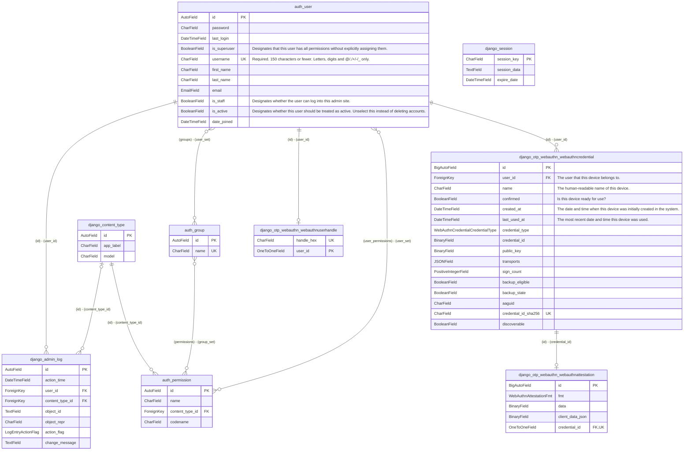

```mermaid
erDiagram
    auth_user ||--o{ django_admin_log : "(id) - (user_id)"
    django_content_type |o--o{ django_admin_log : "(id) - (content_type_id)"
    django_content_type ||--o{ auth_permission : "(id) - (content_type_id)"
    auth_group }o--o{ auth_permission : "(permissions) - (group_set)"
    auth_user }o--o{ auth_group : "(groups) - (user_set)"
    auth_user }o--o{ auth_permission : "(user_permissions) - (user_set)"
    auth_user ||--o{ django_otp_webauthn_webauthncredential : "(id) - (user_id)"
    django_otp_webauthn_webauthncredential ||--o| django_otp_webauthn_webauthnattestation : "(id) - (credential_id)"
    auth_user ||--o| django_otp_webauthn_webauthnuserhandle : "(id) - (user_id)"
    django_admin_log {
        AutoField id PK
        DateTimeField action_time
        ForeignKey user_id FK
        ForeignKey content_type_id FK
        TextField object_id
        CharField object_repr
        LogEntryActionFlag action_flag
        TextField change_message
    }
    auth_permission {
        AutoField id PK
        CharField name
        ForeignKey content_type_id FK
        CharField codename
    }
    auth_group {
        AutoField id PK
        CharField name UK
    }
    auth_user {
        AutoField id PK
        CharField password
        DateTimeField last_login
        BooleanField is_superuser "Designates that this user has all permissions without explicitly assigning them."
        CharField username UK "Required. 150 characters or fewer. Letters, digits and @/./+/-/_ only."
        CharField first_name
        CharField last_name
        EmailField email
        BooleanField is_staff "Designates whether the user can log into this admin site."
        BooleanField is_active "Designates whether this user should be treated as active. Unselect this instead of deleting accounts."
        DateTimeField date_joined
    }
    django_content_type {
        AutoField id PK
        CharField app_label
        CharField model
    }
    django_session {
        CharField session_key PK
        TextField session_data
        DateTimeField expire_date
    }
    django_otp_webauthn_webauthncredential {
        BigAutoField id PK
        ForeignKey user_id FK "The user that this device belongs to."
        CharField name "The human-readable name of this device."
        BooleanField confirmed "Is this device ready for use?"
        DateTimeField created_at "The date and time when this device was initially created in the system."
        DateTimeField last_used_at "The most recent date and time this device was used."
        WebAuthnCredentialCredentialType credential_type
        BinaryField credential_id
        BinaryField public_key
        JSONField transports
        PositiveIntegerField sign_count
        BooleanField backup_eligible
        BooleanField backup_state
        CharField aaguid
        CharField credential_id_sha256 UK
        BooleanField discoverable
    }
    django_otp_webauthn_webauthnattestation {
        BigAutoField id PK
        WebAuthnAttestationFmt fmt
        BinaryField data
        BinaryField client_data_json
        OneToOneField credential_id FK, UK
    }
    django_otp_webauthn_webauthnuserhandle {
        CharField handle_hex UK
        OneToOneField user_id PK
    }
```
