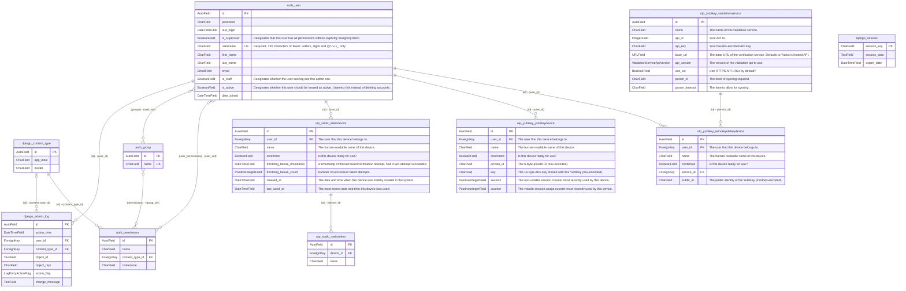

```mermaid
erDiagram
    auth_user ||--o{ django_admin_log : "(id) - (user_id)"
    django_content_type |o--o{ django_admin_log : "(id) - (content_type_id)"
    django_content_type ||--o{ auth_permission : "(id) - (content_type_id)"
    auth_group }o--o{ auth_permission : "(permissions) - (group_set)"
    auth_user }o--o{ auth_group : "(groups) - (user_set)"
    auth_user }o--o{ auth_permission : "(user_permissions) - (user_set)"
    auth_user ||--o{ otp_static_staticdevice : "(id) - (user_id)"
    otp_static_staticdevice ||--o{ otp_static_statictoken : "(id) - (device_id)"
    auth_user ||--o{ otp_yubikey_yubikeydevice : "(id) - (user_id)"
    auth_user ||--o{ otp_yubikey_remoteyubikeydevice : "(id) - (user_id)"
    otp_yubikey_validationservice ||--o{ otp_yubikey_remoteyubikeydevice : "(id) - (service_id)"
    django_admin_log {
        AutoField id PK
        DateTimeField action_time
        ForeignKey user_id FK
        ForeignKey content_type_id FK
        TextField object_id
        CharField object_repr
        LogEntryActionFlag action_flag
        TextField change_message
    }
    auth_permission {
        AutoField id PK
        CharField name
        ForeignKey content_type_id FK
        CharField codename
    }
    auth_group {
        AutoField id PK
        CharField name UK
    }
    auth_user {
        AutoField id PK
        CharField password
        DateTimeField last_login
        BooleanField is_superuser "Designates that this user has all permissions without explicitly assigning them."
        CharField username UK "Required. 150 characters or fewer. Letters, digits and @/./+/-/_ only."
        CharField first_name
        CharField last_name
        EmailField email
        BooleanField is_staff "Designates whether the user can log into this admin site."
        BooleanField is_active "Designates whether this user should be treated as active. Unselect this instead of deleting accounts."
        DateTimeField date_joined
    }
    django_content_type {
        AutoField id PK
        CharField app_label
        CharField model
    }
    django_session {
        CharField session_key PK
        TextField session_data
        DateTimeField expire_date
    }
    otp_static_staticdevice {
        AutoField id PK
        ForeignKey user_id FK "The user that this device belongs to."
        CharField name "The human-readable name of this device."
        BooleanField confirmed "Is this device ready for use?"
        DateTimeField throttling_failure_timestamp "A timestamp of the last failed verification attempt. Null if last attempt succeeded."
        PositiveIntegerField throttling_failure_count "Number of successive failed attempts."
        DateTimeField created_at "The date and time when this device was initially created in the system."
        DateTimeField last_used_at "The most recent date and time this device was used."
    }
    otp_static_statictoken {
        AutoField id PK
        ForeignKey device_id FK
        CharField token
    }
    otp_yubikey_yubikeydevice {
        AutoField id PK
        ForeignKey user_id FK "The user that this device belongs to."
        CharField name "The human-readable name of this device."
        BooleanField confirmed "Is this device ready for use?"
        CharField private_id "The 6-byte private ID (hex-encoded)."
        CharField key "The 16-byte AES key shared with this YubiKey (hex-encoded)."
        PositiveIntegerField session "The non-volatile session counter most recently used by this device."
        PositiveIntegerField counter "The volatile session usage counter most recently used by this device."
    }
    otp_yubikey_validationservice {
        AutoField id PK
        CharField name "The name of this validation service."
        IntegerField api_id "Your API ID."
        CharField api_key "Your base64-encoded API key."
        URLField base_url "The base URL of the verification service. Defaults to Yubico's hosted API."
        ValidationServiceApiVersion api_version "The version of the validation api to use."
        BooleanField use_ssl "Use HTTPS API URLs by default?"
        CharField param_sl "The level of syncing required."
        CharField param_timeout "The time to allow for syncing."
    }
    otp_yubikey_remoteyubikeydevice {
        AutoField id PK
        ForeignKey user_id FK "The user that this device belongs to."
        CharField name "The human-readable name of this device."
        BooleanField confirmed "Is this device ready for use?"
        ForeignKey service_id FK
        CharField public_id "The public identity of the YubiKey (modhex-encoded)."
    }
```
