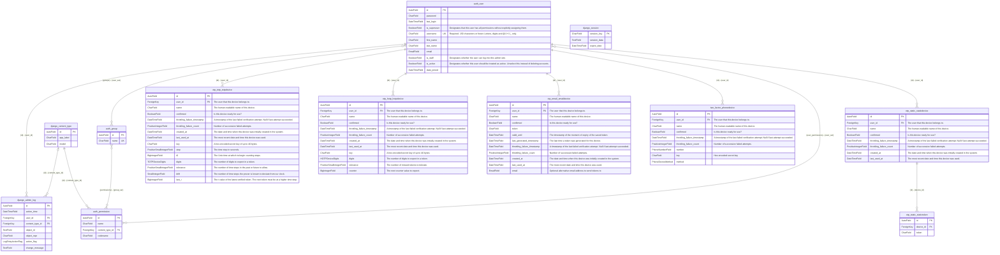

```mermaid
erDiagram
    auth_user ||--o{ django_admin_log : "(id) - (user_id)"
    django_content_type |o--o{ django_admin_log : "(id) - (content_type_id)"
    django_content_type ||--o{ auth_permission : "(id) - (content_type_id)"
    auth_group }o--o{ auth_permission : "(permissions) - (group_set)"
    auth_user }o--o{ auth_group : "(groups) - (user_set)"
    auth_user }o--o{ auth_permission : "(user_permissions) - (user_set)"
    auth_user ||--o{ otp_static_staticdevice : "(id) - (user_id)"
    otp_static_staticdevice ||--o{ otp_static_statictoken : "(id) - (device_id)"
    auth_user ||--o{ otp_totp_totpdevice : "(id) - (user_id)"
    auth_user ||--o{ otp_hotp_hotpdevice : "(id) - (user_id)"
    auth_user ||--o{ otp_email_emaildevice : "(id) - (user_id)"
    auth_user ||--o{ two_factor_phonedevice : "(id) - (user_id)"
    django_admin_log {
        AutoField id PK
        DateTimeField action_time
        ForeignKey user_id FK
        ForeignKey content_type_id FK
        TextField object_id
        CharField object_repr
        LogEntryActionFlag action_flag
        TextField change_message
    }
    auth_permission {
        AutoField id PK
        CharField name
        ForeignKey content_type_id FK
        CharField codename
    }
    auth_group {
        AutoField id PK
        CharField name UK
    }
    auth_user {
        AutoField id PK
        CharField password
        DateTimeField last_login
        BooleanField is_superuser "Designates that this user has all permissions without explicitly assigning them."
        CharField username UK "Required. 150 characters or fewer. Letters, digits and @/./+/-/_ only."
        CharField first_name
        CharField last_name
        EmailField email
        BooleanField is_staff "Designates whether the user can log into this admin site."
        BooleanField is_active "Designates whether this user should be treated as active. Unselect this instead of deleting accounts."
        DateTimeField date_joined
    }
    django_content_type {
        AutoField id PK
        CharField app_label
        CharField model
    }
    django_session {
        CharField session_key PK
        TextField session_data
        DateTimeField expire_date
    }
    otp_static_staticdevice {
        AutoField id PK
        ForeignKey user_id FK "The user that this device belongs to."
        CharField name "The human-readable name of this device."
        BooleanField confirmed "Is this device ready for use?"
        DateTimeField throttling_failure_timestamp "A timestamp of the last failed verification attempt. Null if last attempt succeeded."
        PositiveIntegerField throttling_failure_count "Number of successive failed attempts."
        DateTimeField created_at "The date and time when this device was initially created in the system."
        DateTimeField last_used_at "The most recent date and time this device was used."
    }
    otp_static_statictoken {
        AutoField id PK
        ForeignKey device_id FK
        CharField token
    }
    otp_totp_totpdevice {
        AutoField id PK
        ForeignKey user_id FK "The user that this device belongs to."
        CharField name "The human-readable name of this device."
        BooleanField confirmed "Is this device ready for use?"
        DateTimeField throttling_failure_timestamp "A timestamp of the last failed verification attempt. Null if last attempt succeeded."
        PositiveIntegerField throttling_failure_count "Number of successive failed attempts."
        DateTimeField created_at "The date and time when this device was initially created in the system."
        DateTimeField last_used_at "The most recent date and time this device was used."
        CharField key "A hex-encoded secret key of up to 40 bytes."
        PositiveSmallIntegerField step "The time step in seconds."
        BigIntegerField t0 "The Unix time at which to begin counting steps."
        TOTPDeviceDigits digits "The number of digits to expect in a token."
        PositiveSmallIntegerField tolerance "The number of time steps in the past or future to allow."
        SmallIntegerField drift "The number of time steps the prover is known to deviate from our clock."
        BigIntegerField last_t "The t value of the latest verified token. The next token must be at a higher time step."
    }
    otp_hotp_hotpdevice {
        AutoField id PK
        ForeignKey user_id FK "The user that this device belongs to."
        CharField name "The human-readable name of this device."
        BooleanField confirmed "Is this device ready for use?"
        DateTimeField throttling_failure_timestamp "A timestamp of the last failed verification attempt. Null if last attempt succeeded."
        PositiveIntegerField throttling_failure_count "Number of successive failed attempts."
        DateTimeField created_at "The date and time when this device was initially created in the system."
        DateTimeField last_used_at "The most recent date and time this device was used."
        CharField key "A hex-encoded secret key of up to 40 bytes."
        HOTPDeviceDigits digits "The number of digits to expect in a token."
        PositiveSmallIntegerField tolerance "The number of missed tokens to tolerate."
        BigIntegerField counter "The next counter value to expect."
    }
    otp_email_emaildevice {
        AutoField id PK
        ForeignKey user_id FK "The user that this device belongs to."
        CharField name "The human-readable name of this device."
        BooleanField confirmed "Is this device ready for use?"
        CharField token
        DateTimeField valid_until "The timestamp of the moment of expiry of the saved token."
        DateTimeField last_generated_timestamp "The last time a token was generated for this device."
        DateTimeField throttling_failure_timestamp "A timestamp of the last failed verification attempt. Null if last attempt succeeded."
        PositiveIntegerField throttling_failure_count "Number of successive failed attempts."
        DateTimeField created_at "The date and time when this device was initially created in the system."
        DateTimeField last_used_at "The most recent date and time this device was used."
        EmailField email "Optional alternative email address to send tokens to"
    }
    two_factor_phonedevice {
        AutoField id PK
        ForeignKey user_id FK "The user that this device belongs to."
        CharField name "The human-readable name of this device."
        BooleanField confirmed "Is this device ready for use?"
        DateTimeField throttling_failure_timestamp "A timestamp of the last failed verification attempt. Null if last attempt succeeded."
        PositiveIntegerField throttling_failure_count "Number of successive failed attempts."
        PhoneNumberField number
        CharField key "Hex-encoded secret key"
        PhoneDeviceMethod method
    }
```
