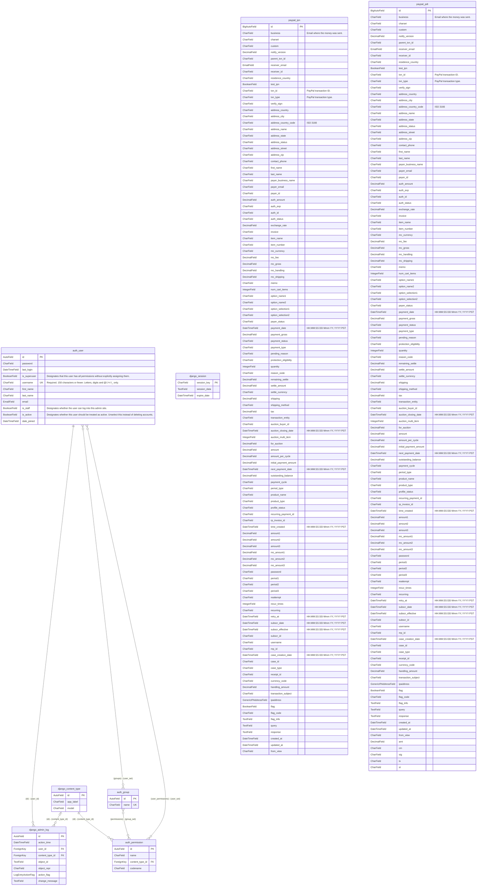

```mermaid
erDiagram
    auth_user ||--o{ django_admin_log : "(id) - (user_id)"
    django_content_type |o--o{ django_admin_log : "(id) - (content_type_id)"
    django_content_type ||--o{ auth_permission : "(id) - (content_type_id)"
    auth_group }o--o{ auth_permission : "(permissions) - (group_set)"
    auth_user }o--o{ auth_group : "(groups) - (user_set)"
    auth_user }o--o{ auth_permission : "(user_permissions) - (user_set)"
    django_admin_log {
        AutoField id PK
        DateTimeField action_time
        ForeignKey user_id FK
        ForeignKey content_type_id FK
        TextField object_id
        CharField object_repr
        LogEntryActionFlag action_flag
        TextField change_message
    }
    auth_permission {
        AutoField id PK
        CharField name
        ForeignKey content_type_id FK
        CharField codename
    }
    auth_group {
        AutoField id PK
        CharField name UK
    }
    auth_user {
        AutoField id PK
        CharField password
        DateTimeField last_login
        BooleanField is_superuser "Designates that this user has all permissions without explicitly assigning them."
        CharField username UK "Required. 150 characters or fewer. Letters, digits and @/./+/-/_ only."
        CharField first_name
        CharField last_name
        EmailField email
        BooleanField is_staff "Designates whether the user can log into this admin site."
        BooleanField is_active "Designates whether this user should be treated as active. Unselect this instead of deleting accounts."
        DateTimeField date_joined
    }
    django_content_type {
        AutoField id PK
        CharField app_label
        CharField model
    }
    django_session {
        CharField session_key PK
        TextField session_data
        DateTimeField expire_date
    }
    paypal_ipn {
        BigAutoField id PK
        CharField business "Email where the money was sent."
        CharField charset
        CharField custom
        DecimalField notify_version
        CharField parent_txn_id
        EmailField receiver_email
        CharField receiver_id
        CharField residence_country
        BooleanField test_ipn
        CharField txn_id "PayPal transaction ID."
        CharField txn_type "PayPal transaction type."
        CharField verify_sign
        CharField address_country
        CharField address_city
        CharField address_country_code "ISO 3166"
        CharField address_name
        CharField address_state
        CharField address_status
        CharField address_street
        CharField address_zip
        CharField contact_phone
        CharField first_name
        CharField last_name
        CharField payer_business_name
        CharField payer_email
        CharField payer_id
        DecimalField auth_amount
        CharField auth_exp
        CharField auth_id
        CharField auth_status
        DecimalField exchange_rate
        CharField invoice
        CharField item_name
        CharField item_number
        CharField mc_currency
        DecimalField mc_fee
        DecimalField mc_gross
        DecimalField mc_handling
        DecimalField mc_shipping
        CharField memo
        IntegerField num_cart_items
        CharField option_name1
        CharField option_name2
        CharField option_selection1
        CharField option_selection2
        CharField payer_status
        DateTimeField payment_date "HH:MM:SS DD Mmm YY, YYYY PST"
        DecimalField payment_gross
        CharField payment_status
        CharField payment_type
        CharField pending_reason
        CharField protection_eligibility
        IntegerField quantity
        CharField reason_code
        DecimalField remaining_settle
        DecimalField settle_amount
        CharField settle_currency
        DecimalField shipping
        CharField shipping_method
        DecimalField tax
        CharField transaction_entity
        CharField auction_buyer_id
        DateTimeField auction_closing_date "HH:MM:SS DD Mmm YY, YYYY PST"
        IntegerField auction_multi_item
        DecimalField for_auction
        DecimalField amount
        DecimalField amount_per_cycle
        DecimalField initial_payment_amount
        DateTimeField next_payment_date "HH:MM:SS DD Mmm YY, YYYY PST"
        DecimalField outstanding_balance
        CharField payment_cycle
        CharField period_type
        CharField product_name
        CharField product_type
        CharField profile_status
        CharField recurring_payment_id
        CharField rp_invoice_id
        DateTimeField time_created "HH:MM:SS DD Mmm YY, YYYY PST"
        DecimalField amount1
        DecimalField amount2
        DecimalField amount3
        DecimalField mc_amount1
        DecimalField mc_amount2
        DecimalField mc_amount3
        CharField password
        CharField period1
        CharField period2
        CharField period3
        CharField reattempt
        IntegerField recur_times
        CharField recurring
        DateTimeField retry_at "HH:MM:SS DD Mmm YY, YYYY PST"
        DateTimeField subscr_date "HH:MM:SS DD Mmm YY, YYYY PST"
        DateTimeField subscr_effective "HH:MM:SS DD Mmm YY, YYYY PST"
        CharField subscr_id
        CharField username
        CharField mp_id
        DateTimeField case_creation_date "HH:MM:SS DD Mmm YY, YYYY PST"
        CharField case_id
        CharField case_type
        CharField receipt_id
        CharField currency_code
        DecimalField handling_amount
        CharField transaction_subject
        GenericIPAddressField ipaddress
        BooleanField flag
        CharField flag_code
        TextField flag_info
        TextField query
        TextField response
        DateTimeField created_at
        DateTimeField updated_at
        CharField from_view
    }
    paypal_pdt {
        BigAutoField id PK
        CharField business "Email where the money was sent."
        CharField charset
        CharField custom
        DecimalField notify_version
        CharField parent_txn_id
        EmailField receiver_email
        CharField receiver_id
        CharField residence_country
        BooleanField test_ipn
        CharField txn_id "PayPal transaction ID."
        CharField txn_type "PayPal transaction type."
        CharField verify_sign
        CharField address_country
        CharField address_city
        CharField address_country_code "ISO 3166"
        CharField address_name
        CharField address_state
        CharField address_status
        CharField address_street
        CharField address_zip
        CharField contact_phone
        CharField first_name
        CharField last_name
        CharField payer_business_name
        CharField payer_email
        CharField payer_id
        DecimalField auth_amount
        CharField auth_exp
        CharField auth_id
        CharField auth_status
        DecimalField exchange_rate
        CharField invoice
        CharField item_name
        CharField item_number
        CharField mc_currency
        DecimalField mc_fee
        DecimalField mc_gross
        DecimalField mc_handling
        DecimalField mc_shipping
        CharField memo
        IntegerField num_cart_items
        CharField option_name1
        CharField option_name2
        CharField option_selection1
        CharField option_selection2
        CharField payer_status
        DateTimeField payment_date "HH:MM:SS DD Mmm YY, YYYY PST"
        DecimalField payment_gross
        CharField payment_status
        CharField payment_type
        CharField pending_reason
        CharField protection_eligibility
        IntegerField quantity
        CharField reason_code
        DecimalField remaining_settle
        DecimalField settle_amount
        CharField settle_currency
        DecimalField shipping
        CharField shipping_method
        DecimalField tax
        CharField transaction_entity
        CharField auction_buyer_id
        DateTimeField auction_closing_date "HH:MM:SS DD Mmm YY, YYYY PST"
        IntegerField auction_multi_item
        DecimalField for_auction
        DecimalField amount
        DecimalField amount_per_cycle
        DecimalField initial_payment_amount
        DateTimeField next_payment_date "HH:MM:SS DD Mmm YY, YYYY PST"
        DecimalField outstanding_balance
        CharField payment_cycle
        CharField period_type
        CharField product_name
        CharField product_type
        CharField profile_status
        CharField recurring_payment_id
        CharField rp_invoice_id
        DateTimeField time_created "HH:MM:SS DD Mmm YY, YYYY PST"
        DecimalField amount1
        DecimalField amount2
        DecimalField amount3
        DecimalField mc_amount1
        DecimalField mc_amount2
        DecimalField mc_amount3
        CharField password
        CharField period1
        CharField period2
        CharField period3
        CharField reattempt
        IntegerField recur_times
        CharField recurring
        DateTimeField retry_at "HH:MM:SS DD Mmm YY, YYYY PST"
        DateTimeField subscr_date "HH:MM:SS DD Mmm YY, YYYY PST"
        DateTimeField subscr_effective "HH:MM:SS DD Mmm YY, YYYY PST"
        CharField subscr_id
        CharField username
        CharField mp_id
        DateTimeField case_creation_date "HH:MM:SS DD Mmm YY, YYYY PST"
        CharField case_id
        CharField case_type
        CharField receipt_id
        CharField currency_code
        DecimalField handling_amount
        CharField transaction_subject
        GenericIPAddressField ipaddress
        BooleanField flag
        CharField flag_code
        TextField flag_info
        TextField query
        TextField response
        DateTimeField created_at
        DateTimeField updated_at
        CharField from_view
        DecimalField amt
        CharField cm
        CharField sig
        CharField tx
        CharField st
    }
```
