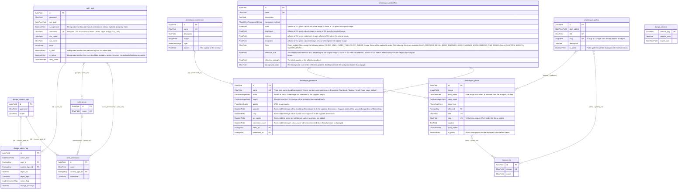

```mermaid
erDiagram
    auth_user ||--o{ django_admin_log : "(id) - (user_id)"
    django_content_type |o--o{ django_admin_log : "(id) - (content_type_id)"
    django_content_type ||--o{ auth_permission : "(id) - (content_type_id)"
    auth_group }o--o{ auth_permission : "(permissions) - (group_set)"
    auth_user }o--o{ auth_group : "(groups) - (user_set)"
    auth_user }o--o{ auth_permission : "(user_permissions) - (user_set)"
    photologue_gallery }o--o{ photologue_photo : "(photos) - (galleries)"
    photologue_gallery }o--o{ django_site : "(sites) - (gallery_set)"
    photologue_photoeffect |o--o{ photologue_photo : "(id) - (effect_id)"
    photologue_photo }o--o{ django_site : "(sites) - (photo_set)"
    photologue_photoeffect |o--o{ photologue_photosize : "(id) - (effect_id)"
    photologue_watermark |o--o{ photologue_photosize : "(id) - (watermark_id)"
    django_admin_log {
        AutoField id PK
        DateTimeField action_time
        ForeignKey user_id FK
        ForeignKey content_type_id FK
        TextField object_id
        CharField object_repr
        LogEntryActionFlag action_flag
        TextField change_message
    }
    auth_permission {
        AutoField id PK
        CharField name
        ForeignKey content_type_id FK
        CharField codename
    }
    auth_group {
        AutoField id PK
        CharField name UK
    }
    auth_user {
        AutoField id PK
        CharField password
        DateTimeField last_login
        BooleanField is_superuser "Designates that this user has all permissions without explicitly assigning them."
        CharField username UK "Required. 150 characters or fewer. Letters, digits and @/./+/-/_ only."
        CharField first_name
        CharField last_name
        EmailField email
        BooleanField is_staff "Designates whether the user can log into this admin site."
        BooleanField is_active "Designates whether this user should be treated as active. Unselect this instead of deleting accounts."
        DateTimeField date_joined
    }
    django_content_type {
        AutoField id PK
        CharField app_label
        CharField model
    }
    django_session {
        CharField session_key PK
        TextField session_data
        DateTimeField expire_date
    }
    django_site {
        AutoField id PK
        CharField domain UK
        CharField name
    }
    photologue_gallery {
        AutoField id PK
        DateTimeField date_added
        CharField title UK
        SlugField slug UK "A 'slug' is a unique URL-friendly title for an object."
        TextField description
        BooleanField is_public "Public galleries will be displayed in the default views."
    }
    photologue_photo {
        AutoField id PK
        ImageField image
        DateTimeField date_taken "Date image was taken; is obtained from the image EXIF data."
        PositiveIntegerField view_count
        PhotoCropFrom crop_from
        ForeignKey effect_id FK
        CharField title UK
        SlugField slug UK "A 'slug' is a unique URL-friendly title for an object."
        TextField caption
        DateTimeField date_added
        BooleanField is_public "Public photographs will be displayed in the default views."
    }
    photologue_photoeffect {
        AutoField id PK
        CharField name UK
        TextField description
        PhotoEffectTransposeMethod transpose_method
        FloatField color "A factor of 0.0 gives a black and white image, a factor of 1.0 gives the original image."
        FloatField brightness "A factor of 0.0 gives a black image, a factor of 1.0 gives the original image."
        FloatField contrast "A factor of 0.0 gives a solid grey image, a factor of 1.0 gives the original image."
        FloatField sharpness "A factor of 0.0 gives a blurred image, a factor of 1.0 gives the original image."
        CharField filters "Chain multiple filters using the following pattern 'FILTER_ONE->FILTER_TWO->FILTER_THREE'. Image filters will be applied in order. The following filters are available: BLUR, CONTOUR, DETAIL, EDGE_ENHANCE, EDGE_ENHANCE_MORE, EMBOSS, FIND_EDGES, Kernel, SHARPEN, SMOOTH, SMOOTH_MORE."
        FloatField reflection_size "The height of the reflection as a percentage of the orignal image. A factor of 0.0 adds no reflection, a factor of 1.0 adds a reflection equal to the height of the orignal image."
        FloatField reflection_strength "The initial opacity of the reflection gradient."
        CharField background_color "The background color of the reflection gradient. Set this to match the background color of your page."
    }
    photologue_watermark {
        AutoField id PK
        CharField name UK
        TextField description
        ImageField image
        WatermarkStyle style
        FloatField opacity "The opacity of the overlay."
    }
    photologue_photosize {
        AutoField id PK
        CharField name UK "Photo size name should contain only letters, numbers and underscores. Examples: 'thumbnail', 'display', 'small', 'main_page_widget'."
        PositiveIntegerField width "If width is set to '0' the image will be scaled to the supplied height."
        PositiveIntegerField height "If height is set to '0' the image will be scaled to the supplied width"
        PhotoSizeQuality quality "JPEG image quality."
        BooleanField upscale "If selected the image will be scaled up if necessary to fit the supplied dimensions. Cropped sizes will be upscaled regardless of this setting."
        BooleanField crop "If selected the image will be scaled and cropped to fit the supplied dimensions."
        BooleanField pre_cache "If selected this photo size will be pre-cached as photos are added."
        BooleanField increment_count "If selected the image's 'view_count' will be incremented when this photo size is displayed."
        ForeignKey effect_id FK
        ForeignKey watermark_id FK
    }
```
