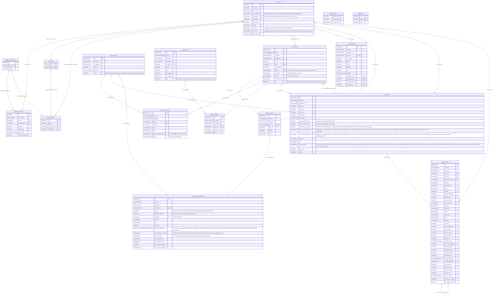

```mermaid
erDiagram
    auth_user ||--o{ django_admin_log : "(id) - (user_id)"
    django_content_type |o--o{ django_admin_log : "(id) - (content_type_id)"
    django_content_type ||--o{ auth_permission : "(id) - (content_type_id)"
    auth_group }o--o{ auth_permission : "(permissions) - (group_set)"
    auth_user }o--o{ auth_group : "(groups) - (user_set)"
    auth_user }o--o{ auth_permission : "(user_permissions) - (user_set)"
    auth_user |o--o{ plans_plan : "(id) - (customized_id)"
    auth_user ||--o| plans_billinginfo : "(id) - (user_id)"
    auth_user ||--o| plans_userplan : "(id) - (user_id)"
    plans_plan ||--o{ plans_userplan : "(id) - (plan_id)"
    plans_plan ||--o{ plans_planpricing : "(id) - (plan_id)"
    plans_pricing ||--o{ plans_planpricing : "(id) - (pricing_id)"
    plans_plan ||--o{ plans_planquota : "(id) - (plan_id)"
    plans_quota ||--o{ plans_planquota : "(id) - (quota_id)"
    auth_user ||--o{ plans_order : "(id) - (user_id)"
    plans_plan ||--o{ plans_order : "(id) - (plan_id)"
    plans_pricing |o--o{ plans_order : "(id) - (pricing_id)"
    plans_plan |o--o{ plans_order : "(id) - (userplan_plan_before_id)"
    auth_user ||--o{ plans_invoice : "(id) - (user_id)"
    plans_order ||--o{ plans_invoice : "(id) - (order_id)"
    plans_invoice |o--o{ plans_invoice : "(id) - (credit_note_for_id)"
    plans_userplan ||--o| plans_recurringuserplan : "(id) - (user_plan_id)"
    plans_pricing |o--o{ plans_recurringuserplan : "(id) - (pricing_id)"
    django_admin_log {
        AutoField id PK
        DateTimeField action_time
        ForeignKey user_id FK
        ForeignKey content_type_id FK
        TextField object_id
        CharField object_repr
        LogEntryActionFlag action_flag
        TextField change_message
    }
    auth_permission {
        AutoField id PK
        CharField name
        ForeignKey content_type_id FK
        CharField codename
    }
    auth_group {
        AutoField id PK
        CharField name UK
    }
    auth_user {
        AutoField id PK
        CharField password
        DateTimeField last_login
        BooleanField is_superuser "Designates that this user has all permissions without explicitly assigning them."
        CharField username UK "Required. 150 characters or fewer. Letters, digits and @/./+/-/_ only."
        CharField first_name
        CharField last_name
        EmailField email
        BooleanField is_staff "Designates whether the user can log into this admin site."
        BooleanField is_active "Designates whether this user should be treated as active. Unselect this instead of deleting accounts."
        DateTimeField date_joined
    }
    django_content_type {
        AutoField id PK
        CharField app_label
        CharField model
    }
    django_session {
        CharField session_key PK
        TextField session_data
        DateTimeField expire_date
    }
    django_site {
        AutoField id PK
        CharField domain UK
        CharField name
    }
    plans_plan {
        BigAutoField id PK
        PositiveIntegerField order
        DateTimeField created
        DateTimeField updated_at
        CharField name
        SlugField slug UK
        TextField description
        BooleanField default UK "Both 'Unknown' and 'No' means that the plan is not default"
        BooleanField available "Is still available for purchase"
        BooleanField visible "Is visible in current offer"
        ForeignKey customized_id FK
        URLField url "Optional link to page with more information (for clickable pricing table headers)"
    }
    plans_billinginfo {
        BigAutoField id PK
        DateTimeField created
        DateTimeField updated_at
        OneToOneField user_id FK, UK
        CharField tax_number
        CharField name
        CharField street
        CharField zipcode
        CharField city
        BillingInfoCountry country
        CharField shipping_name "optional"
        CharField shipping_street "optional"
        CharField shipping_zipcode "optional"
        CharField shipping_city "optional"
    }
    plans_userplan {
        BigAutoField id PK
        DateTimeField created
        DateTimeField updated_at
        OneToOneField user_id FK, UK
        ForeignKey plan_id FK
        DateField expire
        BooleanField active
    }
    plans_pricing {
        BigAutoField id PK
        DateTimeField created
        DateTimeField updated_at
        CharField name
        PositiveIntegerField period
        URLField url "Optional link to page with more information (for clickable pricing table headers)"
    }
    plans_planpricing {
        BigAutoField id PK
        DateTimeField created
        DateTimeField updated_at
        ForeignKey plan_id FK
        ForeignKey pricing_id FK
        DecimalField price
        IntegerField order
        BooleanField has_automatic_renewal "Use automatic renewal if possible?"
        BooleanField visible "Is visible in current offer"
    }
    plans_quota {
        BigAutoField id PK
        PositiveIntegerField order
        DateTimeField created
        DateTimeField updated_at
        CharField codename UK
        CharField name
        CharField unit
        TextField description
        BooleanField is_boolean
        CharField url "Optional link to page with more information (for clickable pricing table headers)"
    }
    plans_planquota {
        BigAutoField id PK
        DateTimeField created
        DateTimeField updated_at
        ForeignKey plan_id FK
        ForeignKey quota_id FK
        BigIntegerField value
    }
    plans_order {
        BigAutoField id PK
        DateTimeField created
        DateTimeField updated_at
        ForeignKey user_id FK
        CharField flat_name
        ForeignKey plan_id FK
        ForeignKey pricing_id FK
        DateTimeField completed
        DateField plan_extended_from "The plan was extended from this date"
        DateField plan_extended_until "The plan was extended until this date"
        DateField userplan_expire_before "Snapshot of ``UserPlan.expire`` taken before this order extended the user's plan. Used to restore expire on refund."
        BooleanField userplan_active_before "Snapshot of ``UserPlan.active`` taken before this order extended the user's plan. Doubles as the marker that a snapshot was taken: it's None for legacy orders completed before the snapshot fields existed and either True or False for new orders."
        ForeignKey userplan_plan_before_id FK "Snapshot of ``UserPlan.plan`` taken before this order extended the user's plan. Used to restore the plan on refund when the order is fully unwound: without it, refunding a first purchase (free -> paid) would leave the user on the paid plan with expire=None. None for legacy orders predating this field."
        DecimalField amount
        DecimalField tax
        DecimalField gross_amount "Tax-inclusive total of the order, for orders priced tax-inclusive (e.g. a fixed amount charged by the payment provider). When set, it is the order total and the tax amount is the difference between it and the net amount; the net amount is then expected to be derived from it with net_from_gross(). Leave empty to compute the total from the net amount and the tax rate."
        CharField currency
        OrderStatus status
    }
    plans_invoice {
        BigAutoField id PK
        DateTimeField created
        DateTimeField updated_at
        ForeignKey user_id FK
        ForeignKey order_id FK
        ForeignKey credit_note_for_id FK
        IntegerField number
        CharField full_number
        InvoiceType type
        DateField issued
        DateField issued_duplicate
        DateField selling_date
        DateField payment_date
        DecimalField unit_price_net
        IntegerField quantity
        DecimalField total_net
        DecimalField total
        DecimalField tax_total
        DecimalField tax
        DecimalField rebate
        CharField currency
        CharField item_description
        CharField buyer_name
        CharField buyer_street
        CharField buyer_zipcode
        CharField buyer_city
        InvoiceBuyerCountry buyer_country
        CharField buyer_tax_number
        CharField shipping_name
        CharField shipping_street
        CharField shipping_zipcode
        CharField shipping_city
        InvoiceShippingCountry shipping_country
        BooleanField require_shipment
        CharField issuer_name
        CharField issuer_street
        CharField issuer_zipcode
        CharField issuer_city
        InvoiceIssuerCountry issuer_country
        CharField issuer_tax_number
        TextField cancellation_reason
    }
    plans_recurringuserplan {
        BigAutoField id PK
        DateTimeField created
        DateTimeField updated_at
        OneToOneField user_plan_id FK, UK
        CharField token "Token, that will be used for payment renewal. Depends on used payment provider"
        CharField payment_provider "Provider, that will be used for payment renewal"
        ForeignKey pricing_id FK "Recurring pricing"
        DecimalField amount
        DecimalField tax
        CharField currency
        RecurringUserPlanRenewalTriggeredBy renewal_triggered_by "The source of the associated plan's renewal (USER = user-initiated renewal, TASK = autorenew_account-task-initiated renewal, OTHER = renewal is triggered using another mechanism)."
        BooleanField has_automatic_renewal "Automatic renewal is enabled for associated plan. If False, the plan renewal can be still initiated by user."
        BooleanField token_verified "The recurring token has been verified by at least one payment to be working."
        IntegerField card_expire_year
        IntegerField card_expire_month
        CharField card_masked_number
        DateTimeField last_renewal_attempt
    }
```
