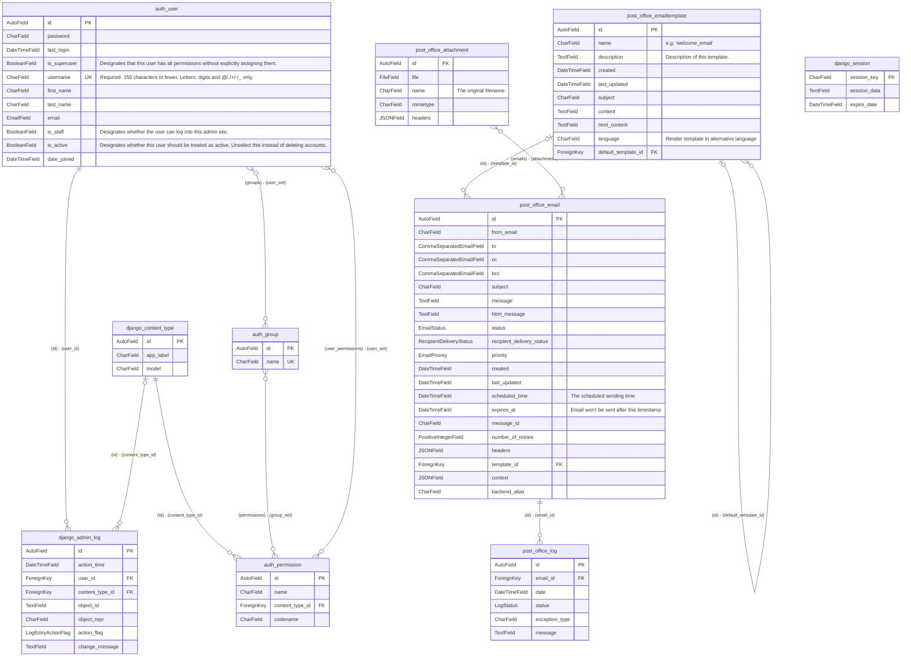

```mermaid
erDiagram
    auth_user ||--o{ django_admin_log : "(id) - (user_id)"
    django_content_type |o--o{ django_admin_log : "(id) - (content_type_id)"
    django_content_type ||--o{ auth_permission : "(id) - (content_type_id)"
    auth_group }o--o{ auth_permission : "(permissions) - (group_set)"
    auth_user }o--o{ auth_group : "(groups) - (user_set)"
    auth_user }o--o{ auth_permission : "(user_permissions) - (user_set)"
    post_office_emailtemplate |o--o{ post_office_email : "(id) - (template_id)"
    post_office_email ||--o{ post_office_log : "(id) - (email_id)"
    post_office_emailtemplate |o--o{ post_office_emailtemplate : "(id) - (default_template_id)"
    post_office_attachment }o--o{ post_office_email : "(emails) - (attachments)"
    django_admin_log {
        AutoField id PK
        DateTimeField action_time
        ForeignKey user_id FK
        ForeignKey content_type_id FK
        TextField object_id
        CharField object_repr
        LogEntryActionFlag action_flag
        TextField change_message
    }
    auth_permission {
        AutoField id PK
        CharField name
        ForeignKey content_type_id FK
        CharField codename
    }
    auth_group {
        AutoField id PK
        CharField name UK
    }
    auth_user {
        AutoField id PK
        CharField password
        DateTimeField last_login
        BooleanField is_superuser "Designates that this user has all permissions without explicitly assigning them."
        CharField username UK "Required. 150 characters or fewer. Letters, digits and @/./+/-/_ only."
        CharField first_name
        CharField last_name
        EmailField email
        BooleanField is_staff "Designates whether the user can log into this admin site."
        BooleanField is_active "Designates whether this user should be treated as active. Unselect this instead of deleting accounts."
        DateTimeField date_joined
    }
    django_content_type {
        AutoField id PK
        CharField app_label
        CharField model
    }
    django_session {
        CharField session_key PK
        TextField session_data
        DateTimeField expire_date
    }
    post_office_email {
        AutoField id PK
        CharField from_email
        CommaSeparatedEmailField to
        CommaSeparatedEmailField cc
        CommaSeparatedEmailField bcc
        CharField subject
        TextField message
        TextField html_message
        EmailStatus status
        RecipientDeliveryStatus recipient_delivery_status
        EmailPriority priority
        DateTimeField created
        DateTimeField last_updated
        DateTimeField scheduled_time "The scheduled sending time"
        DateTimeField expires_at "Email won't be sent after this timestamp"
        CharField message_id
        PositiveIntegerField number_of_retries
        JSONField headers
        ForeignKey template_id FK
        JSONField context
        CharField backend_alias
    }
    post_office_log {
        AutoField id PK
        ForeignKey email_id FK
        DateTimeField date
        LogStatus status
        CharField exception_type
        TextField message
    }
    post_office_emailtemplate {
        AutoField id PK
        CharField name "e.g: 'welcome_email'"
        TextField description "Description of this template."
        DateTimeField created
        DateTimeField last_updated
        CharField subject
        TextField content
        TextField html_content
        CharField language "Render template in alternative language"
        ForeignKey default_template_id FK
    }
    post_office_attachment {
        AutoField id PK
        FileField file
        CharField name "The original filename"
        CharField mimetype
        JSONField headers
    }
```
