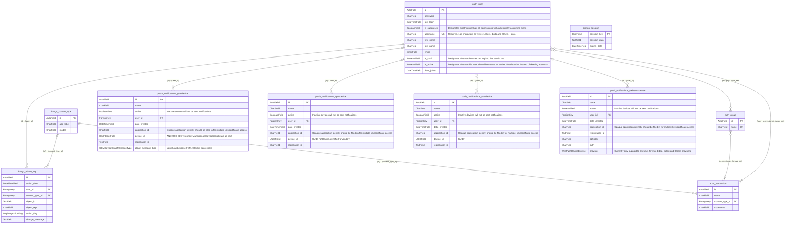

```mermaid
erDiagram
    auth_user ||--o{ django_admin_log : "(id) - (user_id)"
    django_content_type |o--o{ django_admin_log : "(id) - (content_type_id)"
    django_content_type ||--o{ auth_permission : "(id) - (content_type_id)"
    auth_group }o--o{ auth_permission : "(permissions) - (group_set)"
    auth_user }o--o{ auth_group : "(groups) - (user_set)"
    auth_user }o--o{ auth_permission : "(user_permissions) - (user_set)"
    auth_user |o--o{ push_notifications_gcmdevice : "(id) - (user_id)"
    auth_user |o--o{ push_notifications_apnsdevice : "(id) - (user_id)"
    auth_user |o--o{ push_notifications_wnsdevice : "(id) - (user_id)"
    auth_user |o--o{ push_notifications_webpushdevice : "(id) - (user_id)"
    django_admin_log {
        AutoField id PK
        DateTimeField action_time
        ForeignKey user_id FK
        ForeignKey content_type_id FK
        TextField object_id
        CharField object_repr
        LogEntryActionFlag action_flag
        TextField change_message
    }
    auth_permission {
        AutoField id PK
        CharField name
        ForeignKey content_type_id FK
        CharField codename
    }
    auth_group {
        AutoField id PK
        CharField name UK
    }
    auth_user {
        AutoField id PK
        CharField password
        DateTimeField last_login
        BooleanField is_superuser "Designates that this user has all permissions without explicitly assigning them."
        CharField username UK "Required. 150 characters or fewer. Letters, digits and @/./+/-/_ only."
        CharField first_name
        CharField last_name
        EmailField email
        BooleanField is_staff "Designates whether the user can log into this admin site."
        BooleanField is_active "Designates whether this user should be treated as active. Unselect this instead of deleting accounts."
        DateTimeField date_joined
    }
    django_content_type {
        AutoField id PK
        CharField app_label
        CharField model
    }
    django_session {
        CharField session_key PK
        TextField session_data
        DateTimeField expire_date
    }
    push_notifications_gcmdevice {
        AutoField id PK
        CharField name
        BooleanField active "Inactive devices will not be sent notifications"
        ForeignKey user_id FK
        DateTimeField date_created
        CharField application_id "Opaque application identity, should be filled in for multiple key/certificate access"
        HexIntegerField device_id "ANDROID_ID / TelephonyManager.getDeviceId() (always as hex)"
        TextField registration_id
        GCMDeviceCloudMessageType cloud_message_type "You should choose FCM, GCM is deprecated"
    }
    push_notifications_apnsdevice {
        AutoField id PK
        CharField name
        BooleanField active "Inactive devices will not be sent notifications"
        ForeignKey user_id FK
        DateTimeField date_created
        CharField application_id "Opaque application identity, should be filled in for multiple key/certificate access"
        UUIDField device_id "UUID / UIDevice.identifierForVendor()"
        CharField registration_id
    }
    push_notifications_wnsdevice {
        AutoField id PK
        CharField name
        BooleanField active "Inactive devices will not be sent notifications"
        ForeignKey user_id FK
        DateTimeField date_created
        CharField application_id "Opaque application identity, should be filled in for multiple key/certificate access"
        UUIDField device_id "GUID()"
        TextField registration_id
    }
    push_notifications_webpushdevice {
        AutoField id PK
        CharField name
        BooleanField active "Inactive devices will not be sent notifications"
        ForeignKey user_id FK
        DateTimeField date_created
        CharField application_id "Opaque application identity, should be filled in for multiple key/certificate access"
        TextField registration_id
        CharField p256dh
        CharField auth
        WebPushDeviceBrowser browser "Currently only support to Chrome, Firefox, Edge, Safari and Opera browsers"
    }
```
