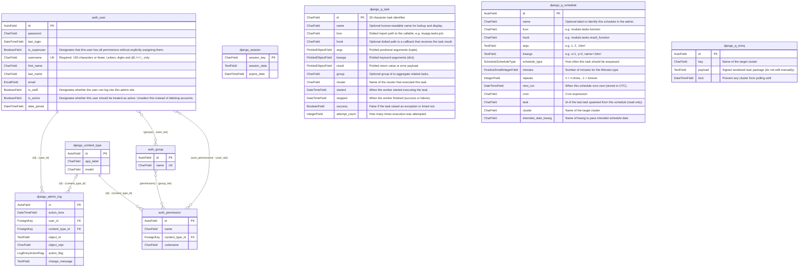

```mermaid
erDiagram
    auth_user ||--o{ django_admin_log : "(id) - (user_id)"
    django_content_type |o--o{ django_admin_log : "(id) - (content_type_id)"
    django_content_type ||--o{ auth_permission : "(id) - (content_type_id)"
    auth_group }o--o{ auth_permission : "(permissions) - (group_set)"
    auth_user }o--o{ auth_group : "(groups) - (user_set)"
    auth_user }o--o{ auth_permission : "(user_permissions) - (user_set)"
    django_admin_log {
        AutoField id PK
        DateTimeField action_time
        ForeignKey user_id FK
        ForeignKey content_type_id FK
        TextField object_id
        CharField object_repr
        LogEntryActionFlag action_flag
        TextField change_message
    }
    auth_permission {
        AutoField id PK
        CharField name
        ForeignKey content_type_id FK
        CharField codename
    }
    auth_group {
        AutoField id PK
        CharField name UK
    }
    auth_user {
        AutoField id PK
        CharField password
        DateTimeField last_login
        BooleanField is_superuser "Designates that this user has all permissions without explicitly assigning them."
        CharField username UK "Required. 150 characters or fewer. Letters, digits and @/./+/-/_ only."
        CharField first_name
        CharField last_name
        EmailField email
        BooleanField is_staff "Designates whether the user can log into this admin site."
        BooleanField is_active "Designates whether this user should be treated as active. Unselect this instead of deleting accounts."
        DateTimeField date_joined
    }
    django_content_type {
        AutoField id PK
        CharField app_label
        CharField model
    }
    django_session {
        CharField session_key PK
        TextField session_data
        DateTimeField expire_date
    }
    django_q_task {
        CharField id PK "32-character task identifier."
        CharField name "Optional human-readable name for lookup and display."
        CharField func "Dotted import path to the callable, e.g. myapp.tasks.job."
        CharField hook "Optional dotted path to a callback that receives the task result."
        PickledObjectField args "Pickled positional arguments (tuple)."
        PickledObjectField kwargs "Pickled keyword arguments (dict)."
        PickledObjectField result "Pickled return value or error payload."
        CharField group "Optional group id to aggregate related tasks."
        CharField cluster "Name of the cluster that executed this task."
        DateTimeField started "When the worker started executing the task."
        DateTimeField stopped "When the worker finished (success or failure)."
        BooleanField success "False if the task raised an exception or timed out."
        IntegerField attempt_count "How many times execution was attempted."
    }
    django_q_schedule {
        AutoField id PK
        CharField name "Optional label to identify this schedule in the admin."
        CharField func "e.g. module.tasks.function"
        CharField hook "e.g. module.tasks.result_function"
        TextField args "e.g. 1, 2, 'John'"
        TextField kwargs "e.g. x=1, y=2, name='John'"
        ScheduleScheduleType schedule_type "How often this task should be enqueued."
        PositiveSmallIntegerField minutes "Number of minutes for the Minutes type"
        IntegerField repeats "n = n times, -1 = forever"
        DateTimeField next_run "When this schedule runs next (stored in UTC)."
        CharField cron "Cron expression"
        CharField task "Id of the last task spawned from this schedule (read-only)."
        CharField cluster "Name of the target cluster"
        CharField intended_date_kwarg "Name of kwarg to pass intended schedule date"
    }
    django_q_ormq {
        AutoField id PK
        CharField key "Name of the target cluster"
        TextField payload "Signed serialized task package (do not edit manually)."
        DateTimeField lock "Prevent any cluster from pulling until"
    }
```
