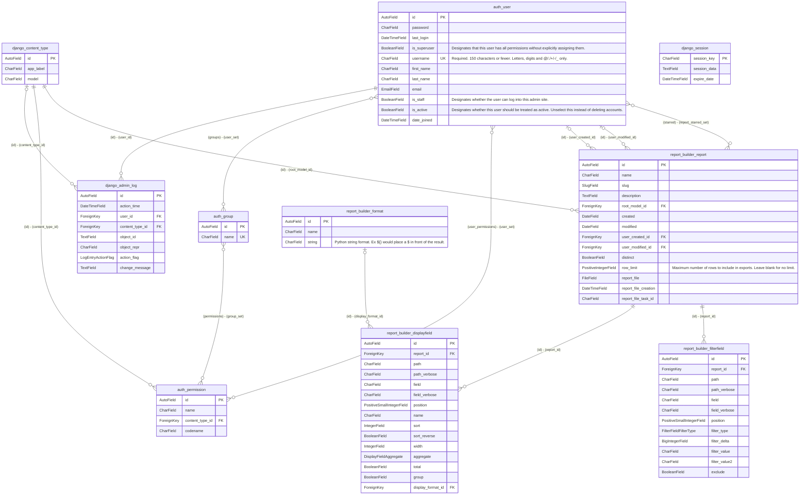

```mermaid
erDiagram
    auth_user ||--o{ django_admin_log : "(id) - (user_id)"
    django_content_type |o--o{ django_admin_log : "(id) - (content_type_id)"
    django_content_type ||--o{ auth_permission : "(id) - (content_type_id)"
    auth_group }o--o{ auth_permission : "(permissions) - (group_set)"
    auth_user }o--o{ auth_group : "(groups) - (user_set)"
    auth_user }o--o{ auth_permission : "(user_permissions) - (user_set)"
    django_content_type ||--o{ report_builder_report : "(id) - (root_model_id)"
    auth_user |o--o{ report_builder_report : "(id) - (user_created_id)"
    auth_user |o--o{ report_builder_report : "(id) - (user_modified_id)"
    report_builder_report }o--o{ auth_user : "(starred) - (report_starred_set)"
    report_builder_report ||--o{ report_builder_displayfield : "(id) - (report_id)"
    report_builder_format |o--o{ report_builder_displayfield : "(id) - (display_format_id)"
    report_builder_report ||--o{ report_builder_filterfield : "(id) - (report_id)"
    django_admin_log {
        AutoField id PK
        DateTimeField action_time
        ForeignKey user_id FK
        ForeignKey content_type_id FK
        TextField object_id
        CharField object_repr
        LogEntryActionFlag action_flag
        TextField change_message
    }
    auth_permission {
        AutoField id PK
        CharField name
        ForeignKey content_type_id FK
        CharField codename
    }
    auth_group {
        AutoField id PK
        CharField name UK
    }
    auth_user {
        AutoField id PK
        CharField password
        DateTimeField last_login
        BooleanField is_superuser "Designates that this user has all permissions without explicitly assigning them."
        CharField username UK "Required. 150 characters or fewer. Letters, digits and @/./+/-/_ only."
        CharField first_name
        CharField last_name
        EmailField email
        BooleanField is_staff "Designates whether the user can log into this admin site."
        BooleanField is_active "Designates whether this user should be treated as active. Unselect this instead of deleting accounts."
        DateTimeField date_joined
    }
    django_content_type {
        AutoField id PK
        CharField app_label
        CharField model
    }
    django_session {
        CharField session_key PK
        TextField session_data
        DateTimeField expire_date
    }
    report_builder_report {
        AutoField id PK
        CharField name
        SlugField slug
        TextField description
        ForeignKey root_model_id FK
        DateField created
        DateField modified
        ForeignKey user_created_id FK
        ForeignKey user_modified_id FK
        BooleanField distinct
        PositiveIntegerField row_limit "Maximum number of rows to include in exports. Leave blank for no limit."
        FileField report_file
        DateTimeField report_file_creation
        CharField report_file_task_id
    }
    report_builder_format {
        AutoField id PK
        CharField name
        CharField string "Python string format. Ex ${} would place a $ in front of the result."
    }
    report_builder_displayfield {
        AutoField id PK
        ForeignKey report_id FK
        CharField path
        CharField path_verbose
        CharField field
        CharField field_verbose
        PositiveSmallIntegerField position
        CharField name
        IntegerField sort
        BooleanField sort_reverse
        IntegerField width
        DisplayFieldAggregate aggregate
        BooleanField total
        BooleanField group
        ForeignKey display_format_id FK
    }
    report_builder_filterfield {
        AutoField id PK
        ForeignKey report_id FK
        CharField path
        CharField path_verbose
        CharField field
        CharField field_verbose
        PositiveSmallIntegerField position
        FilterFieldFilterType filter_type
        BigIntegerField filter_delta
        CharField filter_value
        CharField filter_value2
        BooleanField exclude
    }
```
