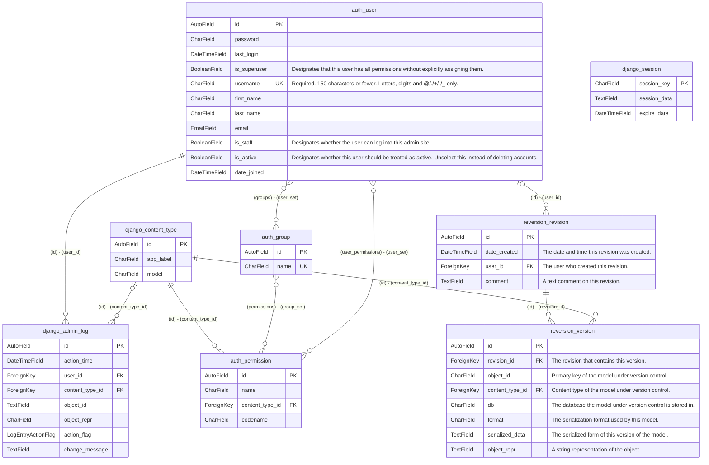

```mermaid
erDiagram
    auth_user ||--o{ django_admin_log : "(id) - (user_id)"
    django_content_type |o--o{ django_admin_log : "(id) - (content_type_id)"
    django_content_type ||--o{ auth_permission : "(id) - (content_type_id)"
    auth_group }o--o{ auth_permission : "(permissions) - (group_set)"
    auth_user }o--o{ auth_group : "(groups) - (user_set)"
    auth_user }o--o{ auth_permission : "(user_permissions) - (user_set)"
    auth_user |o--o{ reversion_revision : "(id) - (user_id)"
    reversion_revision ||--o{ reversion_version : "(id) - (revision_id)"
    django_content_type ||--o{ reversion_version : "(id) - (content_type_id)"
    django_admin_log {
        AutoField id PK
        DateTimeField action_time
        ForeignKey user_id FK
        ForeignKey content_type_id FK
        TextField object_id
        CharField object_repr
        LogEntryActionFlag action_flag
        TextField change_message
    }
    auth_permission {
        AutoField id PK
        CharField name
        ForeignKey content_type_id FK
        CharField codename
    }
    auth_group {
        AutoField id PK
        CharField name UK
    }
    auth_user {
        AutoField id PK
        CharField password
        DateTimeField last_login
        BooleanField is_superuser "Designates that this user has all permissions without explicitly assigning them."
        CharField username UK "Required. 150 characters or fewer. Letters, digits and @/./+/-/_ only."
        CharField first_name
        CharField last_name
        EmailField email
        BooleanField is_staff "Designates whether the user can log into this admin site."
        BooleanField is_active "Designates whether this user should be treated as active. Unselect this instead of deleting accounts."
        DateTimeField date_joined
    }
    django_content_type {
        AutoField id PK
        CharField app_label
        CharField model
    }
    django_session {
        CharField session_key PK
        TextField session_data
        DateTimeField expire_date
    }
    reversion_revision {
        AutoField id PK
        DateTimeField date_created "The date and time this revision was created."
        ForeignKey user_id FK "The user who created this revision."
        TextField comment "A text comment on this revision."
    }
    reversion_version {
        AutoField id PK
        ForeignKey revision_id FK "The revision that contains this version."
        CharField object_id "Primary key of the model under version control."
        ForeignKey content_type_id FK "Content type of the model under version control."
        CharField db "The database the model under version control is stored in."
        CharField format "The serialization format used by this model."
        TextField serialized_data "The serialized form of this version of the model."
        TextField object_repr "A string representation of the object."
    }
```
