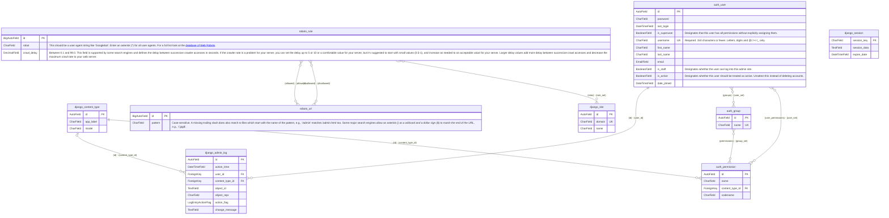

```mermaid
erDiagram
    auth_user ||--o{ django_admin_log : "(id) - (user_id)"
    django_content_type |o--o{ django_admin_log : "(id) - (content_type_id)"
    django_content_type ||--o{ auth_permission : "(id) - (content_type_id)"
    auth_group }o--o{ auth_permission : "(permissions) - (group_set)"
    auth_user }o--o{ auth_group : "(groups) - (user_set)"
    auth_user }o--o{ auth_permission : "(user_permissions) - (user_set)"
    robots_rule }o--o{ robots_url : "(allowed) - (allowed)"
    robots_rule }o--o{ robots_url : "(disallowed) - (disallowed)"
    robots_rule }o--o{ django_site : "(sites) - (rule_set)"
    django_admin_log {
        AutoField id PK
        DateTimeField action_time
        ForeignKey user_id FK
        ForeignKey content_type_id FK
        TextField object_id
        CharField object_repr
        LogEntryActionFlag action_flag
        TextField change_message
    }
    auth_permission {
        AutoField id PK
        CharField name
        ForeignKey content_type_id FK
        CharField codename
    }
    auth_group {
        AutoField id PK
        CharField name UK
    }
    auth_user {
        AutoField id PK
        CharField password
        DateTimeField last_login
        BooleanField is_superuser "Designates that this user has all permissions without explicitly assigning them."
        CharField username UK "Required. 150 characters or fewer. Letters, digits and @/./+/-/_ only."
        CharField first_name
        CharField last_name
        EmailField email
        BooleanField is_staff "Designates whether the user can log into this admin site."
        BooleanField is_active "Designates whether this user should be treated as active. Unselect this instead of deleting accounts."
        DateTimeField date_joined
    }
    django_content_type {
        AutoField id PK
        CharField app_label
        CharField model
    }
    django_session {
        CharField session_key PK
        TextField session_data
        DateTimeField expire_date
    }
    django_site {
        AutoField id PK
        CharField domain UK
        CharField name
    }
    robots_url {
        BigAutoField id PK
        CharField pattern "Case-sensitive. A missing trailing slash does also match to files which start with the name of the pattern, e.g., '/admin' matches /admin.html too. Some major search engines allow an asterisk (*) as a wildcard and a dollar sign ($) to match the end of the URL, e.g., '/*.jpg$'."
    }
    robots_rule {
        BigAutoField id PK
        CharField robot "This should be a user agent string like 'Googlebot'. Enter an asterisk (*) for all user agents. For a full list look at the <a target=_blank href='http://www.robotstxt.org/db.html'> database of Web Robots</a>."
        DecimalField crawl_delay "Between 0.1 and 99.0. This field is supported by some search engines and defines the delay between successive crawler accesses in seconds. If the crawler rate is a problem for your server, you can set the delay up to 5 or 10 or a comfortable value for your server, but it's suggested to start with small values (0.5-1), and increase as needed to an acceptable value for your server. Larger delay values add more delay between successive crawl accesses and decrease the maximum crawl rate to your web server."
    }
```
