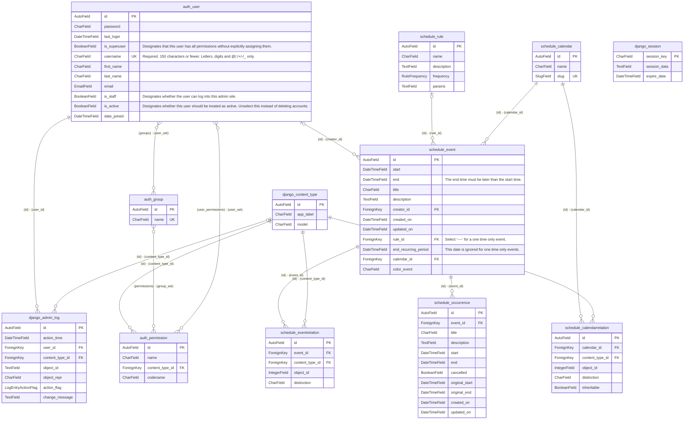

```mermaid
erDiagram
    auth_user ||--o{ django_admin_log : "(id) - (user_id)"
    django_content_type |o--o{ django_admin_log : "(id) - (content_type_id)"
    django_content_type ||--o{ auth_permission : "(id) - (content_type_id)"
    auth_group }o--o{ auth_permission : "(permissions) - (group_set)"
    auth_user }o--o{ auth_group : "(groups) - (user_set)"
    auth_user }o--o{ auth_permission : "(user_permissions) - (user_set)"
    schedule_calendar ||--o{ schedule_calendarrelation : "(id) - (calendar_id)"
    django_content_type ||--o{ schedule_calendarrelation : "(id) - (content_type_id)"
    auth_user |o--o{ schedule_event : "(id) - (creator_id)"
    schedule_rule |o--o{ schedule_event : "(id) - (rule_id)"
    schedule_calendar ||--o{ schedule_event : "(id) - (calendar_id)"
    schedule_event ||--o{ schedule_eventrelation : "(id) - (event_id)"
    django_content_type ||--o{ schedule_eventrelation : "(id) - (content_type_id)"
    schedule_event ||--o{ schedule_occurrence : "(id) - (event_id)"
    django_admin_log {
        AutoField id PK
        DateTimeField action_time
        ForeignKey user_id FK
        ForeignKey content_type_id FK
        TextField object_id
        CharField object_repr
        LogEntryActionFlag action_flag
        TextField change_message
    }
    auth_permission {
        AutoField id PK
        CharField name
        ForeignKey content_type_id FK
        CharField codename
    }
    auth_group {
        AutoField id PK
        CharField name UK
    }
    auth_user {
        AutoField id PK
        CharField password
        DateTimeField last_login
        BooleanField is_superuser "Designates that this user has all permissions without explicitly assigning them."
        CharField username UK "Required. 150 characters or fewer. Letters, digits and @/./+/-/_ only."
        CharField first_name
        CharField last_name
        EmailField email
        BooleanField is_staff "Designates whether the user can log into this admin site."
        BooleanField is_active "Designates whether this user should be treated as active. Unselect this instead of deleting accounts."
        DateTimeField date_joined
    }
    django_content_type {
        AutoField id PK
        CharField app_label
        CharField model
    }
    django_session {
        CharField session_key PK
        TextField session_data
        DateTimeField expire_date
    }
    schedule_calendar {
        AutoField id PK
        CharField name
        SlugField slug UK
    }
    schedule_calendarrelation {
        AutoField id PK
        ForeignKey calendar_id FK
        ForeignKey content_type_id FK
        IntegerField object_id
        CharField distinction
        BooleanField inheritable
    }
    schedule_rule {
        AutoField id PK
        CharField name
        TextField description
        RuleFrequency frequency
        TextField params
    }
    schedule_event {
        AutoField id PK
        DateTimeField start
        DateTimeField end "The end time must be later than the start time."
        CharField title
        TextField description
        ForeignKey creator_id FK
        DateTimeField created_on
        DateTimeField updated_on
        ForeignKey rule_id FK "Select '----' for a one time only event."
        DateTimeField end_recurring_period "This date is ignored for one time only events."
        ForeignKey calendar_id FK
        CharField color_event
    }
    schedule_eventrelation {
        AutoField id PK
        ForeignKey event_id FK
        ForeignKey content_type_id FK
        IntegerField object_id
        CharField distinction
    }
    schedule_occurrence {
        AutoField id PK
        ForeignKey event_id FK
        CharField title
        TextField description
        DateTimeField start
        DateTimeField end
        BooleanField cancelled
        DateTimeField original_start
        DateTimeField original_end
        DateTimeField created_on
        DateTimeField updated_on
    }
```
