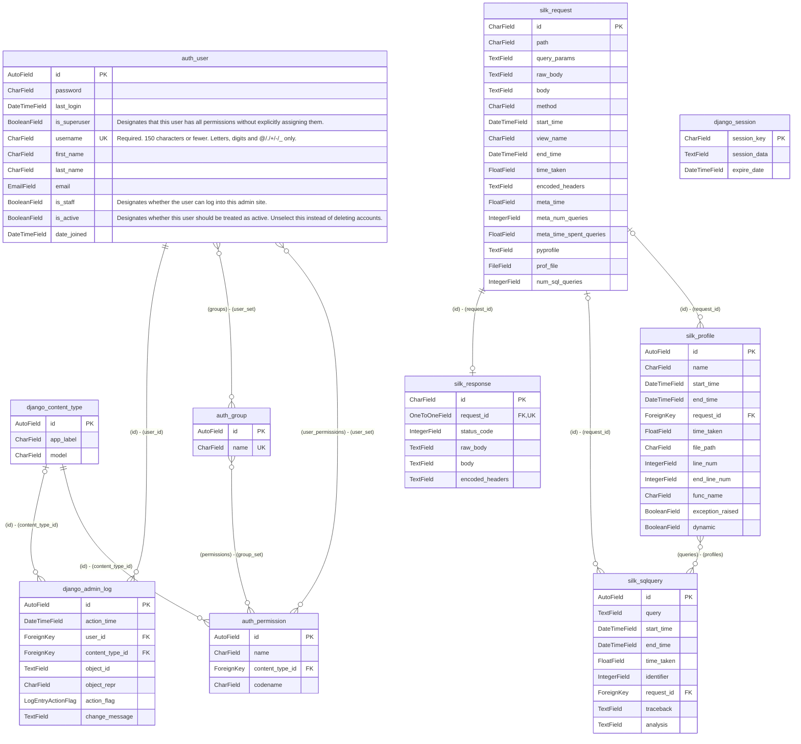

```mermaid
erDiagram
    auth_user ||--o{ django_admin_log : "(id) - (user_id)"
    django_content_type |o--o{ django_admin_log : "(id) - (content_type_id)"
    django_content_type ||--o{ auth_permission : "(id) - (content_type_id)"
    auth_group }o--o{ auth_permission : "(permissions) - (group_set)"
    auth_user }o--o{ auth_group : "(groups) - (user_set)"
    auth_user }o--o{ auth_permission : "(user_permissions) - (user_set)"
    silk_request ||--o| silk_response : "(id) - (request_id)"
    silk_request |o--o{ silk_sqlquery : "(id) - (request_id)"
    silk_request |o--o{ silk_profile : "(id) - (request_id)"
    silk_profile }o--o{ silk_sqlquery : "(queries) - (profiles)"
    django_admin_log {
        AutoField id PK
        DateTimeField action_time
        ForeignKey user_id FK
        ForeignKey content_type_id FK
        TextField object_id
        CharField object_repr
        LogEntryActionFlag action_flag
        TextField change_message
    }
    auth_permission {
        AutoField id PK
        CharField name
        ForeignKey content_type_id FK
        CharField codename
    }
    auth_group {
        AutoField id PK
        CharField name UK
    }
    auth_user {
        AutoField id PK
        CharField password
        DateTimeField last_login
        BooleanField is_superuser "Designates that this user has all permissions without explicitly assigning them."
        CharField username UK "Required. 150 characters or fewer. Letters, digits and @/./+/-/_ only."
        CharField first_name
        CharField last_name
        EmailField email
        BooleanField is_staff "Designates whether the user can log into this admin site."
        BooleanField is_active "Designates whether this user should be treated as active. Unselect this instead of deleting accounts."
        DateTimeField date_joined
    }
    django_content_type {
        AutoField id PK
        CharField app_label
        CharField model
    }
    django_session {
        CharField session_key PK
        TextField session_data
        DateTimeField expire_date
    }
    silk_request {
        CharField id PK
        CharField path
        TextField query_params
        TextField raw_body
        TextField body
        CharField method
        DateTimeField start_time
        CharField view_name
        DateTimeField end_time
        FloatField time_taken
        TextField encoded_headers
        FloatField meta_time
        IntegerField meta_num_queries
        FloatField meta_time_spent_queries
        TextField pyprofile
        FileField prof_file
        IntegerField num_sql_queries
    }
    silk_response {
        CharField id PK
        OneToOneField request_id FK, UK
        IntegerField status_code
        TextField raw_body
        TextField body
        TextField encoded_headers
    }
    silk_sqlquery {
        AutoField id PK
        TextField query
        DateTimeField start_time
        DateTimeField end_time
        FloatField time_taken
        IntegerField identifier
        ForeignKey request_id FK
        TextField traceback
        TextField analysis
    }
    silk_profile {
        AutoField id PK
        CharField name
        DateTimeField start_time
        DateTimeField end_time
        ForeignKey request_id FK
        FloatField time_taken
        CharField file_path
        IntegerField line_num
        IntegerField end_line_num
        CharField func_name
        BooleanField exception_raised
        BooleanField dynamic
    }
```
