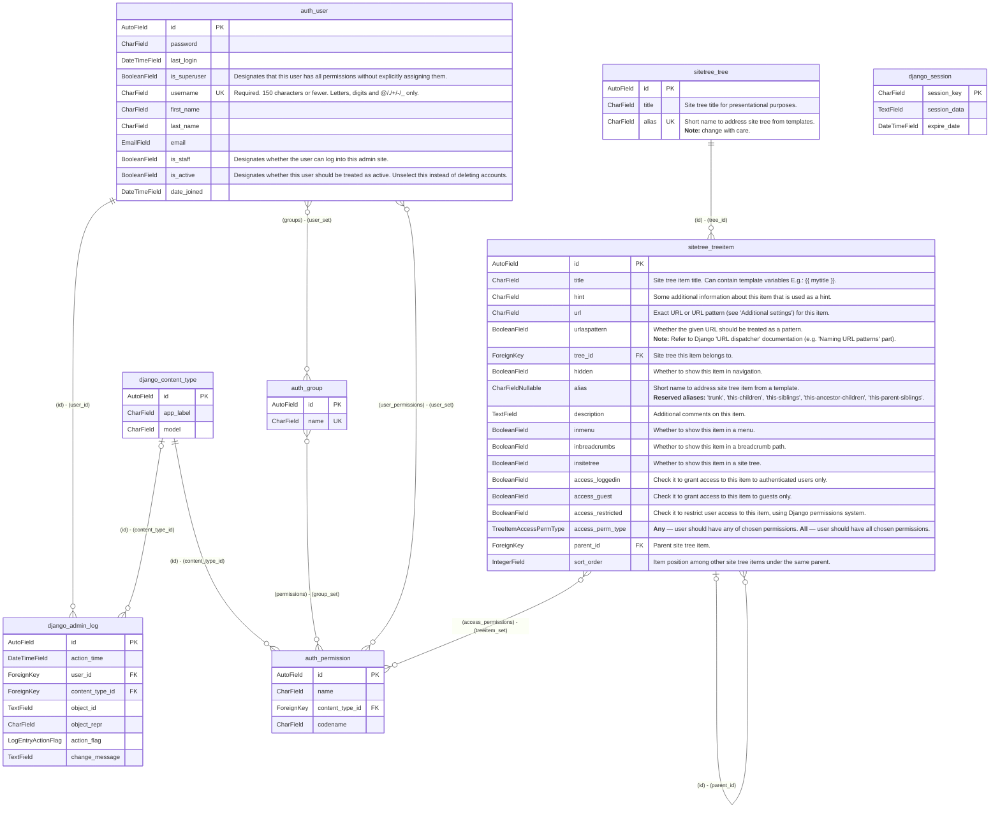

```mermaid
erDiagram
    auth_user ||--o{ django_admin_log : "(id) - (user_id)"
    django_content_type |o--o{ django_admin_log : "(id) - (content_type_id)"
    django_content_type ||--o{ auth_permission : "(id) - (content_type_id)"
    auth_group }o--o{ auth_permission : "(permissions) - (group_set)"
    auth_user }o--o{ auth_group : "(groups) - (user_set)"
    auth_user }o--o{ auth_permission : "(user_permissions) - (user_set)"
    sitetree_tree ||--o{ sitetree_treeitem : "(id) - (tree_id)"
    sitetree_treeitem |o--o{ sitetree_treeitem : "(id) - (parent_id)"
    sitetree_treeitem }o--o{ auth_permission : "(access_permissions) - (treeitem_set)"
    django_admin_log {
        AutoField id PK
        DateTimeField action_time
        ForeignKey user_id FK
        ForeignKey content_type_id FK
        TextField object_id
        CharField object_repr
        LogEntryActionFlag action_flag
        TextField change_message
    }
    auth_permission {
        AutoField id PK
        CharField name
        ForeignKey content_type_id FK
        CharField codename
    }
    auth_group {
        AutoField id PK
        CharField name UK
    }
    auth_user {
        AutoField id PK
        CharField password
        DateTimeField last_login
        BooleanField is_superuser "Designates that this user has all permissions without explicitly assigning them."
        CharField username UK "Required. 150 characters or fewer. Letters, digits and @/./+/-/_ only."
        CharField first_name
        CharField last_name
        EmailField email
        BooleanField is_staff "Designates whether the user can log into this admin site."
        BooleanField is_active "Designates whether this user should be treated as active. Unselect this instead of deleting accounts."
        DateTimeField date_joined
    }
    django_content_type {
        AutoField id PK
        CharField app_label
        CharField model
    }
    django_session {
        CharField session_key PK
        TextField session_data
        DateTimeField expire_date
    }
    sitetree_tree {
        AutoField id PK
        CharField title "Site tree title for presentational purposes."
        CharField alias UK "Short name to address site tree from templates.<br /><b>Note:</b> change with care."
    }
    sitetree_treeitem {
        AutoField id PK
        CharField title "Site tree item title. Can contain template variables E.g.: {{ mytitle }}."
        CharField hint "Some additional information about this item that is used as a hint."
        CharField url "Exact URL or URL pattern (see 'Additional settings') for this item."
        BooleanField urlaspattern "Whether the given URL should be treated as a pattern.<br /><b>Note:</b> Refer to Django 'URL dispatcher' documentation (e.g. 'Naming URL patterns' part)."
        ForeignKey tree_id FK "Site tree this item belongs to."
        BooleanField hidden "Whether to show this item in navigation."
        CharFieldNullable alias "Short name to address site tree item from a template.<br /><b>Reserved aliases:</b> 'trunk', 'this-children', 'this-siblings', 'this-ancestor-children', 'this-parent-siblings'."
        TextField description "Additional comments on this item."
        BooleanField inmenu "Whether to show this item in a menu."
        BooleanField inbreadcrumbs "Whether to show this item in a breadcrumb path."
        BooleanField insitetree "Whether to show this item in a site tree."
        BooleanField access_loggedin "Check it to grant access to this item to authenticated users only."
        BooleanField access_guest "Check it to grant access to this item to guests only."
        BooleanField access_restricted "Check it to restrict user access to this item, using Django permissions system."
        TreeItemAccessPermType access_perm_type "<b>Any</b> &mdash; user should have any of chosen permissions. <b>All</b> &mdash; user should have all chosen permissions."
        ForeignKey parent_id FK "Parent site tree item."
        IntegerField sort_order "Item position among other site tree items under the same parent."
    }
```
