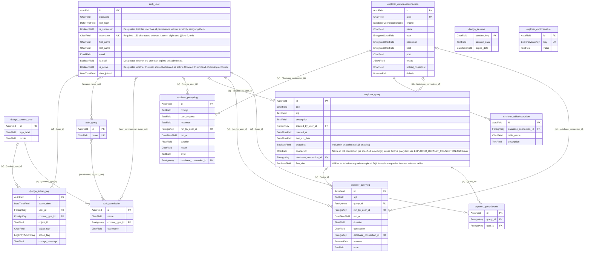

```mermaid
erDiagram
    auth_user ||--o{ django_admin_log : "(id) - (user_id)"
    django_content_type |o--o{ django_admin_log : "(id) - (content_type_id)"
    django_content_type ||--o{ auth_permission : "(id) - (content_type_id)"
    auth_group }o--o{ auth_permission : "(permissions) - (group_set)"
    auth_user }o--o{ auth_group : "(groups) - (user_set)"
    auth_user }o--o{ auth_permission : "(user_permissions) - (user_set)"
    auth_user |o--o{ explorer_promptlog : "(id) - (run_by_user_id)"
    explorer_databaseconnection |o--o{ explorer_promptlog : "(id) - (database_connection_id)"
    explorer_databaseconnection ||--o{ explorer_tabledescription : "(id) - (database_connection_id)"
    auth_user |o--o{ explorer_query : "(id) - (created_by_user_id)"
    explorer_databaseconnection |o--o{ explorer_query : "(id) - (database_connection_id)"
    explorer_query |o--o{ explorer_querylog : "(id) - (query_id)"
    auth_user |o--o{ explorer_querylog : "(id) - (run_by_user_id)"
    explorer_databaseconnection |o--o{ explorer_querylog : "(id) - (database_connection_id)"
    explorer_query ||--o{ explorer_queryfavorite : "(id) - (query_id)"
    auth_user ||--o{ explorer_queryfavorite : "(id) - (user_id)"
    django_admin_log {
        AutoField id PK
        DateTimeField action_time
        ForeignKey user_id FK
        ForeignKey content_type_id FK
        TextField object_id
        CharField object_repr
        LogEntryActionFlag action_flag
        TextField change_message
    }
    auth_permission {
        AutoField id PK
        CharField name
        ForeignKey content_type_id FK
        CharField codename
    }
    auth_group {
        AutoField id PK
        CharField name UK
    }
    auth_user {
        AutoField id PK
        CharField password
        DateTimeField last_login
        BooleanField is_superuser "Designates that this user has all permissions without explicitly assigning them."
        CharField username UK "Required. 150 characters or fewer. Letters, digits and @/./+/-/_ only."
        CharField first_name
        CharField last_name
        EmailField email
        BooleanField is_staff "Designates whether the user can log into this admin site."
        BooleanField is_active "Designates whether this user should be treated as active. Unselect this instead of deleting accounts."
        DateTimeField date_joined
    }
    django_content_type {
        AutoField id PK
        CharField app_label
        CharField model
    }
    django_session {
        CharField session_key PK
        TextField session_data
        DateTimeField expire_date
    }
    explorer_databaseconnection {
        AutoField id PK
        CharField alias UK
        DatabaseConnectionEngine engine
        CharField name
        EncryptedCharField user
        EncryptedCharField password
        EncryptedCharField host
        CharField port
        JSONField extras
        CharField upload_fingerprint
        BooleanField default
    }
    explorer_promptlog {
        AutoField id PK
        TextField prompt
        TextField user_request
        TextField response
        ForeignKey run_by_user_id FK
        DateTimeField run_at
        FloatField duration
        CharField model
        TextField error
        ForeignKey database_connection_id FK
    }
    explorer_tabledescription {
        AutoField id PK
        ForeignKey database_connection_id FK
        CharField table_name
        TextField description
    }
    explorer_query {
        AutoField id PK
        CharField title
        TextField sql
        TextField description
        ForeignKey created_by_user_id FK
        DateTimeField created_at
        DateTimeField last_run_date
        BooleanField snapshot "Include in snapshot task (if enabled)"
        CharField connection "Name of DB connection (as specified in settings) to use for this query.Will use EXPLORER_DEFAULT_CONNECTION if left blank"
        ForeignKey database_connection_id FK
        BooleanField few_shot "Will be included as a good example of SQL in assistant queries that use relevant tables"
    }
    explorer_querylog {
        AutoField id PK
        TextField sql
        ForeignKey query_id FK
        ForeignKey run_by_user_id FK
        DateTimeField run_at
        FloatField duration
        CharField connection
        ForeignKey database_connection_id FK
        BooleanField success
        TextField error
    }
    explorer_queryfavorite {
        AutoField id PK
        ForeignKey query_id FK
        ForeignKey user_id FK
    }
    explorer_explorervalue {
        AutoField id PK
        ExplorerValueKey key UK
        TextField value
    }
```
