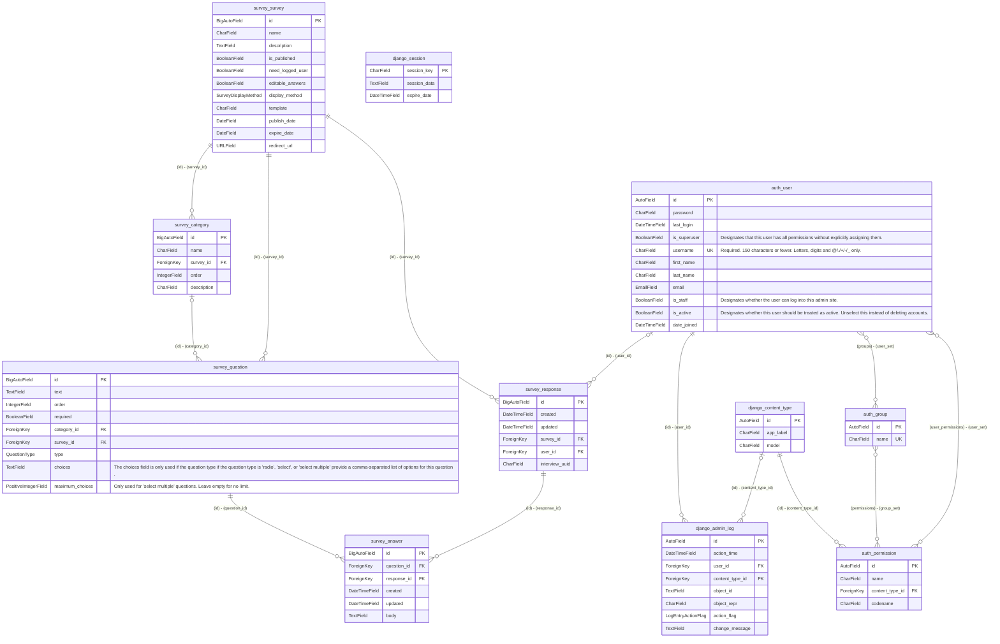

```mermaid
erDiagram
    auth_user ||--o{ django_admin_log : "(id) - (user_id)"
    django_content_type |o--o{ django_admin_log : "(id) - (content_type_id)"
    django_content_type ||--o{ auth_permission : "(id) - (content_type_id)"
    auth_group }o--o{ auth_permission : "(permissions) - (group_set)"
    auth_user }o--o{ auth_group : "(groups) - (user_set)"
    auth_user }o--o{ auth_permission : "(user_permissions) - (user_set)"
    survey_survey ||--o{ survey_category : "(id) - (survey_id)"
    survey_category |o--o{ survey_question : "(id) - (category_id)"
    survey_survey ||--o{ survey_question : "(id) - (survey_id)"
    survey_survey ||--o{ survey_response : "(id) - (survey_id)"
    auth_user |o--o{ survey_response : "(id) - (user_id)"
    survey_question ||--o{ survey_answer : "(id) - (question_id)"
    survey_response ||--o{ survey_answer : "(id) - (response_id)"
    django_admin_log {
        AutoField id PK
        DateTimeField action_time
        ForeignKey user_id FK
        ForeignKey content_type_id FK
        TextField object_id
        CharField object_repr
        LogEntryActionFlag action_flag
        TextField change_message
    }
    auth_permission {
        AutoField id PK
        CharField name
        ForeignKey content_type_id FK
        CharField codename
    }
    auth_group {
        AutoField id PK
        CharField name UK
    }
    auth_user {
        AutoField id PK
        CharField password
        DateTimeField last_login
        BooleanField is_superuser "Designates that this user has all permissions without explicitly assigning them."
        CharField username UK "Required. 150 characters or fewer. Letters, digits and @/./+/-/_ only."
        CharField first_name
        CharField last_name
        EmailField email
        BooleanField is_staff "Designates whether the user can log into this admin site."
        BooleanField is_active "Designates whether this user should be treated as active. Unselect this instead of deleting accounts."
        DateTimeField date_joined
    }
    django_content_type {
        AutoField id PK
        CharField app_label
        CharField model
    }
    django_session {
        CharField session_key PK
        TextField session_data
        DateTimeField expire_date
    }
    survey_survey {
        BigAutoField id PK
        CharField name
        TextField description
        BooleanField is_published
        BooleanField need_logged_user
        BooleanField editable_answers
        SurveyDisplayMethod display_method
        CharField template
        DateField publish_date
        DateField expire_date
        URLField redirect_url
    }
    survey_category {
        BigAutoField id PK
        CharField name
        ForeignKey survey_id FK
        IntegerField order
        CharField description
    }
    survey_question {
        BigAutoField id PK
        TextField text
        IntegerField order
        BooleanField required
        ForeignKey category_id FK
        ForeignKey survey_id FK
        QuestionType type
        TextField choices "The choices field is only used if the question type if the question type is 'radio', 'select', or 'select multiple' provide a comma-separated list of options for this question ."
        PositiveIntegerField maximum_choices "Only used for 'select multiple' questions. Leave empty for no limit."
    }
    survey_response {
        BigAutoField id PK
        DateTimeField created
        DateTimeField updated
        ForeignKey survey_id FK
        ForeignKey user_id FK
        CharField interview_uuid
    }
    survey_answer {
        BigAutoField id PK
        ForeignKey question_id FK
        ForeignKey response_id FK
        DateTimeField created
        DateTimeField updated
        TextField body
    }
```
