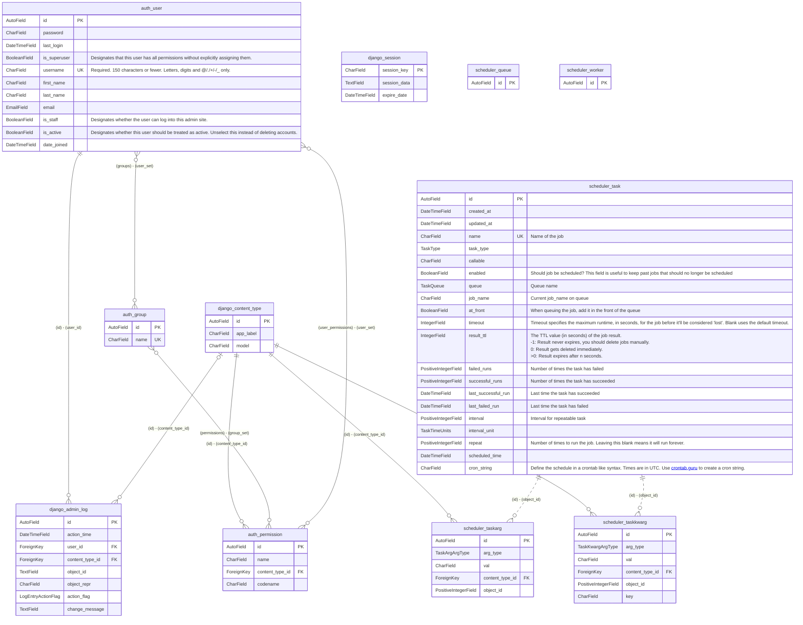

```mermaid
erDiagram
    auth_user ||--o{ django_admin_log : "(id) - (user_id)"
    django_content_type |o--o{ django_admin_log : "(id) - (content_type_id)"
    django_content_type ||--o{ auth_permission : "(id) - (content_type_id)"
    auth_group }o--o{ auth_permission : "(permissions) - (group_set)"
    auth_user }o--o{ auth_group : "(groups) - (user_set)"
    auth_user }o--o{ auth_permission : "(user_permissions) - (user_set)"
    django_content_type ||--o{ scheduler_taskarg : "(id) - (content_type_id)"
    django_content_type ||--o{ scheduler_taskkwarg : "(id) - (content_type_id)"
    scheduler_task ||..o{ scheduler_taskarg : "(id) - (object_id)"
    scheduler_task ||..o{ scheduler_taskkwarg : "(id) - (object_id)"
    django_admin_log {
        AutoField id PK
        DateTimeField action_time
        ForeignKey user_id FK
        ForeignKey content_type_id FK
        TextField object_id
        CharField object_repr
        LogEntryActionFlag action_flag
        TextField change_message
    }
    auth_permission {
        AutoField id PK
        CharField name
        ForeignKey content_type_id FK
        CharField codename
    }
    auth_group {
        AutoField id PK
        CharField name UK
    }
    auth_user {
        AutoField id PK
        CharField password
        DateTimeField last_login
        BooleanField is_superuser "Designates that this user has all permissions without explicitly assigning them."
        CharField username UK "Required. 150 characters or fewer. Letters, digits and @/./+/-/_ only."
        CharField first_name
        CharField last_name
        EmailField email
        BooleanField is_staff "Designates whether the user can log into this admin site."
        BooleanField is_active "Designates whether this user should be treated as active. Unselect this instead of deleting accounts."
        DateTimeField date_joined
    }
    django_content_type {
        AutoField id PK
        CharField app_label
        CharField model
    }
    django_session {
        CharField session_key PK
        TextField session_data
        DateTimeField expire_date
    }
    scheduler_taskarg {
        AutoField id PK
        TaskArgArgType arg_type
        CharField val
        ForeignKey content_type_id FK
        PositiveIntegerField object_id
    }
    scheduler_taskkwarg {
        AutoField id PK
        TaskKwargArgType arg_type
        CharField val
        ForeignKey content_type_id FK
        PositiveIntegerField object_id
        CharField key
    }
    scheduler_task {
        AutoField id PK
        DateTimeField created_at
        DateTimeField updated_at
        CharField name UK "Name of the job"
        TaskType task_type
        CharField callable
        BooleanField enabled "Should job be scheduled? This field is useful to keep past jobs that should no longer be scheduled"
        TaskQueue queue "Queue name"
        CharField job_name "Current job_name on queue"
        BooleanField at_front "When queuing the job, add it in the front of the queue"
        IntegerField timeout "Timeout specifies the maximum runtime, in seconds, for the job before it'll be considered 'lost'. Blank uses the default timeout."
        IntegerField result_ttl "The TTL value (in seconds) of the job result.<br/>                -1: Result never expires, you should delete jobs manually. <br/>                 0: Result gets deleted immediately. <br/>                 >0: Result expires after n seconds."
        PositiveIntegerField failed_runs "Number of times the task has failed"
        PositiveIntegerField successful_runs "Number of times the task has succeeded"
        DateTimeField last_successful_run "Last time the task has succeeded"
        DateTimeField last_failed_run "Last time the task has failed"
        PositiveIntegerField interval "Interval for repeatable task"
        TaskTimeUnits interval_unit
        PositiveIntegerField repeat "Number of times to run the job. Leaving this blank means it will run forever."
        DateTimeField scheduled_time
        CharField cron_string "Define the schedule in a crontab like syntax.             Times are in UTC. Use <a href='https://crontab.guru/'>crontab.guru</a> to create a cron string."
    }
    scheduler_queue {
        AutoField id PK
    }
    scheduler_worker {
        AutoField id PK
    }
```
