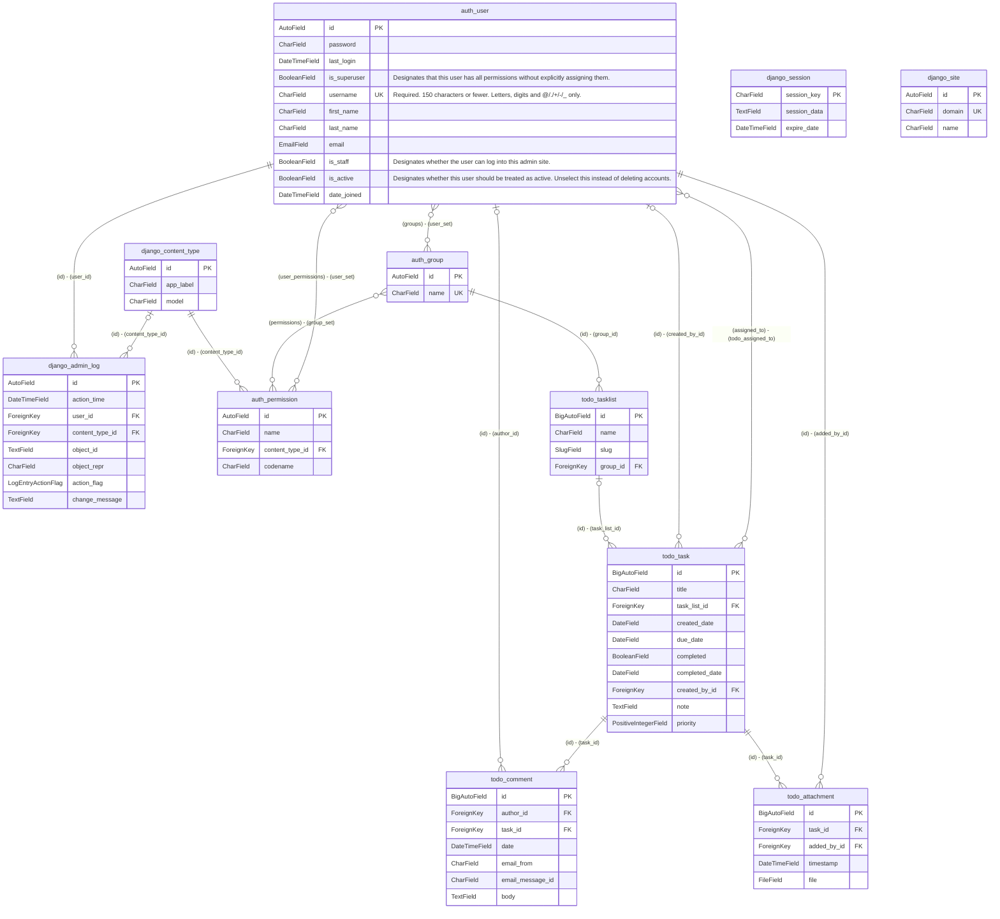

```mermaid
erDiagram
    auth_user ||--o{ django_admin_log : "(id) - (user_id)"
    django_content_type |o--o{ django_admin_log : "(id) - (content_type_id)"
    django_content_type ||--o{ auth_permission : "(id) - (content_type_id)"
    auth_group }o--o{ auth_permission : "(permissions) - (group_set)"
    auth_user }o--o{ auth_group : "(groups) - (user_set)"
    auth_user }o--o{ auth_permission : "(user_permissions) - (user_set)"
    auth_group ||--o{ todo_tasklist : "(id) - (group_id)"
    todo_tasklist |o--o{ todo_task : "(id) - (task_list_id)"
    auth_user |o--o{ todo_task : "(id) - (created_by_id)"
    todo_task }o--o{ auth_user : "(assigned_to) - (todo_assigned_to)"
    auth_user |o--o{ todo_comment : "(id) - (author_id)"
    todo_task ||--o{ todo_comment : "(id) - (task_id)"
    todo_task ||--o{ todo_attachment : "(id) - (task_id)"
    auth_user ||--o{ todo_attachment : "(id) - (added_by_id)"
    django_admin_log {
        AutoField id PK
        DateTimeField action_time
        ForeignKey user_id FK
        ForeignKey content_type_id FK
        TextField object_id
        CharField object_repr
        LogEntryActionFlag action_flag
        TextField change_message
    }
    auth_permission {
        AutoField id PK
        CharField name
        ForeignKey content_type_id FK
        CharField codename
    }
    auth_group {
        AutoField id PK
        CharField name UK
    }
    auth_user {
        AutoField id PK
        CharField password
        DateTimeField last_login
        BooleanField is_superuser "Designates that this user has all permissions without explicitly assigning them."
        CharField username UK "Required. 150 characters or fewer. Letters, digits and @/./+/-/_ only."
        CharField first_name
        CharField last_name
        EmailField email
        BooleanField is_staff "Designates whether the user can log into this admin site."
        BooleanField is_active "Designates whether this user should be treated as active. Unselect this instead of deleting accounts."
        DateTimeField date_joined
    }
    django_content_type {
        AutoField id PK
        CharField app_label
        CharField model
    }
    django_session {
        CharField session_key PK
        TextField session_data
        DateTimeField expire_date
    }
    django_site {
        AutoField id PK
        CharField domain UK
        CharField name
    }
    todo_tasklist {
        BigAutoField id PK
        CharField name
        SlugField slug
        ForeignKey group_id FK
    }
    todo_task {
        BigAutoField id PK
        CharField title
        ForeignKey task_list_id FK
        DateField created_date
        DateField due_date
        BooleanField completed
        DateField completed_date
        ForeignKey created_by_id FK
        TextField note
        PositiveIntegerField priority
    }
    todo_comment {
        BigAutoField id PK
        ForeignKey author_id FK
        ForeignKey task_id FK
        DateTimeField date
        CharField email_from
        CharField email_message_id
        TextField body
    }
    todo_attachment {
        BigAutoField id PK
        ForeignKey task_id FK
        ForeignKey added_by_id FK
        DateTimeField timestamp
        FileField file
    }
```
