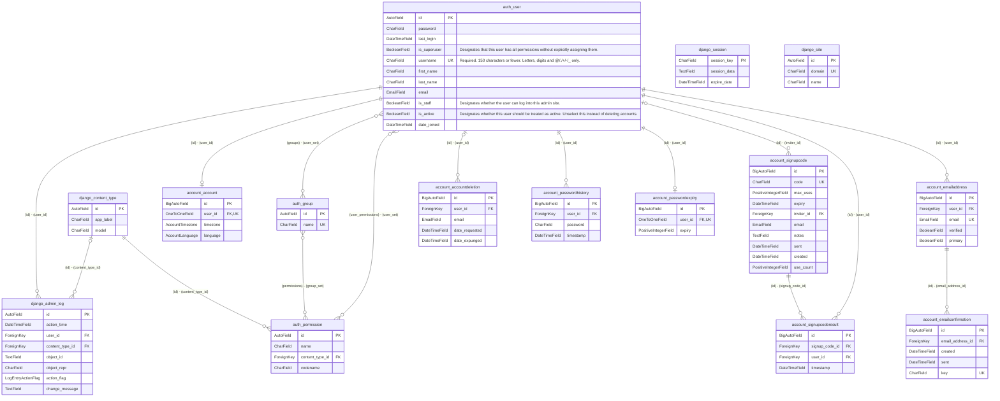

```mermaid
erDiagram
    auth_user ||--o{ django_admin_log : "(id) - (user_id)"
    django_content_type |o--o{ django_admin_log : "(id) - (content_type_id)"
    django_content_type ||--o{ auth_permission : "(id) - (content_type_id)"
    auth_group }o--o{ auth_permission : "(permissions) - (group_set)"
    auth_user }o--o{ auth_group : "(groups) - (user_set)"
    auth_user }o--o{ auth_permission : "(user_permissions) - (user_set)"
    auth_user ||--o| account_account : "(id) - (user_id)"
    auth_user |o--o{ account_signupcode : "(id) - (inviter_id)"
    account_signupcode ||--o{ account_signupcoderesult : "(id) - (signup_code_id)"
    auth_user ||--o{ account_signupcoderesult : "(id) - (user_id)"
    auth_user ||--o{ account_emailaddress : "(id) - (user_id)"
    account_emailaddress ||--o{ account_emailconfirmation : "(id) - (email_address_id)"
    auth_user |o--o{ account_accountdeletion : "(id) - (user_id)"
    auth_user ||--o{ account_passwordhistory : "(id) - (user_id)"
    auth_user ||--o| account_passwordexpiry : "(id) - (user_id)"
    django_admin_log {
        AutoField id PK
        DateTimeField action_time
        ForeignKey user_id FK
        ForeignKey content_type_id FK
        TextField object_id
        CharField object_repr
        LogEntryActionFlag action_flag
        TextField change_message
    }
    auth_permission {
        AutoField id PK
        CharField name
        ForeignKey content_type_id FK
        CharField codename
    }
    auth_group {
        AutoField id PK
        CharField name UK
    }
    auth_user {
        AutoField id PK
        CharField password
        DateTimeField last_login
        BooleanField is_superuser "Designates that this user has all permissions without explicitly assigning them."
        CharField username UK "Required. 150 characters or fewer. Letters, digits and @/./+/-/_ only."
        CharField first_name
        CharField last_name
        EmailField email
        BooleanField is_staff "Designates whether the user can log into this admin site."
        BooleanField is_active "Designates whether this user should be treated as active. Unselect this instead of deleting accounts."
        DateTimeField date_joined
    }
    django_content_type {
        AutoField id PK
        CharField app_label
        CharField model
    }
    django_session {
        CharField session_key PK
        TextField session_data
        DateTimeField expire_date
    }
    django_site {
        AutoField id PK
        CharField domain UK
        CharField name
    }
    account_account {
        BigAutoField id PK
        OneToOneField user_id FK, UK
        AccountTimezone timezone
        AccountLanguage language
    }
    account_signupcode {
        BigAutoField id PK
        CharField code UK
        PositiveIntegerField max_uses
        DateTimeField expiry
        ForeignKey inviter_id FK
        EmailField email
        TextField notes
        DateTimeField sent
        DateTimeField created
        PositiveIntegerField use_count
    }
    account_signupcoderesult {
        BigAutoField id PK
        ForeignKey signup_code_id FK
        ForeignKey user_id FK
        DateTimeField timestamp
    }
    account_emailaddress {
        BigAutoField id PK
        ForeignKey user_id FK
        EmailField email UK
        BooleanField verified
        BooleanField primary
    }
    account_emailconfirmation {
        BigAutoField id PK
        ForeignKey email_address_id FK
        DateTimeField created
        DateTimeField sent
        CharField key UK
    }
    account_accountdeletion {
        BigAutoField id PK
        ForeignKey user_id FK
        EmailField email
        DateTimeField date_requested
        DateTimeField date_expunged
    }
    account_passwordhistory {
        BigAutoField id PK
        ForeignKey user_id FK
        CharField password
        DateTimeField timestamp
    }
    account_passwordexpiry {
        BigAutoField id PK
        OneToOneField user_id FK, UK
        PositiveIntegerField expiry
    }
```
