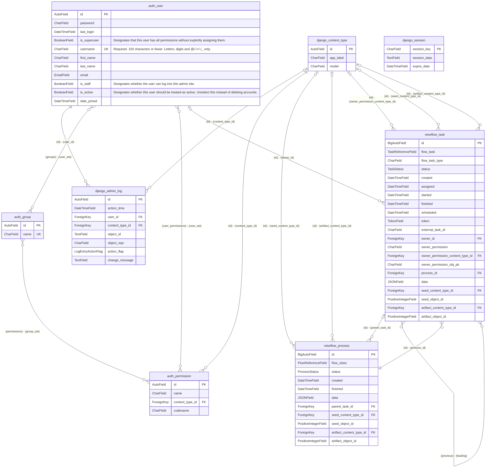

```mermaid
erDiagram
    auth_user ||--o{ django_admin_log : "(id) - (user_id)"
    django_content_type |o--o{ django_admin_log : "(id) - (content_type_id)"
    django_content_type ||--o{ auth_permission : "(id) - (content_type_id)"
    auth_group }o--o{ auth_permission : "(permissions) - (group_set)"
    auth_user }o--o{ auth_group : "(groups) - (user_set)"
    auth_user }o--o{ auth_permission : "(user_permissions) - (user_set)"
    viewflow_task |o--o{ viewflow_process : "(id) - (parent_task_id)"
    django_content_type |o--o{ viewflow_process : "(id) - (seed_content_type_id)"
    django_content_type |o--o{ viewflow_process : "(id) - (artifact_content_type_id)"
    auth_user |o--o{ viewflow_task : "(id) - (owner_id)"
    django_content_type |o--o{ viewflow_task : "(id) - (owner_permission_content_type_id)"
    viewflow_process ||--o{ viewflow_task : "(id) - (process_id)"
    django_content_type |o--o{ viewflow_task : "(id) - (seed_content_type_id)"
    django_content_type |o--o{ viewflow_task : "(id) - (artifact_content_type_id)"
    viewflow_task }o--o{ viewflow_task : "(previous) - (leading)"
    django_admin_log {
        AutoField id PK
        DateTimeField action_time
        ForeignKey user_id FK
        ForeignKey content_type_id FK
        TextField object_id
        CharField object_repr
        LogEntryActionFlag action_flag
        TextField change_message
    }
    auth_permission {
        AutoField id PK
        CharField name
        ForeignKey content_type_id FK
        CharField codename
    }
    auth_group {
        AutoField id PK
        CharField name UK
    }
    auth_user {
        AutoField id PK
        CharField password
        DateTimeField last_login
        BooleanField is_superuser "Designates that this user has all permissions without explicitly assigning them."
        CharField username UK "Required. 150 characters or fewer. Letters, digits and @/./+/-/_ only."
        CharField first_name
        CharField last_name
        EmailField email
        BooleanField is_staff "Designates whether the user can log into this admin site."
        BooleanField is_active "Designates whether this user should be treated as active. Unselect this instead of deleting accounts."
        DateTimeField date_joined
    }
    django_content_type {
        AutoField id PK
        CharField app_label
        CharField model
    }
    django_session {
        CharField session_key PK
        TextField session_data
        DateTimeField expire_date
    }
    viewflow_process {
        BigAutoField id PK
        FlowReferenceField flow_class
        ProcessStatus status
        DateTimeField created
        DateTimeField finished
        JSONField data
        ForeignKey parent_task_id FK
        ForeignKey seed_content_type_id FK
        PositiveIntegerField seed_object_id
        ForeignKey artifact_content_type_id FK
        PositiveIntegerField artifact_object_id
    }
    viewflow_task {
        BigAutoField id PK
        TaskReferenceField flow_task
        CharField flow_task_type
        TaskStatus status
        DateTimeField created
        DateTimeField assigned
        DateTimeField started
        DateTimeField finished
        DateTimeField scheduled
        TokenField token
        CharField external_task_id
        ForeignKey owner_id FK
        CharField owner_permission
        ForeignKey owner_permission_content_type_id FK
        CharField owner_permission_obj_pk
        ForeignKey process_id FK
        JSONField data
        ForeignKey seed_content_type_id FK
        PositiveIntegerField seed_object_id
        ForeignKey artifact_content_type_id FK
        PositiveIntegerField artifact_object_id
    }
```
