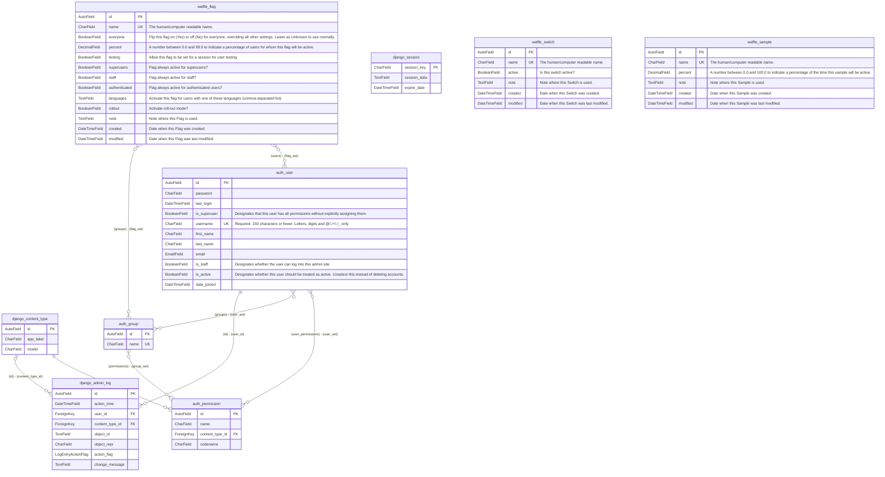

```mermaid
erDiagram
    auth_user ||--o{ django_admin_log : "(id) - (user_id)"
    django_content_type |o--o{ django_admin_log : "(id) - (content_type_id)"
    django_content_type ||--o{ auth_permission : "(id) - (content_type_id)"
    auth_group }o--o{ auth_permission : "(permissions) - (group_set)"
    auth_user }o--o{ auth_group : "(groups) - (user_set)"
    auth_user }o--o{ auth_permission : "(user_permissions) - (user_set)"
    waffle_flag }o--o{ auth_group : "(groups) - (flag_set)"
    waffle_flag }o--o{ auth_user : "(users) - (flag_set)"
    django_admin_log {
        AutoField id PK
        DateTimeField action_time
        ForeignKey user_id FK
        ForeignKey content_type_id FK
        TextField object_id
        CharField object_repr
        LogEntryActionFlag action_flag
        TextField change_message
    }
    auth_permission {
        AutoField id PK
        CharField name
        ForeignKey content_type_id FK
        CharField codename
    }
    auth_group {
        AutoField id PK
        CharField name UK
    }
    auth_user {
        AutoField id PK
        CharField password
        DateTimeField last_login
        BooleanField is_superuser "Designates that this user has all permissions without explicitly assigning them."
        CharField username UK "Required. 150 characters or fewer. Letters, digits and @/./+/-/_ only."
        CharField first_name
        CharField last_name
        EmailField email
        BooleanField is_staff "Designates whether the user can log into this admin site."
        BooleanField is_active "Designates whether this user should be treated as active. Unselect this instead of deleting accounts."
        DateTimeField date_joined
    }
    django_content_type {
        AutoField id PK
        CharField app_label
        CharField model
    }
    django_session {
        CharField session_key PK
        TextField session_data
        DateTimeField expire_date
    }
    waffle_flag {
        AutoField id PK
        CharField name UK "The human/computer readable name."
        BooleanField everyone "Flip this flag on (Yes) or off (No) for everyone, overriding all other settings. Leave as Unknown to use normally."
        DecimalField percent "A number between 0.0 and 99.9 to indicate a percentage of users for whom this flag will be active."
        BooleanField testing "Allow this flag to be set for a session for user testing"
        BooleanField superusers "Flag always active for superusers?"
        BooleanField staff "Flag always active for staff?"
        BooleanField authenticated "Flag always active for authenticated users?"
        TextField languages "Activate this flag for users with one of these languages (comma-separated list)"
        BooleanField rollout "Activate roll-out mode?"
        TextField note "Note where this Flag is used."
        DateTimeField created "Date when this Flag was created."
        DateTimeField modified "Date when this Flag was last modified."
    }
    waffle_switch {
        AutoField id PK
        CharField name UK "The human/computer readable name."
        BooleanField active "Is this switch active?"
        TextField note "Note where this Switch is used."
        DateTimeField created "Date when this Switch was created."
        DateTimeField modified "Date when this Switch was last modified."
    }
    waffle_sample {
        AutoField id PK
        CharField name UK "The human/computer readable name."
        DecimalField percent "A number between 0.0 and 100.0 to indicate a percentage of the time this sample will be active."
        TextField note "Note where this Sample is used."
        DateTimeField created "Date when this Sample was created."
        DateTimeField modified "Date when this Sample was last modified."
    }
```
