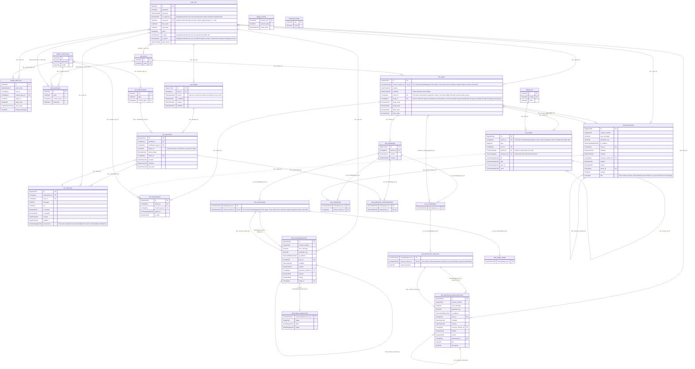

```mermaid
erDiagram
    auth_user ||--o{ django_admin_log : "(id) - (user_id)"
    django_content_type |o--o{ django_admin_log : "(id) - (content_type_id)"
    django_content_type ||--o{ auth_permission : "(id) - (content_type_id)"
    auth_group }o--o{ auth_permission : "(permissions) - (group_set)"
    auth_user }o--o{ auth_group : "(groups) - (user_set)"
    auth_user }o--o{ auth_permission : "(user_permissions) - (user_set)"
    django_content_type |o--o{ nyt_notificationtype : "(id) - (content_type_id)"
    auth_user ||--o{ nyt_settings : "(id) - (user_id)"
    nyt_settings ||--o{ nyt_subscription : "(id) - (settings_id)"
    nyt_notificationtype ||--o{ nyt_subscription : "(key) - (notification_type_id)"
    nyt_notification |o--o{ nyt_subscription : "(id) - (latest_id)"
    nyt_subscription |o--o{ nyt_notification : "(id) - (subscription_id)"
    auth_user |o--o{ nyt_notification : "(id) - (user_id)"
    wiki_articlerevision |o--o| wiki_article : "(id) - (current_revision_id)"
    auth_user |o--o{ wiki_article : "(id) - (owner_id)"
    auth_group |o--o{ wiki_article : "(id) - (group_id)"
    wiki_article ||--o{ wiki_articleforobject : "(id) - (article_id)"
    django_content_type ||--o{ wiki_articleforobject : "(id) - (content_type_id)"
    auth_user |o--o{ wiki_articlerevision : "(id) - (user_id)"
    wiki_articlerevision |o--o{ wiki_articlerevision : "(id) - (previous_revision_id)"
    wiki_article ||--o{ wiki_articlerevision : "(id) - (article_id)"
    wiki_article ||--o{ wiki_articleplugin : "(id) - (article_id)"
    wiki_articleplugin ||--o| wiki_reusableplugin : "is a, by articleplugin_ptr_id"
    wiki_reusableplugin }o--o{ wiki_article : "(articles) - (shared_plugins_set)"
    wiki_articleplugin ||--o| wiki_simpleplugin : "is a, by articleplugin_ptr_id"
    wiki_articlerevision ||--o{ wiki_simpleplugin : "(id) - (article_revision_id)"
    wiki_articleplugin ||--o| wiki_revisionplugin : "is a, by articleplugin_ptr_id"
    wiki_revisionpluginrevision |o--o| wiki_revisionplugin : "(id) - (current_revision_id)"
    auth_user |o--o{ wiki_revisionpluginrevision : "(id) - (user_id)"
    wiki_revisionpluginrevision |o--o{ wiki_revisionpluginrevision : "(id) - (previous_revision_id)"
    wiki_revisionplugin ||--o{ wiki_revisionpluginrevision : "(articleplugin_ptr_id) - (plugin_id)"
    wiki_article ||--o{ wiki_urlpath : "(id) - (article_id)"
    django_site ||--o{ wiki_urlpath : "(id) - (site_id)"
    wiki_urlpath |o--o{ wiki_urlpath : "(id) - (parent_id)"
    wiki_urlpath |o--o{ wiki_urlpath : "(id) - (moved_to_id)"
    wiki_urlpath ||..o{ wiki_articleforobject : "(id) - (object_id)"
    wiki_reusableplugin ||--o| wiki_attachments_attachment : "is a, by reusableplugin_ptr_id"
    wiki_attachments_attachmentrevision |o--o| wiki_attachments_attachment : "(id) - (current_revision_id)"
    auth_user |o--o{ wiki_attachments_attachmentrevision : "(id) - (user_id)"
    wiki_attachments_attachmentrevision |o--o{ wiki_attachments_attachmentrevision : "(id) - (previous_revision_id)"
    wiki_attachments_attachment ||--o{ wiki_attachments_attachmentrevision : "(reusableplugin_ptr_id) - (attachment_id)"
    wiki_articleplugin ||--o| wiki_notifications_articlesubscription : "is a, by articleplugin_ptr_id"
    nyt_subscription ||--o| wiki_notifications_articlesubscription : "(id) - (subscription_id)"
    wiki_revisionplugin ||--o| wiki_images_image : "is a, by revisionplugin_ptr_id"
    wiki_revisionpluginrevision ||--o| wiki_images_imagerevision : "is a, by revisionpluginrevision_ptr_id"
    django_admin_log {
        AutoField id PK
        DateTimeField action_time
        ForeignKey user_id FK
        ForeignKey content_type_id FK
        TextField object_id
        CharField object_repr
        LogEntryActionFlag action_flag
        TextField change_message
    }
    auth_permission {
        AutoField id PK
        CharField name
        ForeignKey content_type_id FK
        CharField codename
    }
    auth_group {
        AutoField id PK
        CharField name UK
    }
    auth_user {
        AutoField id PK
        CharField password
        DateTimeField last_login
        BooleanField is_superuser "Designates that this user has all permissions without explicitly assigning them."
        CharField username UK "Required. 150 characters or fewer. Letters, digits and @/./+/-/_ only."
        CharField first_name
        CharField last_name
        EmailField email
        BooleanField is_staff "Designates whether the user can log into this admin site."
        BooleanField is_active "Designates whether this user should be treated as active. Unselect this instead of deleting accounts."
        DateTimeField date_joined
    }
    django_content_type {
        AutoField id PK
        CharField app_label
        CharField model
    }
    django_session {
        CharField session_key PK
        TextField session_data
        DateTimeField expire_date
    }
    django_site {
        AutoField id PK
        CharField domain UK
        CharField name
    }
    nyt_notificationtype {
        CharField key PK
        CharField label
        ForeignKey content_type_id FK
    }
    nyt_settings {
        BigAutoField id PK
        ForeignKey user_id FK
        SettingsInterval interval "interval in minutes (0=instant, 60=notify once per hour)"
        BooleanField is_default
        DateTimeField created
        DateTimeField modified
    }
    nyt_subscription {
        BigAutoField id PK
        ForeignKey settings_id FK
        ForeignKey notification_type_id FK
        CharField object_id "Leave this blank to subscribe to any kind of object"
        BooleanField send_emails
        ForeignKey latest_id FK
        DateTimeField created
        DateTimeField modified
        DateTimeField last_sent
    }
    nyt_notification {
        BigAutoField id PK
        ForeignKey subscription_id FK
        ForeignKey user_id FK
        TextField message
        CharField url
        BooleanField is_viewed
        BooleanField is_emailed
        DateTimeField created
        DateTimeField modified
        PositiveIntegerField occurrences "If the same notification was fired multiple times with no intermediate notifications"
    }
    thumbnail_kvstore {
        CharField key PK
        TextField value
    }
    wiki_article {
        BigAutoField id PK
        OneToOneField current_revision_id FK, UK "The revision being displayed for this article. If you need to do a roll-back, simply change the value of this field."
        DateTimeField created
        DateTimeField modified "Article properties last modified"
        ForeignKey owner_id FK "The owner of the article, usually the creator. The owner always has both read and write access."
        ForeignKey group_id FK "Like in a UNIX file system, permissions can be given to a user according to group membership. Groups are handled through the Django auth system."
        BooleanField group_read
        BooleanField group_write
        BooleanField other_read
        BooleanField other_write
    }
    wiki_articleforobject {
        BigAutoField id PK
        ForeignKey article_id FK
        ForeignKey content_type_id FK
        PositiveIntegerField object_id
        BooleanField is_mptt
    }
    wiki_articlerevision {
        BigAutoField id PK
        IntegerField revision_number
        TextField user_message
        TextField automatic_log
        GenericIPAddressField ip_address
        ForeignKey user_id FK
        DateTimeField modified
        DateTimeField created
        ForeignKey previous_revision_id FK
        BooleanField deleted
        BooleanField locked
        ForeignKey article_id FK
        TextField content
        CharField title "Each revision contains a title field that must be filled out, even if the title has not changed"
    }
    wiki_articleplugin {
        BigAutoField id PK
        ForeignKey article_id FK
        BooleanField deleted
        DateTimeField created
    }
    wiki_reusableplugin {
        OneToOneField articleplugin_ptr_id PK
    }
    wiki_simpleplugin {
        OneToOneField articleplugin_ptr_id PK
        ForeignKey article_revision_id FK
    }
    wiki_revisionplugin {
        OneToOneField articleplugin_ptr_id PK
        OneToOneField current_revision_id FK, UK "The revision being displayed for this plugin. If you need to do a roll-back, simply change the value of this field."
    }
    wiki_revisionpluginrevision {
        BigAutoField id PK
        IntegerField revision_number
        TextField user_message
        TextField automatic_log
        GenericIPAddressField ip_address
        ForeignKey user_id FK
        DateTimeField modified
        DateTimeField created
        ForeignKey previous_revision_id FK
        BooleanField deleted
        BooleanField locked
        ForeignKey plugin_id FK
    }
    wiki_urlpath {
        BigAutoField id PK
        ForeignKey article_id FK "This field is automatically updated, but you need to populate it when creating a new URL path."
        SlugField slug
        ForeignKey site_id FK
        TreeForeignKey parent_id FK "Position of URL path in the tree."
        TreeForeignKey moved_to_id FK "Article path was moved to this location"
        PositiveIntegerField lft
        PositiveIntegerField rght
        PositiveIntegerField tree_id
        PositiveIntegerField level
    }
    wiki_attachments_attachment {
        OneToOneField reusableplugin_ptr_id PK
        OneToOneField current_revision_id FK, UK "The revision of this attachment currently in use (on all articles using the attachment)"
        CharField original_filename
    }
    wiki_attachments_attachmentrevision {
        BigAutoField id PK
        IntegerField revision_number
        TextField user_message
        TextField automatic_log
        GenericIPAddressField ip_address
        ForeignKey user_id FK
        DateTimeField modified
        DateTimeField created
        ForeignKey previous_revision_id FK
        BooleanField deleted
        BooleanField locked
        ForeignKey attachment_id FK
        FileField file
        TextField description
    }
    wiki_notifications_articlesubscription {
        OneToOneField articleplugin_ptr_id PK
        OneToOneField subscription_id FK, UK
    }
    wiki_images_image {
        OneToOneField revisionplugin_ptr_id PK
    }
    wiki_images_imagerevision {
        OneToOneField revisionpluginrevision_ptr_id PK
        ImageField image
        SmallIntegerField width
        SmallIntegerField height
    }
```
