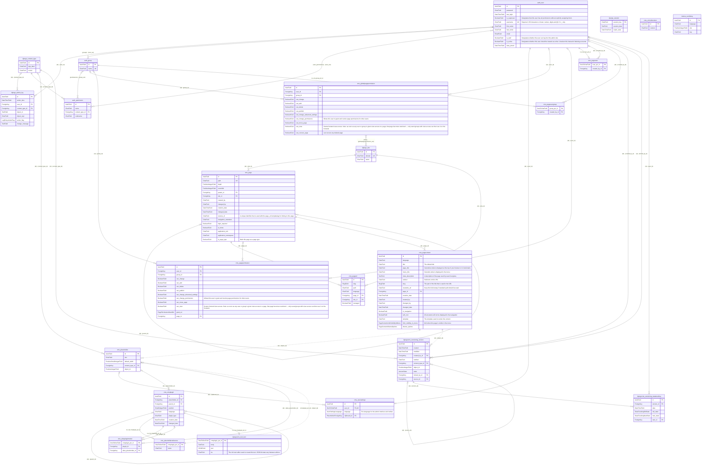

```mermaid
erDiagram
    auth_user ||--o{ django_admin_log : "(id) - (user_id)"
    django_content_type |o--o{ django_admin_log : "(id) - (content_type_id)"
    django_content_type ||--o{ auth_permission : "(id) - (content_type_id)"
    auth_group }o--o{ auth_permission : "(permissions) - (group_set)"
    auth_user }o--o{ auth_group : "(groups) - (user_set)"
    auth_user }o--o{ auth_permission : "(user_permissions) - (user_set)"
    auth_user ||--o| cms_usersettings : "(id) - (user_id)"
    cms_placeholder |o--o{ cms_usersettings : "(id) - (clipboard_id)"
    cms_page |o--o{ cms_page : "(id) - (parent_id)"
    django_site ||--o{ cms_page : "(id) - (site_id)"
    cms_page ||--o{ cms_pageurl : "(id) - (page_id)"
    django_site ||--o{ cms_pageurl : "(id) - (site_id)"
    auth_user |o--o{ cms_globalpagepermission : "(id) - (user_id)"
    auth_group |o--o{ cms_globalpagepermission : "(id) - (group_id)"
    cms_globalpagepermission }o--o{ django_site : "(sites) - (globalpagepermission_set)"
    auth_user |o--o{ cms_pagepermission : "(id) - (user_id)"
    auth_group |o--o{ cms_pagepermission : "(id) - (group_id)"
    cms_page |o--o{ cms_pagepermission : "(id) - (page_id)"
    auth_user ||--o| cms_pageuser : "is a, by user_ptr_id"
    auth_user |o--o{ cms_pageuser : "(id) - (created_by_id)"
    auth_group ||--o| cms_pageusergroup : "is a, by group_ptr_id"
    auth_user |o--o{ cms_pageusergroup : "(id) - (created_by_id)"
    django_content_type |o--o{ cms_placeholder : "(id) - (content_type_id)"
    cms_placeholder |o--o{ cms_cmsplugin : "(id) - (placeholder_id)"
    cms_cmsplugin |o--o{ cms_cmsplugin : "(id) - (parent_id)"
    cms_page ||--o{ cms_pagecontent : "(id) - (page_id)"
    cms_pagecontent ||..o{ cms_placeholder : "(id) - (object_id)"
    cms_pagecontent ||..o{ djangocms_versioning_version : "(id) - (object_id)"
    cms_cmsplugin ||--o| cms_placeholderreference : "is a, by cmsplugin_ptr_id"
    cms_placeholderreference ||..o{ cms_placeholder : "(cmsplugin_ptr_id) - (object_id)"
    cms_cmsplugin ||--o| cms_aliaspluginmodel : "is a, by cmsplugin_ptr_id"
    cms_cmsplugin |o--o{ cms_aliaspluginmodel : "(id) - (plugin_id)"
    cms_placeholder |o--o{ cms_aliaspluginmodel : "(id) - (alias_placeholder_id)"
    cms_cmsplugin ||--o| djangocms_text_text : "is a, by cmsplugin_ptr_id"
    auth_user ||--o{ djangocms_versioning_version : "(id) - (created_by_id)"
    django_content_type ||--o{ djangocms_versioning_version : "(id) - (content_type_id)"
    auth_user |o--o{ djangocms_versioning_version : "(id) - (locked_by_id)"
    djangocms_versioning_version |o--o{ djangocms_versioning_version : "(id) - (source_id)"
    djangocms_versioning_version ||--o{ djangocms_versioning_statetracking : "(id) - (version_id)"
    auth_user ||--o{ djangocms_versioning_statetracking : "(id) - (user_id)"
    django_admin_log {
        AutoField id PK
        DateTimeField action_time
        ForeignKey user_id FK
        ForeignKey content_type_id FK
        TextField object_id
        CharField object_repr
        LogEntryActionFlag action_flag
        TextField change_message
    }
    auth_permission {
        AutoField id PK
        CharField name
        ForeignKey content_type_id FK
        CharField codename
    }
    auth_group {
        AutoField id PK
        CharField name UK
    }
    auth_user {
        AutoField id PK
        CharField password
        DateTimeField last_login
        BooleanField is_superuser "Designates that this user has all permissions without explicitly assigning them."
        CharField username UK "Required. 150 characters or fewer. Letters, digits and @/./+/-/_ only."
        CharField first_name
        CharField last_name
        EmailField email
        BooleanField is_staff "Designates whether the user can log into this admin site."
        BooleanField is_active "Designates whether this user should be treated as active. Unselect this instead of deleting accounts."
        DateTimeField date_joined
    }
    django_content_type {
        AutoField id PK
        CharField app_label
        CharField model
    }
    django_session {
        CharField session_key PK
        TextField session_data
        DateTimeField expire_date
    }
    django_site {
        AutoField id PK
        CharField domain UK
        CharField name
    }
    cms_usersettings {
        AutoField id PK
        OneToOneField user_id FK, UK
        UserSettingsLanguage language "The language for the admin interface and toolbar"
        PlaceholderForeignKey clipboard_id FK
    }
    cms_page {
        AutoField id PK
        CharField path UK
        PositiveIntegerField depth
        PositiveIntegerField numchild
        ForeignKey parent_id FK
        ForeignKey site_id FK
        CharField created_by
        CharField changed_by
        DateTimeField creation_date
        DateTimeField changed_date
        CharField reverse_id "A unique identifier that is used with the page_url templatetag for linking to this page"
        CharField navigation_extenders
        BooleanField login_required
        BooleanField is_home
        CharField application_urls
        CharField application_namespace
        BooleanField is_page_type "Mark this page as a page type"
    }
    cms_pageurl {
        AutoField id PK
        SlugField slug
        CharField path
        CharField language
        ForeignKey page_id FK
        ForeignKey site_id FK
        BooleanField managed
    }
    cms_globalpagepermission {
        AutoField id PK
        ForeignKey user_id FK
        ForeignKey group_id FK
        BooleanField can_change
        BooleanField can_add
        BooleanField can_delete
        BooleanField can_publish
        BooleanField can_change_advanced_settings
        BooleanField can_change_permissions "Allows this user to grant and revoke page permissions for other users."
        BooleanField can_move_page
        BooleanField can_view "Grants frontend view access. Note: as soon as any user or group is given view access to a page, that page becomes restricted — only users/groups with view access can then see it on the frontend."
        BooleanField can_recover_page "can recover any deleted page"
    }
    cms_pagepermission {
        AutoField id PK
        ForeignKey user_id FK
        ForeignKey group_id FK
        BooleanField can_change
        BooleanField can_add
        BooleanField can_delete
        BooleanField can_publish
        BooleanField can_change_advanced_settings
        BooleanField can_change_permissions "Allows this user to grant and revoke page permissions for other users."
        BooleanField can_move_page
        BooleanField can_view "Grants frontend view access. Note: as soon as any user or group is given view access to a page, that page becomes restricted — only users/groups with view access can then see it on the frontend."
        PagePermissionGrantOn grant_on
        ForeignKey page_id FK
    }
    cms_pageuser {
        OneToOneField user_ptr_id PK
        ForeignKey created_by_id FK
    }
    cms_pageusergroup {
        OneToOneField group_ptr_id PK
        ForeignKey created_by_id FK
    }
    cms_placeholder {
        AutoField id PK
        CharField slot
        PositiveSmallIntegerField default_width
        ForeignKey content_type_id FK
        PositiveIntegerField object_id
    }
    cms_cmsplugin {
        AutoField id PK
        ForeignKey placeholder_id FK
        ForeignKey parent_id FK
        SmallIntegerField position
        CharField language
        CharField plugin_type
        DateTimeField creation_date
        DateTimeField changed_date
    }
    cms_pagecontent {
        AutoField id PK
        CharField language
        CharField title "The default title"
        CharField page_title "Overwrites what is displayed at the top of your browser or in bookmarks"
        CharField menu_title "Overwrite what is displayed in the menu"
        TextField meta_description "A description of the page used by search engines."
        CharField redirect "Redirects to this URL."
        SlugField slug "The part of the title that is used in the URL"
        CharField overwrite_url "Keep this field empty if standard path should be used."
        ForeignKey page_id FK
        DateTimeField creation_date
        CharField created_by
        CharField changed_by
        DateTimeField changed_date
        BooleanField in_navigation
        BooleanField soft_root "All ancestors will not be displayed in the navigation"
        CharField template "The template used to render the content."
        PageContentLimitVisibilityInMenu limit_visibility_in_menu "limit when this page is visible in the menu"
        PageContentXframeOptions xframe_options
    }
    cms_placeholderreference {
        OneToOneField cmsplugin_ptr_id PK
        CharField name
    }
    cms_aliaspluginmodel {
        OneToOneField cmsplugin_ptr_id PK
        ForeignKey plugin_id FK
        ForeignKey alias_placeholder_id FK
    }
    cms_urlconfrevision {
        AutoField id PK
        CharField revision
    }
    menus_cachekey {
        AutoField id PK
        CharField language
        PositiveIntegerField site
        CharField key
    }
    djangocms_text_text {
        OneToOneField cmsplugin_ptr_id PK
        TextField body
        JSONField json
        CharField rte "The rich text editor used to create this text. JSON formats vary between editors."
    }
    djangocms_versioning_version {
        AutoField id PK
        DateTimeField created
        DateTimeField modified
        ForeignKey created_by_id FK
        CharField number
        ForeignKey content_type_id FK
        PositiveIntegerField object_id
        VersionState state
        ForeignKey locked_by_id FK
        ForeignKey source_id FK
    }
    djangocms_versioning_statetracking {
        AutoField id PK
        ForeignKey version_id FK
        DateTimeField date
        StateTrackingOldState old_state
        StateTrackingNewState new_state
        ForeignKey user_id FK
    }
```
