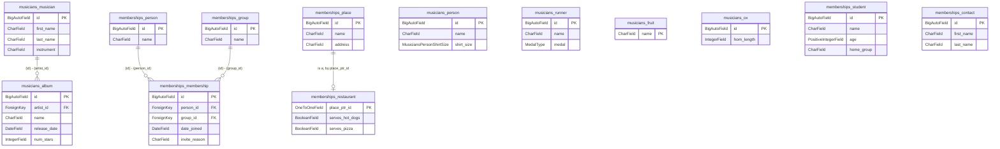

```mermaid
erDiagram
    musicians_musician ||--o{ musicians_album : "(id) - (artist_id)"
    memberships_person ||--o{ memberships_membership : "(id) - (person_id)"
    memberships_group ||--o{ memberships_membership : "(id) - (group_id)"
    memberships_place ||--o| memberships_restaurant : "is a, by place_ptr_id"
    musicians_musician {
        BigAutoField id PK
        CharField first_name
        CharField last_name
        CharField instrument
    }
    musicians_album {
        BigAutoField id PK
        ForeignKey artist_id FK
        CharField name
        DateField release_date
        IntegerField num_stars
    }
    musicians_person {
        BigAutoField id PK
        CharField name
        MusiciansPersonShirtSize shirt_size
    }
    musicians_runner {
        BigAutoField id PK
        CharField name
        MedalType medal
    }
    musicians_fruit {
        CharField name PK
    }
    musicians_ox {
        BigAutoField id PK
        IntegerField horn_length
    }
    memberships_person {
        BigAutoField id PK
        CharField name
    }
    memberships_group {
        BigAutoField id PK
        CharField name
    }
    memberships_membership {
        BigAutoField id PK
        ForeignKey person_id FK
        ForeignKey group_id FK
        DateField date_joined
        CharField invite_reason
    }
    memberships_student {
        BigAutoField id PK
        CharField name
        PositiveIntegerField age
        CharField home_group
    }
    memberships_place {
        BigAutoField id PK
        CharField name
        CharField address
    }
    memberships_restaurant {
        OneToOneField place_ptr_id PK
        BooleanField serves_hot_dogs
        BooleanField serves_pizza
    }
    memberships_contact {
        BigAutoField id PK
        CharField first_name
        CharField last_name
    }
```
