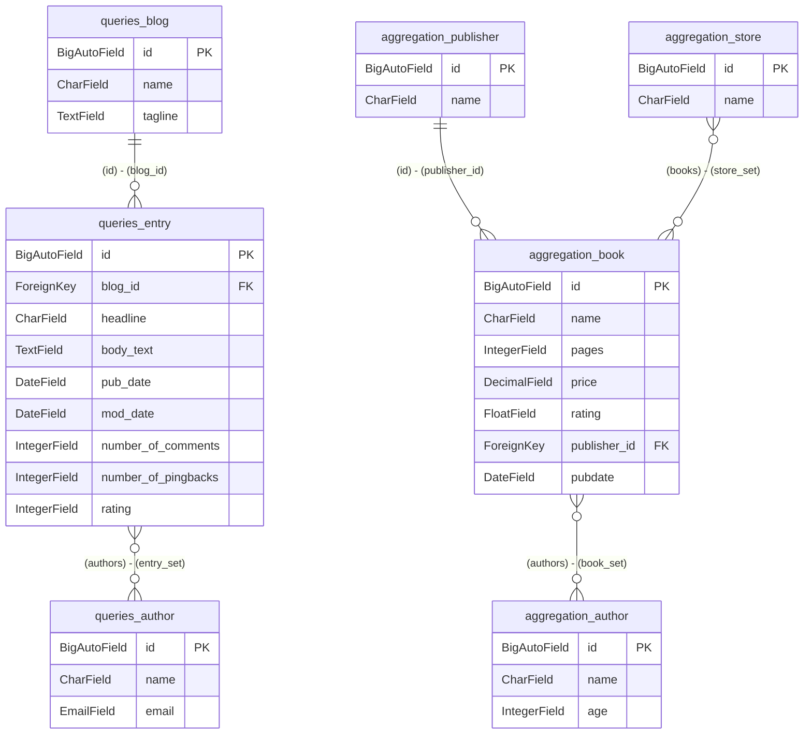

```mermaid
erDiagram
    queries_blog ||--o{ queries_entry : "(id) - (blog_id)"
    queries_entry }o--o{ queries_author : "(authors) - (entry_set)"
    aggregation_publisher ||--o{ aggregation_book : "(id) - (publisher_id)"
    aggregation_book }o--o{ aggregation_author : "(authors) - (book_set)"
    aggregation_store }o--o{ aggregation_book : "(books) - (store_set)"
    queries_blog {
        BigAutoField id PK
        CharField name
        TextField tagline
    }
    queries_author {
        BigAutoField id PK
        CharField name
        EmailField email
    }
    queries_entry {
        BigAutoField id PK
        ForeignKey blog_id FK
        CharField headline
        TextField body_text
        DateField pub_date
        DateField mod_date
        IntegerField number_of_comments
        IntegerField number_of_pingbacks
        IntegerField rating
    }
    aggregation_author {
        BigAutoField id PK
        CharField name
        IntegerField age
    }
    aggregation_publisher {
        BigAutoField id PK
        CharField name
    }
    aggregation_book {
        BigAutoField id PK
        CharField name
        IntegerField pages
        DecimalField price
        FloatField rating
        ForeignKey publisher_id FK
        DateField pubdate
    }
    aggregation_store {
        BigAutoField id PK
        CharField name
    }
```
