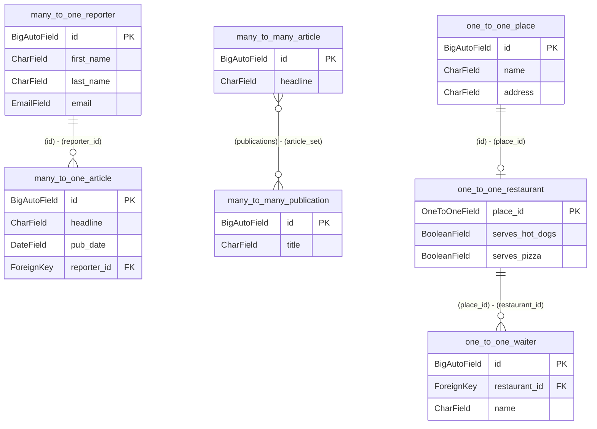

```mermaid
erDiagram
    many_to_one_reporter ||--o{ many_to_one_article : "(id) - (reporter_id)"
    many_to_many_article }o--o{ many_to_many_publication : "(publications) - (article_set)"
    one_to_one_place ||--o| one_to_one_restaurant : "(id) - (place_id)"
    one_to_one_restaurant ||--o{ one_to_one_waiter : "(place_id) - (restaurant_id)"
    many_to_one_reporter {
        BigAutoField id PK
        CharField first_name
        CharField last_name
        EmailField email
    }
    many_to_one_article {
        BigAutoField id PK
        CharField headline
        DateField pub_date
        ForeignKey reporter_id FK
    }
    many_to_many_publication {
        BigAutoField id PK
        CharField title
    }
    many_to_many_article {
        BigAutoField id PK
        CharField headline
    }
    one_to_one_place {
        BigAutoField id PK
        CharField name
        CharField address
    }
    one_to_one_restaurant {
        OneToOneField place_id PK
        BooleanField serves_hot_dogs
        BooleanField serves_pizza
    }
    one_to_one_waiter {
        BigAutoField id PK
        ForeignKey restaurant_id FK
        CharField name
    }
```
