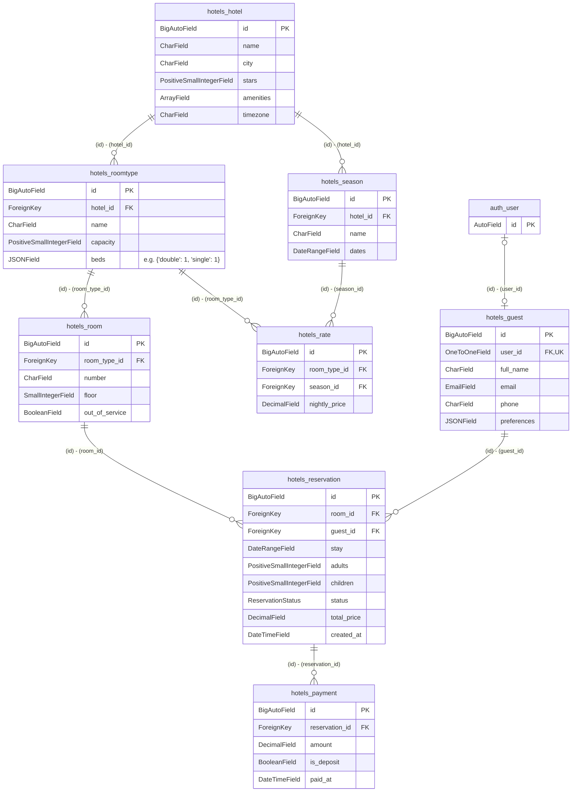

```mermaid
erDiagram
    hotels_hotel ||--o{ hotels_roomtype : "(id) - (hotel_id)"
    hotels_roomtype ||--o{ hotels_room : "(id) - (room_type_id)"
    hotels_hotel ||--o{ hotels_season : "(id) - (hotel_id)"
    hotels_roomtype ||--o{ hotels_rate : "(id) - (room_type_id)"
    hotels_season ||--o{ hotels_rate : "(id) - (season_id)"
    auth_user |o--o| hotels_guest : "(id) - (user_id)"
    hotels_room ||--o{ hotels_reservation : "(id) - (room_id)"
    hotels_guest ||--o{ hotels_reservation : "(id) - (guest_id)"
    hotels_reservation ||--o{ hotels_payment : "(id) - (reservation_id)"
    hotels_hotel {
        BigAutoField id PK
        CharField name
        CharField city
        PositiveSmallIntegerField stars
        ArrayField amenities
        CharField timezone
    }
    hotels_roomtype {
        BigAutoField id PK
        ForeignKey hotel_id FK
        CharField name
        PositiveSmallIntegerField capacity
        JSONField beds "e.g. {'double': 1, 'single': 1}"
    }
    hotels_room {
        BigAutoField id PK
        ForeignKey room_type_id FK
        CharField number
        SmallIntegerField floor
        BooleanField out_of_service
    }
    hotels_season {
        BigAutoField id PK
        ForeignKey hotel_id FK
        CharField name
        DateRangeField dates
    }
    hotels_rate {
        BigAutoField id PK
        ForeignKey room_type_id FK
        ForeignKey season_id FK
        DecimalField nightly_price
    }
    hotels_guest {
        BigAutoField id PK
        OneToOneField user_id FK, UK
        CharField full_name
        EmailField email
        CharField phone
        JSONField preferences
    }
    hotels_reservation {
        BigAutoField id PK
        ForeignKey room_id FK
        ForeignKey guest_id FK
        DateRangeField stay
        PositiveSmallIntegerField adults
        PositiveSmallIntegerField children
        ReservationStatus status
        DecimalField total_price
        DateTimeField created_at
    }
    hotels_payment {
        BigAutoField id PK
        ForeignKey reservation_id FK
        DecimalField amount
        BooleanField is_deposit
        DateTimeField paid_at
    }
    auth_user {
        AutoField id PK
    }
```
